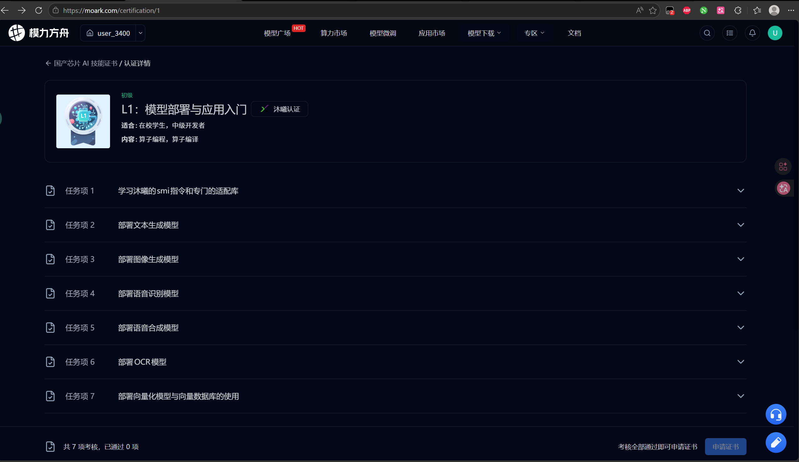

# 01｜认证任务概览

## 1. 认证基本信息

| 项目 | 内容 |
|---|---|
| 认证名称 | L1：模型部署与应用入门 |
| 平台 | 模力方舟 / Gitee AI |
| 认证类型 | 国产芯片 AI 技能证书 / 沐曦认证 |
| 难度等级 | 初级 |
| 适合人群 | 在校学生、中级开发者 |
| 页面显示内容 | 算子编程、算子编译 |
| 实际任务覆盖 | 模型部署、API 服务、文本生成、图像生成、ASR、TTS、OCR、Embedding / Rerank |
| 芯片环境 | 沐曦 GPU |
| 当前任务数量 | 共 7 项考核 |
| 当前进度 | 已通过 7 项 |
| 认证入口 | https://moark.com/certification/1 |

认证详情首页截图如下：



该截图记录了认证名称、等级、沐曦认证标签、适合人群、认证内容、任务 1～7 列表，以及当前通过进度。

我对这个认证的初步理解是：  
它不是单纯的刷题任务，而是一次国产 GPU 环境下的模型部署与应用入门实践。核心目标是熟悉沐曦算力环境，完成不同类型模型的单次推理与 API 服务部署，并把整个过程整理成其他同学也能复现的实验手册。

---

## 2. 本实验手册目标

本实验手册的目标不是只记录“我通过了认证”，而是记录从零开始完成认证的完整过程。

最终希望做到：

1. 记录账号注册、算力券领取、GPU 租用流程；
2. 记录沐曦 GPU 环境检查方法；
3. 记录每个任务的模型路径、输出文件、服务端口和接口格式；
4. 保存关键命令、代码、截图和报错信息；
5. 补充每一步涉及的背景知识；
6. 总结常见问题和解决方案；
7. 让后续同学可以参考本文档独立完成认证。

一句话目标：

```text
把“我自己跑通认证”整理成“别人也能照着跑通的开源实验手册”。
```

---

## 3. 全局规则与共性要求

从任务说明中可以看到，本认证有几个共性要求。

### 3.1 算力要求

所有任务都需要使用沐曦机器完成。

如果尚未创建实例，需要先到模力方舟算力市场租用沐曦 GPU 实例。

当前计划：

```text
任务 1：先使用曦云 C500 / 16GB 显存实例，降低试错成本。
后续模型部署任务如显存不足，再升级到 32GB 或 64GB 实例。
```

### 3.2 输出目录

多数任务要求将最终输出保存到：

```text
/data/exam/
```

因此后续每个任务开始前，都需要先确认该目录是否存在：

```bash
mkdir -p /data/exam
```

### 3.3 API 服务端口

多个任务要求在固定端口启动服务：

```text
8188
```

因此部署 API 服务前需要注意：

1. 端口是否被占用；
2. 服务是否监听在正确端口；
3. `curl` 是否能正常访问；
4. 检测前服务是否仍在运行。

### 3.4 API 风格

认证中多个任务要求兼容 OpenAI API 格式，例如：

| 类型 | 接口 |
|---|---|
| 文本生成 | `/v1/chat/completions` |
| 图像生成 | `/v1/images/generations` |
| 语音识别 | `/v1/audio/transcriptions` |
| 语音合成 | `/v1/audio/speech` |
| OCR | `/v1/vision/ocr` |
| Embedding | `/v1/embeddings` |

这说明该认证不只是考模型推理，还考察如何把模型封装成可被调用的服务。

---

## 4. 任务总览

| 任务编号 | 任务名称 | 核心目标 | 主要技术 | 对应文档 |
|---|---|---|---|---|
| 任务 1 | 学习沐曦的 smi 指令和专门适配库 | 使用 `mx-smi` 监控 GPU，检查 maca / metax 相关库 | `mx-smi`、`pip list` | `04-task1-mx-smi.md` |
| 任务 2 | 部署文本生成模型 | 使用 Qwen3-8B 完成文本推理，并用 vLLM 部署 OpenAI 兼容 API | Transformers、vLLM、curl | `05-task2-text-model.md` |
| 任务 3 | 部署图像生成模型 | 使用图像生成模型生成图片，并用 FastAPI 部署图像生成 API | Diffusers、FastAPI、base64 | `06-task3-image-model.md` |
| 任务 4 | 部署语音识别模型 | 使用 ASR 模型识别音频，并部署语音识别 API | Transformers、FastAPI、UploadFile | `07-task4-asr.md` |
| 任务 5 | 部署语音合成模型 | 使用 TTS 模型合成音频，并部署语音合成 API | TTS、FastAPI、音频处理 | `08-task5-tts.md` |
| 任务 6 | 部署 OCR 模型 | 使用 OCR 模型识别图片文字，并部署 OCR API | Vision2Seq、PIL、FastAPI | `09-task6-ocr.md` |
| 任务 7 | 部署向量化模型与向量数据库 | 部署 Embedding API，完成文档切片、向量存储和 rerank | vLLM、Chroma、Reranker | `10-task7-embedding-rerank.md` |

---

## 5. 各任务关键要求摘要

### 5.1 任务 1：沐曦 GPU 状态与适配库检查

任务目标：

1. 学习使用 `mx-smi` 监控沐曦算力芯片状态和性能；
2. 使用 `pip list | grep -e maca -e metax` 查看沐曦相关适配库。

核心命令：

```bash
mx-smi
pip list | grep -e maca -e metax
```

当前理解：

`mx-smi` 类似 NVIDIA 生态中的 `nvidia-smi`，用于查看 GPU 状态、显存占用、运行进程等信息。  
`maca` / `metax` 相关库则体现了沐曦生态对 AI 框架和模型部署的适配能力。

---

### 5.2 任务 2：部署文本生成模型

模型路径：

```text
/mnt/moark-models/Qwen3-8B
```

任务一：单次推理测试

要求：

1. 使用 Qwen3-8B 模型；
2. 生成一段 100 个字符以上的短篇小说；
3. 保存到：

```text
/data/exam/text_inference.txt
```

任务二：部署 OpenAI 兼容 API

要求：

1. 使用 vLLM 启动 Qwen3-8B；
2. 端口为：

```text
8188
```

3. API 兼容：

```text
/v1/chat/completions
```

4. 使用参数重新指定模型名：

```bash
--served-model-name Qwen3-8B
```

---

### 5.3 任务 3：部署图像生成模型

模型路径：

```text
/mnt/moark-models/
```

可用模型：

```text
Z-Image-Turbo / Qwen-Image-2512
```

任务一：单次图像生成

要求生成指定提示词对应的图像，并保存到：

```text
/data/exam/image_output.png
```

任务二：部署 OpenAI 兼容图像生成 API

要求：

1. 使用 FastAPI 创建服务；
2. 端口为：

```text
8188
```

3. 提供接口：

```text
/v1/images/generations
```

4. 接收 JSON 请求；
5. 返回 base64 编码图像；
6. 服务端必须将生成的第一张图保存为：

```text
/data/exam/image_output.png
```

---

### 5.4 任务 4：部署语音识别模型

模型路径：

```text
/mnt/moark-models/Qwen3-ASR-1.7B
```

测试音频：

```text
/mnt/moark-models/L1_exam/asr_demo.wav
```

任务一：单次 ASR 推理

输出文件：

```text
/data/exam/asr_output.txt
```

任务二：部署语音识别 API

要求：

1. 使用 FastAPI；
2. 端口为：

```text
8188
```

3. 提供接口：

```text
/v1/audio/transcriptions
```

4. 使用 `multipart/form-data` 上传音频文件；
5. 返回 JSON：

```json
{"text": "识别到的文本内容"}
```

---

### 5.5 任务 5：部署语音合成模型

实际使用模型：

```text
IndexTTS-2
```

模型路径：

```text
/mnt/moark-models/IndexTTS-2
```

IndexTTS 仓库路径：

```text
/mnt/moark-models/github/index-tts
```

参考音频：

```text
/mnt/moark-models/github/index-tts/emo_sad.wav
```

任务一：单次 TTS 推理

合成文本：

```text
欢迎来到模力方舟平台，这里汇聚了最前沿的国产算力资源，为您的AI研发提供强大支持。
```

输出文件：

```text
/data/exam/tts_output.wav
```

任务二：部署语音合成 API

要求：

1. 使用 FastAPI；
2. 端口为：

```text
8188
```

3. 提供接口：

```text
/v1/audio/speech
```

4. 接收 `multipart/form-data`；
5. 返回 base64 编码音频；
6. 服务端必须将生成音频保存为：

```text
/data/exam/tts_output.wav
```

---

### 5.6 任务 6：部署 OCR 模型

模型路径：

```text
/mnt/moark-models/FireRed-OCR
```

测试图片：

```text
/mnt/moark-models/L1_exam/ocr_test_image.jpg
```

任务一：单次 OCR 推理

输出文件：

```text
/data/exam/ocr_output.txt
```

任务二：部署 OCR API

要求：

1. 使用 FastAPI；
2. 端口为：

```text
8188
```

3. 提供接口：

```text
/v1/vision/ocr
```

4. 接收图片文件上传；
5. 返回 JSON：

```json
{"text": "识别结果"}
```

---

### 5.7 任务 7：部署向量化模型与向量数据库

涉及模型：

```text
Qwen3-Embedding-8B
bge-reranker-v2-m3
```

任务一：部署 Embedding API 服务

要求：

1. 使用 vLLM；
2. 端口为：

```text
8188
```

3. 提供接口：

```text
/v1/embeddings
```

4. 支持批量编码；
5. 返回 1024 维向量；
6. 使用参数重新指定模型名：

```bash
--served-model-name Qwen3-Embedding-8B
```

任务二：文档切片与 Chroma 向量数据库存储

测试文档：

```text
/mnt/moark-models/L1_exam/embedding_documents.txt
```

要求：

1. 对文档进行智能切片；
2. 至少生成 10 个 chunk；
3. 使用 Qwen3-Embedding-8B 向量化；
4. 存入 Chroma 数据库。

任务三：使用重排模型优化检索结果

要求：

1. 使用 `bge-reranker-v2-m3`；
2. 检索 Top-10 候选；
3. 对候选结果 rerank；
4. 将对比结果写入：

```text
/data/exam/reranking_results.json
```

---

## 6. 认证涉及的主要技术栈

从 7 个任务看，本认证涉及以下技术：

| 技术方向 | 涉及任务 | 说明 |
|---|---|---|
| 国产 GPU 环境检查 | 任务 1 | `mx-smi`、maca / metax 适配库 |
| 文本生成模型部署 | 任务 2 | Qwen3-8B、Transformers、vLLM |
| 图像生成模型部署 | 任务 3 | Diffusers、FastAPI、base64 |
| 语音识别 | 任务 4 | ASR、音频上传、FastAPI |
| 语音合成 | 任务 5 | TTS、参考音频、音频编码 |
| OCR | 任务 6 | Vision2Seq、PIL、图片上传 |
| Embedding / RAG | 任务 7 | vLLM、Chroma、reranker |
| API 服务 | 任务 2～7 | OpenAI 兼容接口、8188 端口、curl 测试 |

---

## 7. 当前难点预判

目前预判可能遇到的难点包括：

1. 沐曦 GPU 环境与常见 NVIDIA CUDA 环境不同；
2. 部分模型可能需要特定适配库或特定版本依赖；
3. vLLM 在沐曦环境下的启动参数可能需要按平台要求调整；
4. 图像、语音、OCR 类模型的依赖可能比文本模型更复杂；
5. 8188 端口可能被占用，需要检查进程；
6. 自动检测要求输出文件路径严格匹配；
7. API 返回格式必须符合题目要求；
8. 如果显存不足，可能需要更换更高规格实例；
9. 报错信息需要及时记录，否则后续很难复盘。

---

## 8. 当前计划

按照从易到难的顺序推进：

1. 完成算力券领取；
2. 租用沐曦 C500 实例；
3. 完成环境检查；
4. 完成任务 1；
5. 再进入任务 2 的文本生成模型部署；
6. 根据任务 2 的显存和环境情况，决定后续是否升级实例；
7. 每完成一个任务，就整理对应文档；
8. 所有报错统一记录到 `11-errors-and-fixes.md` 中。

当前优先级：

```text
先跑通任务 1；
再攻克任务 2；
后续任务按模型类型逐个拆解。
```

---

## 9. 我的当前基础与记录方式

我目前是大一学生，正在学习 C++、数据结构、线性代数等基础内容。对 AI Infra、模型部署和国产 GPU 生态比较感兴趣，但还没有系统完成过类似认证。

因此本手册会尽量从初学者视角记录：

1. 一开始我不懂什么；
2. 我查了哪些资料；
3. 每一步为什么这样做；
4. 哪些地方容易卡住；
5. 报错是怎么排查的；
6. 最后如何把流程整理成别人也能复现的版本。

---

## 10. 截图记录

| 截图文件 | 内容 | 用途 |
|---|---|---|
| `assets/01-certification-detail-with-task-list.png` | 登录后的 L1：模型部署与应用入门认证详情页，包含认证名称、等级、任务 1～7 列表和通过进度 | 用作认证整体概览截图 |
| `assets/01-task1-detail.png` | 任务 1：学习沐曦的 smi 指令和专门适配库 | 用于记录任务 1 的考核要求 |
| `assets/01-task2-detail.png` | 任务 2：部署文本生成模型 | 用于记录任务 2 的模型路径、输出文件和 API 要求 |
| `assets/01-task3-detail.png` | 任务 3：部署图像生成模型 | 用于记录任务 3 的图像生成和 API 要求 |
| `assets/01-task4-detail.png` | 任务 4：部署语音识别模型 | 用于记录任务 4 的 ASR 推理和接口要求 |
| `assets/01-task5-detail.png` | 任务 5：部署语音合成模型 | 用于记录任务 5 的 TTS 推理和接口要求 |
| `assets/01-task6-detail.png` | 任务 6：部署 OCR 模型 | 用于记录任务 6 的 OCR 推理和接口要求 |
| `assets/01-task7-detail.png` | 任务 7：部署向量化模型与向量数据库的使用 | 用于记录任务 7 的 Embedding、Chroma 和 rerank 要求 |