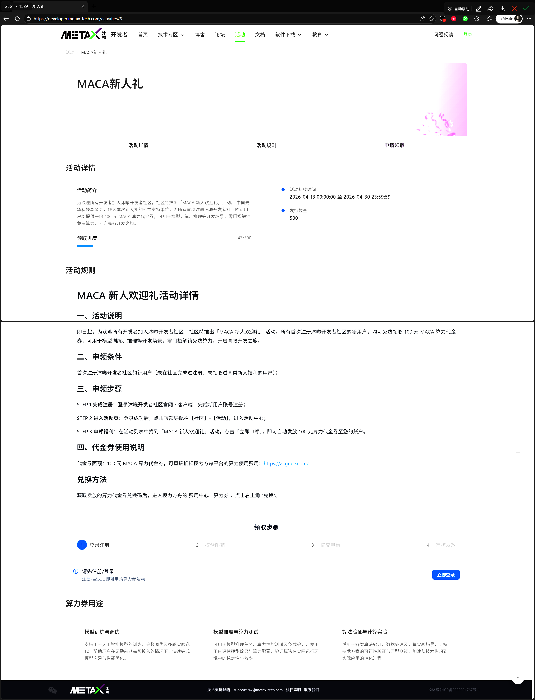
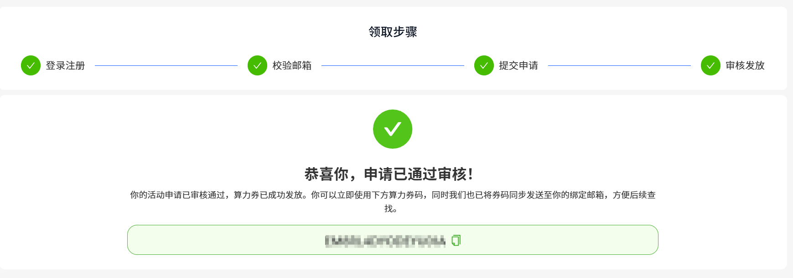
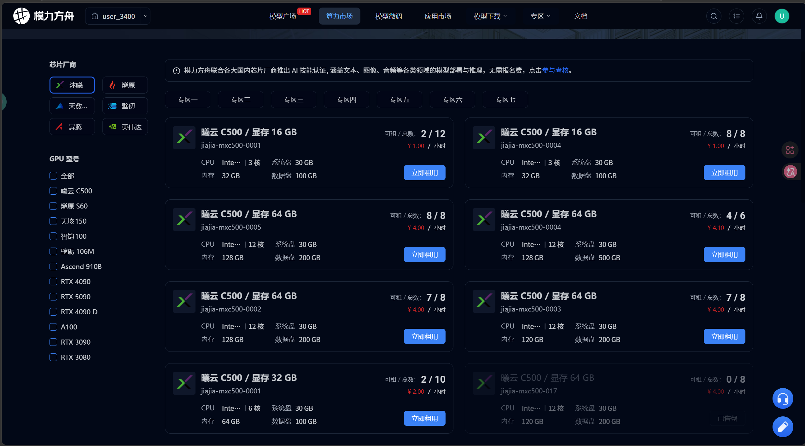
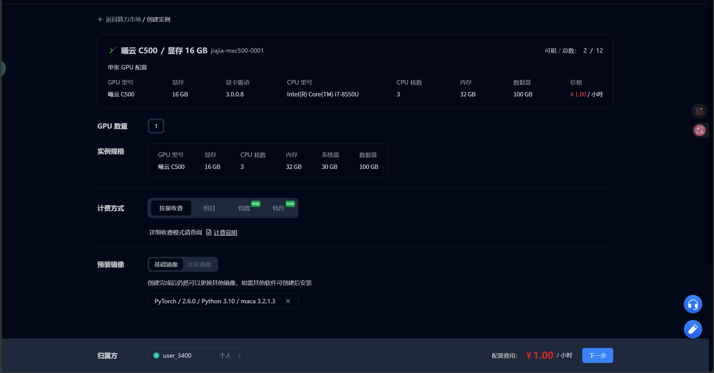
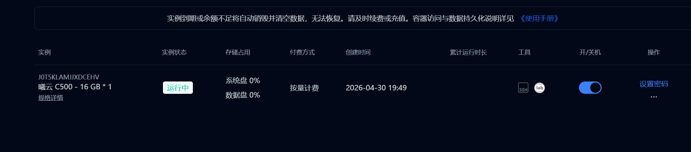
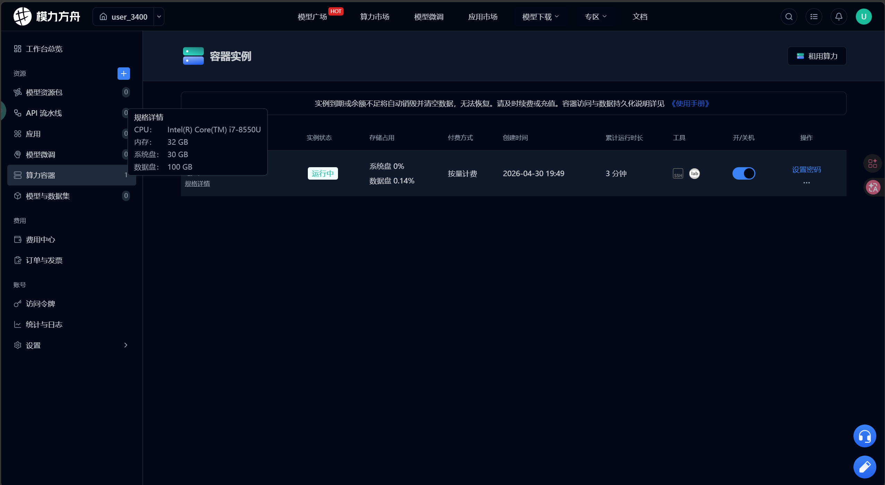
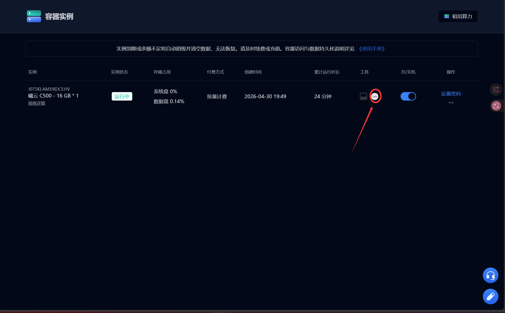

# 02｜沐曦 GPU 算力租用与实例创建流程

## 1. 文档目标

本文件记录从注册账号到成功进入沐曦 GPU 实例的完整流程。

L1 认证的所有 7 项任务都需要在沐曦 GPU 环境中完成，因此租用算力是整个认证的第一步。本文档覆盖以下内容：

1. 为什么需要租用沐曦 GPU；
2. 注册账号与领取算力券；
3. 进入算力市场并选择沐曦专区；
4. 选择 C500 实例规格；
5. 选择预装镜像；
6. 创建实例；
7. 进入 Lab / 终端；
8. 截图证据；
9. 租用阶段的常见问题和建议。

---

## 2. 为什么需要租用沐曦 GPU

L1 认证的考核环境是沐曦国产 GPU，不是 NVIDIA GPU。

认证平台会自动检测任务是否在沐曦算力容器中完成，因此：

1. 不能使用本地机器或其他云厂商的 NVIDIA GPU；
2. 不能使用 CPU-only 环境；
3. 必须通过模力方舟平台租用沐曦 GPU 实例。

如果没有可用的沐曦 GPU 实例，认证页面的"申请检测"按钮无法正常工作，所有任务都无法通过。

---

## 3. 注册与领取算力券

### 3.1 注册账号

在模力方舟平台完成账号注册。如果已有 Gitee 账号，可以直接登录。

### 3.2 领取算力券

平台会不定期提供算力券活动，用于抵扣 GPU 租用费用。

领取入口通常在平台首页或活动页面中。建议在租用实例前先检查是否有可用的算力券。

算力券活动页面：

领取成功后可以在账户中确认：

---

## 4. 进入算力市场

### 4.1 找到算力市场入口

登录后，在平台导航中找到"算力市场"入口。

### 4.2 选择沐曦专区

算力市场中包含多个芯片厂商的实例。本次认证必须选择沐曦专区。

进入沐曦专区后，可以看到不同规格的 C500 实例：

---

## 5. 选择 C500 实例规格

沐曦专区中提供多种 C500 实例规格，主要区别在于显存大小和价格：

| 显存 | 适用场景 | 价格参考 |
|---|---|---|
| 16 GB | 环境检查、小模型推理、任务 1 验证 | 较低 |
| 32 GB | 中等规模模型部署 | 中等 |
| 64 GB | 大模型部署、vLLM 服务 | 较高 |

我的选择：

第一次租用时选择了 C500 / 16 GB / 1 卡实例，原因是任务 1 只需要环境检查和 `mx-smi`，不涉及大模型部署，先用最低成本实例验证流程。

后续任务如果遇到显存不足，再切换到更高规格的实例。

---

## 6. 选择预装镜像

### 6.1 可选镜像类型

平台提供多种预装镜像，包括：

| 镜像类型 | 适用场景 |
|---|---|
| PyTorch | 通用深度学习开发，覆盖 Transformers、Diffusers 等 |
| vLLM | 大语言模型推理服务 |
| ComfyUI | 图像生成工作流 |
| OpenClaw / TileLang | 特定框架场景 |

### 6.2 镜像选择原则

选择镜像时需要考虑：

1. 后续任务覆盖文本生成、图像生成、ASR、TTS、OCR、Embedding 等多种场景；
2. PyTorch 镜像是最通用的基础环境，大部分模型框架都基于 PyTorch；
3. Python 版本建议选 3.10，在当前 AI 生态中兼容性较好；
4. 镜像中需要包含 maca 适配库，否则沐曦 GPU 无法被正确调用。

### 6.3 我的选择

选择了 PyTorch 2.6.0 / Python 3.10 / maca 3.2.1.3 镜像。

选择原因：

1. PyTorch 2.6.0 版本不算太旧，兼容性较好；
2. Python 3.10 在 Transformers、vLLM、Diffusers 等库中兼容性稳定；
3. 镜像自带 maca 3.2.1.3，不需要手动安装沐曦适配库。

租用配置页面：

---

## 7. 创建实例

确认实例规格和镜像后，点击创建。

创建成功后，平台会显示实例详情页面，包含实例状态、连接方式等信息。

实例创建成功：

实例详情页面：

---

## 8. 进入 Lab / 终端

### 8.1 连接方式

平台提供两种进入实例的方式：

| 方式 | 特点 |
|---|---|
| Lab | 浏览器内直接打开开发环境和终端，无需额外配置 |
| SSH | 需要配置 SSH 密钥，适合长时间开发或使用本地 IDE 远程连接 |

### 8.2 我的选择

第一次使用选择了 Lab 方式。

原因：Lab 可以直接在浏览器中打开终端，适合快速完成环境检查和截图记录，不需要额外配置 SSH 密钥。

后续如果需要长时间开发、上传代码或使用 VS Code Remote，再考虑 SSH 方式。

进入 Lab 的入口：

---

## 9. 截图证据汇总

本阶段保存的截图如下：

| 截图文件 | 内容 |
|---|---|
| `assets/02-coupon-activity-page.png` | 算力券活动页面 |
| `assets/02-coupon-received.png` | 算力券领取成功 |
| `assets/02-compute-market-c500-options.png` | 算力市场沐曦 C500 实例列表 |
| `assets/02-rental-config-pytorch260-python310-maca3213.png` | 租用配置页面（镜像选择） |
| `assets/02-rental-success.png` | 实例创建成功 |
| `assets/02-instance-detail.png` | 实例详情页面 |
| `assets/02-lab-entry.png` | Lab 入口 |

---

## 10. 租用阶段的常见问题和建议

| 问题 | 建议 |
|---|---|
| 不确定该租多大显存的实例 | 如果只是做环境检查或任务 1，16 GB 足够；涉及大模型部署时再升级到 32 GB 或 64 GB |
| 不确定该选哪个镜像 | 优先选 PyTorch 镜像，它是最通用的基础环境；确认镜像中包含 maca 适配库 |
| 不确定 Python 版本 | 建议选 Python 3.10，兼容性较好；Python 3.12 部分 AI 库可能还未完全适配 |
| 算力券余额不足 | 关注平台活动页面，及时领取新的算力券；不用时及时关闭实例，避免空跑计费 |
| 实例创建后无法进入 | 等待实例状态变为"运行中"后再尝试进入；如果长时间未就绪，检查平台公告或联系客服 |
| 不确定用 SSH 还是 Lab | 快速验证和截图用 Lab；长时间开发或需要本地 IDE 用 SSH |
| 实例意外关机或释放 | 按量计费实例在欠费后可能被释放；重要数据建议保存到数据盘或本地 |

---

## 11. 本阶段小结

完成本阶段后，已经具备：

1. 模力方舟平台账号；
2. 可用的算力券；
3. 一台运行中的沐曦 C500 实例；
4. 可以通过 Lab 进入实例终端。

下一步进入基础环境检查（03-env-check.md），确认 GPU、Python、适配库等环境是否正常。
