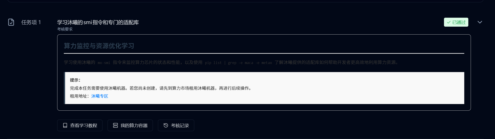

# 04｜任务 1：学习沐曦的 smi 指令和专门的适配库

## 1. 任务目标

任务 1 的名称是：

```text
学习沐曦的 smi 指令和专门的适配库
```

认证页面中的考核要求为：

```text
算力监控与资源优化学习
```

本任务要求学习使用沐曦的 `mx-smi` 指令来监控算力芯片的状态和性能，并使用：

```bash
pip list | grep -e maca -e metax
```

查看沐曦提供的适配库。

我对任务 1 的理解是：

这个任务本身不涉及复杂模型部署，也不需要编写 Python 推理代码。它的核心作用是确认当前沐曦 GPU 环境是否可用，为后续文本生成、图像生成、ASR、TTS、OCR、Embedding 等模型部署任务做准备。

如果任务 1 中 GPU 无法识别，或者相关适配库不存在，那么后续模型部署很可能会失败。因此任务 1 是整个认证的环境入口。

---

## 2. 我的任务拆解

我把任务 1 拆成以下几个小目标：

1. 租用一台沐曦 C500 实例；
2. 选择合适的预装镜像；
3. 进入实例终端；
4. 运行基础环境检查命令；
5. 运行 `mx-smi`，确认 GPU 能被系统识别；
6. 运行 `pip list | grep -e maca -e metax`，确认环境中存在沐曦相关适配库；
7. 回到认证页面申请检测；
8. 记录任务 1 通过结果；
9. 将整个过程整理成后续同学可复现的实验手册。

这个任务的难点不在代码，而在于：

1. 不知道该租什么规格的机器；
2. 不知道该选哪个预装镜像；
3. 不知道用 SSH 还是 Lab；
4. 不知道哪些环境信息需要记录；
5. 不知道 `mx-smi` 和 maca / metax 相关库分别代表什么。

所以本文档不仅记录命令，也记录当时的选择原因和判断过程。

---

## 3. 前置条件

完成本任务需要使用沐曦机器。

本次使用的实例配置如下：

| 项目 | 内容 |
|---|---|
| 芯片厂商 | 沐曦 |
| GPU 型号 | 曦云 C500 |
| 显存 | 16 GB |
| GPU 数量 | 1 |
| 显卡驱动 | 3.0.0.8 |
| CPU 型号 | Intel(R) Core(TM) i7-8550U |
| CPU 核数 | 3 |
| 内存 | 32 GB |
| 系统盘 | 30 GB |
| 数据盘 | 100 GB |
| 预装镜像 | PyTorch 2.6.0 / Python 3.10 / maca 3.2.1.3 |
| 计费方式 | 按量计费 |
| 价格 | 1.00 元 / 小时 |

选择该实例的原因：

任务 1 主要是环境检查、`mx-smi` 使用和适配库查看，不涉及大模型正式部署，因此先选择 C500 / 16GB 的低成本实例完成验证。

后续如果任务 2 或任务 3 出现显存不足，再切换到 32GB 或 64GB 实例。

---

## 4. 前置知识与补充学习

完成任务 1 前，我补充了解了几个概念。

### 4.1 `mx-smi` 是什么

`mx-smi` 是沐曦 GPU 环境中的设备状态查看工具。

它可以用来查看：

1. GPU 是否被系统识别；
2. GPU 型号；
3. 显存总量；
4. 显存占用情况；
5. 当前运行进程；
6. 芯片状态和运行信息。

它的作用类似 NVIDIA 生态中的：

```bash
nvidia-smi
```

简单对比如下：

| 工具 | 对应生态 | 作用 |
|---|---|---|
| `nvidia-smi` | NVIDIA / CUDA | 查看 NVIDIA GPU 状态 |
| `mx-smi` | 沐曦 / MACA | 查看沐曦 GPU 状态 |

我的理解是：

在国产 GPU 环境中，不能默认使用 NVIDIA 生态里的 `nvidia-smi`。不同硬件厂商会提供自己的设备状态管理工具。沐曦环境中，对应的工具就是 `mx-smi`。

---

### 4.2 为什么要先检查 GPU 状态

模型部署前必须先确认 GPU 是否可用。

如果底层 GPU 没有被系统识别，后续运行：

1. Transformers；
2. vLLM；
3. Diffusers；
4. FastAPI 模型服务；
5. Embedding 服务；

都可能出现模型加载失败、设备不可用或算子执行失败等问题。

所以任务 1 实际上是在确认：

```text
当前沐曦 GPU 实例是否具备继续完成后续认证任务的基础环境。
```

---

### 4.3 `pip list | grep -e maca -e metax` 的作用

`pip list` 用于查看当前 Python 环境中安装的包。

`grep -e maca -e metax` 用于筛选名称中包含 `maca` 或 `metax` 的包。

命令：

```bash
pip list | grep -e maca -e metax
```

其中：

| 关键词 | 当前理解 |
|---|---|
| `maca` | 沐曦相关的软件栈、算子或框架适配关键词 |
| `metax` | 沐曦 MetaX 相关生态关键词 |

我的理解是：

国产 GPU 环境下，模型框架不能只依赖普通 PyTorch，还需要底层驱动、适配库和算子支持。`maca` / `metax` 相关库就是连接上层模型框架和底层沐曦硬件的重要部分。

如果这些库缺失，后续即使 Python、PyTorch 能运行，也可能无法正确调用沐曦 GPU。

---

## 5. 进入实例

平台提供了 SSH 和 Lab 两种进入实例的方式。

本次第一轮选择：

```text
Lab
```

选择原因：

Lab 可以直接在浏览器中打开开发环境和终端，适合快速完成环境检查、截图记录和任务 1 验证，不需要额外配置 SSH 密钥或本地远程连接。

后续如果需要更长时间开发、上传代码或使用 VS Code Remote，再考虑使用 SSH 方式连接实例。

---

## 6. 基础环境检查

进入 Lab 终端后，先进行基础环境检查。

这一步的目的不是为了通过任务 1 检测，而是为了给后续文档留下环境基线。后面如果模型部署失败，可以回头检查是不是 Python、pip、系统资源或磁盘空间出了问题。

---

### 6.1 查看系统时间、主机名和系统信息

运行命令：

```bash
date
hostname
uname -a
```

命令作用：

| 命令 | 作用 |
|---|---|
| `date` | 查看当前系统时间 |
| `hostname` | 查看当前实例主机名 |
| `uname -a` | 查看系统内核和系统架构信息 |

实际输出：

本次未单独保存 `date`、`hostname` 和 `uname -a` 的完整文本输出，复现时可按上方命令重新执行；本手册以对应截图作为过程证据。

截图记录：

```text
assets/03-terminal-basic-check.png
```

---

### 6.2 查看 Python 和 pip 版本

运行命令：

```bash
python --version
pip --version
```

如果 `python` 或 `pip` 不可用，则尝试：

```bash
python3 --version
pip3 --version
```

实际输出：

本次未单独保存 `python --version` 和 `pip --version` 的完整文本输出，复现时可按上方命令重新执行；本手册以对应截图作为过程证据。

这一步的作用：

模型部署和后续认证任务通常会依赖 Python 环境，因此需要先确认 Python 和 pip 是否可用。

---

### 6.3 查看 CPU、内存和磁盘信息

运行命令：

```bash
lscpu
free -h
df -h
```

命令作用：

| 命令 | 作用 |
|---|---|
| `lscpu` | 查看 CPU 架构和核心信息 |
| `free -h` | 查看内存使用情况 |
| `df -h` | 查看磁盘容量和挂载情况 |

实际输出：

本次未单独保存 `lscpu`、`free -h` 和 `df -h` 的完整文本输出，复现时可按上方命令重新执行；本手册以对应截图作为过程证据。

截图记录：

```text
assets/03-system-resource-check.png
```

这一步的作用：

后续模型部署可能会受到 CPU、内存、磁盘容量影响。提前记录当前实例资源，可以在后续遇到依赖安装失败、模型加载失败、磁盘不足等问题时回头对照。

---

## 7. 使用 `mx-smi` 查看沐曦 GPU 状态

任务 1 最关键的命令是：

```bash
mx-smi
```

---

### 7.1 命令作用

`mx-smi` 可以理解为沐曦生态中的 GPU 状态查看工具，作用类似 NVIDIA 生态中的 `nvidia-smi`。

它主要用于查看：

1. GPU 是否被系统识别；
2. GPU 型号；
3. 显存总量；
4. 显存占用情况；
5. 当前运行进程；
6. 芯片状态和运行信息。

---

### 7.2 实际运行

运行命令：

```bash
mx-smi
```

实际输出：

本次未单独保存 `mx-smi` 的完整文本输出，复现时可按上方命令重新执行；本手册以对应截图作为过程证据。

截图记录：

```text
assets/03-mx-smi-output.png
```

---

### 7.3 我的理解

在正式部署模型前，先确认 GPU 是否能被系统识别是非常重要的。

如果 `mx-smi` 无法正常运行，后续模型推理或 API 服务部署大概率也会失败。

因此任务 1 实际上是在确认：

```text
当前沐曦 GPU 环境是否可用。
```

---

## 8. 查看 maca / metax 相关适配库

认证页面要求运行：

```bash
pip list | grep -e maca -e metax
```

也可以使用：

```bash
pip list | grep -E "maca|metax"
```

---

### 8.1 命令作用

这条命令用于查看当前 Python 环境中是否存在与沐曦生态相关的适配库。

其中：

| 关键词 | 当前理解 |
|---|---|
| `maca` | 沐曦相关的软件栈、算子或框架适配关键词 |
| `metax` | 沐曦 MetaX 相关生态关键词 |

这些库的作用是让模型部署框架、深度学习框架和沐曦硬件之间能够更好地适配。

---

### 8.2 实际运行

运行命令：

```bash
pip list | grep -e maca -e metax
```

实际输出：

本次未单独保存 `pip list | grep -e maca -e metax` 的完整文本输出，复现时可按上方命令重新执行；本手册以对应截图作为过程证据。

截图记录：

```text
assets/03-pip-list-maca-metax.png
```

---

### 8.3 我的理解

`pip list` 用于查看当前 Python 环境中安装的包。  
通过 `grep -e maca -e metax` 可以筛选出与沐曦相关的适配库。

这一步的意义是确认当前镜像中是否已经预装了沐曦生态相关软件栈。

如果缺少相关库，后续运行 PyTorch、Transformers、vLLM 等模型部署工具时，可能会出现硬件不识别、算子不支持或运行失败等问题。

---

## 9. 代码与命令汇总

任务 1 没有 Python 脚本代码，主要使用 Linux 命令完成环境检查。  
这些命令也属于本任务的核心“代码”，后续同学可以直接复制执行。

---

### 9.1 基础环境检查

```bash
date
hostname
uname -a
python --version
pip --version
lscpu
free -h
df -h
```

---

### 9.2 沐曦 GPU 状态检查

```bash
mx-smi
```

---

### 9.3 沐曦适配库检查

```bash
pip list | grep -e maca -e metax
```

或者：

```bash
pip list | grep -E "maca|metax"
```

---

## 10. 任务 1 操作流程总结

本任务的完整操作流程如下：

1. 在算力市场租用沐曦 C500 实例；
2. 选择 PyTorch 2.6.0 / Python 3.10 / maca 3.2.1.3 预装镜像；
3. 通过 Lab 进入实例；
4. 打开终端；
5. 执行基础环境检查；
6. 执行 `mx-smi` 查看沐曦 GPU 状态；
7. 执行 `pip list | grep -e maca -e metax` 查看相关适配库；
8. 回到认证页面；
9. 点击“已准备好，申请检测”；
10. 等待平台自动检测结果。

---

## 11. 检测结果

完成环境检查后，我在认证页面点击：

```text
已准备好，申请检测
```

检测结果：

```text
任务项 1：已通过
```

完成算力环境检查后，任务 1 是第一个通过平台检测的任务。以下截图记录了环境验证完成后的检测通过结果：



本任务通过后，说明当前沐曦 GPU 实例已经满足认证平台对 `mx-smi` 和相关适配库检查的要求，可以继续进入任务 2：部署文本生成模型。

---

## 12. 本任务涉及的知识点

通过任务 1，我初步了解了以下内容：

1. 国产 GPU 平台上也有类似 `nvidia-smi` 的状态查看工具；
2. 沐曦平台使用 `mx-smi` 查看芯片状态和资源占用；
3. 模型部署前需要先确认 GPU 是否能被正常识别；
4. 需要检查当前 Python 环境中是否存在硬件适配相关库；
5. 适配库是模型框架和底层硬件之间的重要连接层；
6. 后续模型部署问题可能和硬件、驱动、适配库、Python 包版本都有关系。

---

## 13. 本任务遇到的问题与决策记录

任务 1 本身没有复杂代码报错，但在开始阶段遇到了一些环境选择和流程判断问题。这里记录下来，方便后续同学参考。

| 问题 / 疑问 | 当时情况 | 处理方式 | 最终结果 |
|---|---|---|---|
| 不确定一开始要不要租 64GB 显存实例 | 算力市场中有 16GB、32GB、64GB 多种 C500 实例 | 判断任务 1 只需要环境检查和 `mx-smi`，不涉及大模型部署，因此先选最低成本的 16GB 实例 | 选择 C500 / 16GB / 1 元每小时，任务 1 顺利通过 |
| 不确定预装镜像该选哪个 | 平台提供 vLLM、OpenClaw、TileLang、PyTorch、ComfyUI 等多个镜像 | 考虑后续任务覆盖 Transformers、vLLM、Diffusers、FastAPI 等，先选更通用的 PyTorch 镜像 | 选择 PyTorch 镜像作为基础环境 |
| 不确定 PyTorch 版本该选哪个 | 可选版本包括 PyTorch 2.8.0 / Python 3.12、PyTorch 2.6.0 / Python 3.10、PyTorch 2.4.0 / Python 3.10 | 考虑 Python 3.10 在 AI 依赖中兼容性更稳，同时 PyTorch 2.6.0 不算太旧 | 选择 PyTorch 2.6.0 / Python 3.10 / maca 3.2.1.3 |
| 不确定使用 SSH 还是 Lab 进入实例 | 平台提供 SSH 和 Lab 两种连接方式 | 第一轮任务主要是快速进入终端、执行命令和截图，因此先选 Lab，避免配置 SSH 密钥 | 使用 Lab 进入实例，顺利完成任务 1 |
| 不确定什么时候录屏 | 一开始还在探索流程，直接录屏容易很乱 | 决定第一次先截图和记录，等任务跑通后再补录关键步骤短视频 | 任务 1 先完成截图和文档记录，录屏后续补 |
| 不确定哪些内容需要截图 | 任务过程中涉及实例配置、终端输出、检测结果等多个页面 | 只保留关键证据截图：配置页、实例页、环境命令、`mx-smi`、适配库检查、检测通过结果 | 当前已保存任务 1 检测通过截图 |

---

### 13.1 本任务实际没有遇到的命令报错

本次任务 1 没有遇到明显命令报错，平台检测也一次通过。

如果后续同学复现时遇到以下问题，可以优先检查：

1. 是否真的租用了沐曦机器，而不是其他厂商 GPU；
2. 是否进入了正确的实例终端；
3. `mx-smi` 是否存在；
4. 当前镜像中是否包含 maca / metax 相关适配库；
5. 是否在认证页面选择了正确的算力容器进行检测。

后续如果出现实际报错，会统一补充到：

```text
11-errors-and-fixes.md
```

---

## 14. 录屏记录

任务 1 的第一轮操作主要采用截图和文字记录方式。

后续补录关键步骤短视频时，建议录制以下内容：

1. 打开认证页面，展示任务 1 要求；
2. 打开算力实例页面，展示已创建的 C500 容器；
3. 进入 Lab 终端；
4. 运行 `mx-smi`；
5. 运行 `pip list | grep -e maca -e metax`；
6. 回到认证页面，展示任务 1 已通过。

录屏保存位置：

```text
recordings/01-task1-env-check.mp4
```

录屏目标不是展示所有试错过程，而是让后续同学可以对照视频确认关键步骤。

---

## 15. 复现检查清单

后续同学复现任务 1 时，可以按下面清单检查：

- [ ] 已登录模力方舟账号；
- [ ] 已进入 L1：模型部署与应用入门认证页面；
- [ ] 已租用沐曦 C500 实例；
- [ ] 已选择包含 PyTorch / Python / maca 的预装镜像；
- [ ] 已通过 Lab 或 SSH 进入实例终端；
- [ ] `python --version` 可以正常输出；
- [ ] `pip --version` 可以正常输出；
- [ ] `mx-smi` 可以正常输出沐曦 GPU 状态；
- [ ] `pip list | grep -e maca -e metax` 可以查看到相关适配库；
- [ ] 已在认证页面选择正确的算力容器；
- [ ] 已点击“已准备好，申请检测”；
- [ ] 任务 1 显示“已通过”。

---

## 16. 本任务小结

任务 1 是整个 L1 认证的环境入口。

它本身没有复杂模型部署，但很重要，因为后续所有任务都依赖当前沐曦 GPU 环境是否正常。

本任务完成后，当前已经确认：

1. 已成功租用沐曦 C500 实例；
2. 已进入 Lab 终端；
3. 已完成基础环境检查；
4. 已运行 `mx-smi`；
5. 已检查 maca / metax 相关适配库；
6. 平台检测结果为“已通过”。

下一步进入：

```text
任务 2：部署文本生成模型
```