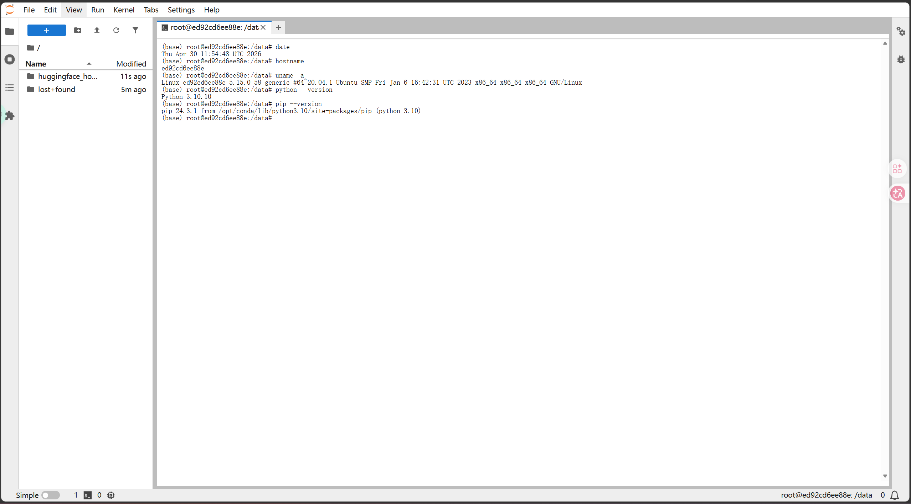
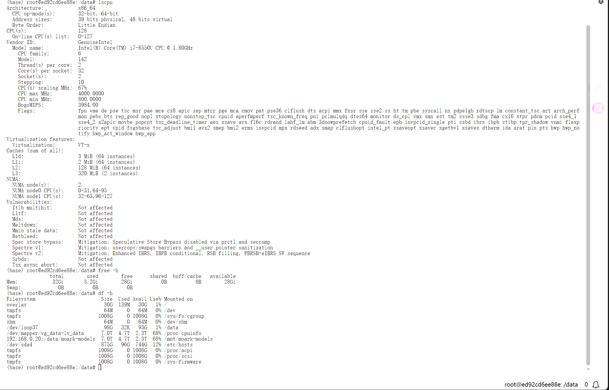

# 03｜基础环境检查

## 1. 文档目标

本文件用于记录进入沐曦 GPU 实例后的基础环境检查过程。

在正式开始任务 1 和后续模型部署任务前，需要先确认：

1. 当前实例能否正常进入；
2. Python / pip 是否可用；
3. CPU、内存、磁盘资源是否符合预期；
4. 沐曦 GPU 是否能被系统识别；
5. `mx-smi` 是否可用；
6. 当前 Python 环境中是否存在 maca / metax 相关适配库。

这些检查不是某一个具体模型任务的全部内容，但它们是后续任务能否顺利运行的基础。

---

## 2. 当前实例信息

本次环境检查基于第一次租用的沐曦 C500 实例。

| 项目 | 内容 |
|---|---|
| 芯片厂商 | 沐曦 / MetaX |
| GPU 型号 | 曦云 C500 |
| GPU 数量 | 1 |
| 显存 | 16 GB |
| 显卡驱动 | 3.0.0.8 |
| CPU 型号 | Intel(R) Core(TM) i7-8550U |
| CPU 核数 | 3 |
| 内存 | 32 GB |
| 系统盘 | 30 GB |
| 数据盘 | 100 GB |
| 计费方式 | 按量计费 |
| 价格 | 1.00 元 / 小时 |
| 预装镜像 | PyTorch 2.6.0 / Python 3.10 / maca 3.2.1.3 |

选择该实例的原因：

任务 1 主要是学习 `mx-smi` 指令和查看沐曦适配库，不涉及大模型正式部署，因此先选择成本较低的 C500 / 16GB 实例完成基础环境验证。

---

## 3. 进入实例方式

平台提供了两种主要连接方式：

| 方式 | 说明 | 本次是否使用 |
|---|---|---|
| SSH | 适合本地终端、VS Code Remote、长期开发 | 暂未使用 |
| Lab | 浏览器中直接打开 JupyterLab / Terminal | 使用 |

本次选择 Lab 的原因：

1. 不需要额外配置 SSH 密钥；
2. 可以快速进入终端；
3. 适合执行环境检查命令；
4. 方便截图和记录过程；
5. 对于任务 1 这种轻量环境验证任务更直接。

后续如果需要长时间开发、上传代码或使用 VS Code Remote，可以再考虑 SSH。

---

## 4. 基础系统信息检查

### 4.1 查看系统时间、主机名和内核信息

执行命令：

```bash
date
hostname
uname -a
```

命令作用：

| 命令 | 作用 |
|---|---|
| `date` | 查看当前系统时间 |
| `hostname` | 查看当前容器 / 实例主机名 |
| `uname -a` | 查看系统内核、系统架构等信息 |

截图记录：



我的理解：

这一步主要是确认自己已经进入了远程实例环境，而不是本地电脑环境。  
`hostname` 可以帮助区分不同容器，后续如果切换实例，也可以通过主机名判断当前处于哪个环境中。

---

### 4.2 查看 Python 和 pip 版本

执行命令：

```bash
python --version
pip --version
```

如果 `python` 或 `pip` 不可用，可以尝试：

```bash
python3 --version
pip3 --version
```

命令作用：

| 命令 | 作用 |
|---|---|
| `python --version` | 查看 Python 版本 |
| `pip --version` | 查看 Python 包管理器版本 |

本次环境中 Python 可以正常使用。

Python 环境对后续任务非常重要，因为任务 2 以后会涉及：

1. Transformers；
2. vLLM；
3. Diffusers；
4. FastAPI；
5. Chroma；
6. Reranker；
7. ASR / TTS / OCR 相关模型脚本。

如果 Python 或 pip 不可用，后续模型部署会直接受阻。

---

## 5. 系统资源检查

### 5.1 查看 CPU 信息

执行命令：

```bash
lscpu
```

作用：

`lscpu` 用于查看 CPU 架构、核心数、线程数等信息。

虽然模型推理主要依赖 GPU，但 CPU 仍然会影响：

1. Python 程序启动；
2. 模型权重加载；
3. tokenization；
4. 数据预处理；
5. API 服务运行；
6. 某些 CPU offload 场景。

---

### 5.2 查看内存信息

执行命令：

```bash
free -h
```

作用：

`free -h` 用于查看系统内存总量、已用内存和可用内存。

后续加载模型时，如果显存不足，部分参数可能发生 CPU offload，此时系统内存也会影响推理是否能继续运行。

---

### 5.3 查看磁盘空间

执行命令：

```bash
df -h
```

作用：

`df -h` 用于查看磁盘容量和挂载情况。

这一步很重要，因为后续任务会不断写入：

```text
/data/exam/
```

例如：

| 任务 | 输出文件 |
|---|---|
| 任务 2 | `/data/exam/text_inference.txt` |
| 任务 3 | `/data/exam/image_output.png` |
| 任务 4 | `/data/exam/asr_output.txt` |
| 任务 5 | `/data/exam/tts_output.wav` |
| 任务 6 | `/data/exam/ocr_output.txt` |
| 任务 7 | `/data/exam/reranking_results.json` |

如果磁盘空间不足，可能会导致模型输出文件保存失败。

截图记录：



---

## 6. 创建认证输出目录

认证任务中多次要求将结果保存到：

```text
/data/exam/
```

因此提前创建该目录：

```bash
mkdir -p /data/exam
ls -ld /data/exam
```

命令解释：

| 命令 | 作用 |
|---|---|
| `mkdir -p /data/exam` | 创建输出目录，如果目录已存在也不会报错 |
| `ls -ld /data/exam` | 查看目录是否创建成功 |

我的理解：

`/data/exam/` 是认证平台约定的输出路径。  
后续自动检测时，大概率会检查该目录下是否存在指定文件。  
因此每次进入新实例后，都应该先确认该目录是否存在。

---

## 7. 沐曦 GPU 状态检查

### 7.1 使用 `mx-smi`

执行命令：

```bash
mx-smi
```

截图记录：


---

### 7.2 `mx-smi` 的作用

`mx-smi` 是沐曦 GPU 环境中的设备状态查看工具，作用类似 NVIDIA 生态中的：

```bash
nvidia-smi
```

简单对比如下：

| 工具 | 对应生态 | 作用 |
|---|---|---|
| `nvidia-smi` | NVIDIA / CUDA | 查看 NVIDIA GPU 状态 |
| `mx-smi` | 沐曦 / MetaX / MACA | 查看沐曦 GPU 状态 |

`mx-smi` 主要可以查看：

1. GPU 是否被系统识别；
2. GPU 型号；
3. 驱动版本；
4. MACA 版本；
5. 显存总量；
6. 显存占用情况；
7. GPU 当前状态；
8. 是否有进程正在使用 GPU。

---

### 7.3 为什么先检查 GPU 状态

在正式运行模型之前，必须先确认 GPU 能被系统识别。

如果 `mx-smi` 无法正常运行，后续可能会出现：

1. PyTorch 无法调用 GPU；
2. 模型加载失败；
3. vLLM 启动失败；
4. 算子执行失败；
5. 平台检测失败。

因此，`mx-smi` 是后续所有模型部署任务前最基础的检查命令。

---

## 8. 沐曦适配库检查

认证页面要求查看 maca / metax 相关适配库。

执行命令：

```bash
pip list | grep -e maca -e metax
```

也可以写成：

```bash
pip list | grep -E "maca|metax"
```

截图记录：


---

## 9. maca / metax 相关库的意义

`pip list` 用于查看当前 Python 环境中安装的包。

`grep -e maca -e metax` 用于筛选和沐曦生态相关的软件包。

| 关键词 | 当前理解 |
|---|---|
| `maca` | 沐曦 MACA 软件栈、算子或框架适配相关关键词 |
| `metax` | 沐曦 MetaX 生态相关关键词 |

我的理解：

国产 GPU 环境下，不能只看是否安装了普通 PyTorch，还要看当前 PyTorch 是否是硬件适配版本，以及是否存在相应的底层算子、通信库、加速库和运行时支持。

这些适配库的作用是连接：

```text
上层模型框架 → 深度学习框架 → 硬件适配层 → 沐曦 GPU
```

如果缺少相关适配库，即使 Python 代码本身没有问题，也可能在模型加载、推理或服务启动时失败。

---

## 10. 本次环境检查使用的命令汇总

本次环境检查主要使用以下命令：

```bash
date
hostname
uname -a

python --version
pip --version

lscpu
free -h
df -h

mkdir -p /data/exam
ls -ld /data/exam

mx-smi
pip list | grep -e maca -e metax
```

如果需要更宽松地匹配 maca / metax 相关库，也可以使用：

```bash
pip list | grep -E "maca|metax"
```

---

## 11. 环境检查结论

通过本次检查，可以确认：

1. 已成功进入沐曦 C500 实例；
2. Lab 终端可以正常使用；
3. Python 和 pip 可以正常运行；
4. 系统资源可以被正常查看；
5. `/data/exam/` 输出目录可以创建；
6. `mx-smi` 可以正常查看沐曦 GPU 状态；
7. 当前 Python 环境中存在 maca / metax 相关适配库；
8. 当前实例可以继续进行任务 1 的 `mx-smi` 检测。

---

## 12. 遇到的问题与决策记录

本阶段没有复杂代码报错，但有几个重要选择需要记录。

| 问题 / 疑问 | 当时情况 | 处理方式 | 结果 |
|---|---|---|---|
| 是否一开始就租高显存实例 | 算力市场有 16GB、32GB、64GB 多种规格 | 任务 1 只需要环境检查，因此先选 16GB 降低成本 | 成功完成任务 1 |
| 使用 SSH 还是 Lab | 平台提供 SSH 和 Lab 两种方式 | 第一轮选择 Lab，降低连接成本 | 顺利进入终端 |
| 是否需要先安装依赖 | 镜像已预装 PyTorch / Python / maca | 先不乱装包，先做环境检查 | 避免破坏基础环境 |
| 哪些内容需要截图 | 命令较多，全部截图会很乱 | 只截图关键证据：基础环境、系统资源、`mx-smi`、适配库 | 便于后续写实验手册 |

---

## 13. 截图记录

| 截图文件 | 内容 | 用途 |
|---|---|---|
| `assets/03-terminal-basic-check.png` | `date`、`hostname`、`uname -a`、`python --version`、`pip --version` 输出 | 记录基础系统与 Python 环境 |
| `assets/03-system-resource-check.png` | `lscpu`、`free -h`、`df -h` 输出 | 记录 CPU、内存、磁盘资源 |
| `assets/03-mx-smi-output.png` | `mx-smi` 输出 | 记录沐曦 GPU 状态 |
| `assets/03-pip-list-maca-metax.png` | `pip list | grep -e maca -e metax` 输出 | 记录沐曦相关适配库 |

---

## 14. 复现检查清单

后续同学复现环境检查时，可以按下面清单确认：

- [ ] 已成功租用沐曦 C500 实例；
- [ ] 已进入 Lab 或 SSH 终端；
- [ ] `date` 可以正常输出；
- [ ] `hostname` 可以正常输出；
- [ ] `uname -a` 可以正常输出；
- [ ] `python --version` 可以正常输出；
- [ ] `pip --version` 可以正常输出；
- [ ] `lscpu` 可以正常输出；
- [ ] `free -h` 可以正常输出；
- [ ] `df -h` 可以正常输出；
- [ ] `/data/exam` 已创建；
- [ ] `mx-smi` 可以正常输出 GPU 状态；
- [ ] `pip list | grep -e maca -e metax` 可以查看到相关适配库；
- [ ] 已保存关键截图；
- [ ] 可以继续进入任务 1。

---

## 15. 本文件小结

`03-env-check.md` 记录的是认证开始前的基础环境检查。

它的作用不是完成某一个模型部署任务，而是建立后续任务的环境基线。

通过本文件，可以确认当前实例具备继续完成任务 1 和后续模型部署任务的基本条件。

下一步进入：

```text
04-task1-mx-smi.md
```