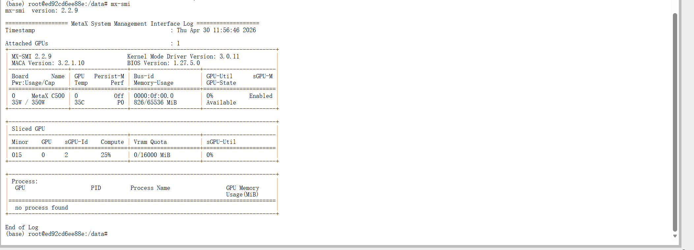
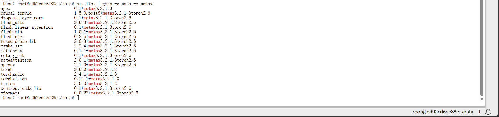

# 04｜任务 1：学习沐曦的 smi 指令和专门的适配库

## 1. 任务目标

任务 1 的名称是：

```text
学习沐曦的 smi 指令和专门的适配库
```

认证页面中的考核要求是：

```text
算力监控与资源优化学习
```

本任务要求学习使用沐曦的 `mx-smi` 指令监控算力芯片状态和性能，并使用：

```bash
pip list | grep -e maca -e metax
```

查看当前环境中的沐曦相关适配库。

任务 1 的核心不是部署模型，而是确认当前沐曦 GPU 环境是否可用。  
如果这一步环境检查失败，后续文本生成、图像生成、ASR、TTS、OCR、Embedding 等任务都可能无法正常完成。

---

## 2. 我的任务拆解

我把任务 1 拆成以下几个小目标：

1. 租用一台沐曦 C500 实例；
2. 选择合适的预装镜像；
3. 通过 Lab 进入实例终端；
4. 执行基础环境检查；
5. 运行 `mx-smi`，确认沐曦 GPU 能被系统识别；
6. 运行 `pip list | grep -e maca -e metax`，确认当前环境中存在沐曦相关适配库；
7. 回到认证页面申请检测；
8. 记录检测通过结果；
9. 将整个过程整理成后续同学可复现的实验手册。

这个任务本身没有复杂代码，但它决定了后续任务是否能继续推进。

---

## 3. 前置环境

本次任务使用的实例配置如下：

| 项目 | 内容 |
|---|---|
| 芯片厂商 | 沐曦 / MetaX |
| GPU 型号 | 曦云 C500 |
| GPU 数量 | 1 |
| 显存 | 16 GB |
| 显卡驱动 | 3.0.0.8 |
| CPU 型号 | Intel(R) Core(TM) i7-8550U |
| CPU 核数 | 3 |
| 内存 | 32 GB |
| 系统盘 | 30 GB |
| 数据盘 | 100 GB |
| 计费方式 | 按量计费 |
| 价格 | 1.00 元 / 小时 |
| 预装镜像 | PyTorch 2.6.0 / Python 3.10 / maca 3.2.1.3 |

选择该实例的原因：

任务 1 只需要完成 `mx-smi`、适配库检查和平台检测，不涉及大模型正式部署。  
因此先选择 C500 / 16GB 的低成本实例，降低试错成本。后续如果任务 2 或任务 3 出现显存不足，再切换到 32GB 或 64GB 实例。

---

## 4. 前置知识与补充学习

### 4.1 `mx-smi` 是什么

`mx-smi` 是沐曦 GPU 环境中的设备状态查看工具。

它的作用类似 NVIDIA 生态中的：

```bash
nvidia-smi
```

对比如下：

| 工具 | 对应生态 | 作用 |
|---|---|---|
| `nvidia-smi` | NVIDIA / CUDA | 查看 NVIDIA GPU 状态 |
| `mx-smi` | 沐曦 / MetaX / MACA | 查看沐曦 GPU 状态 |

`mx-smi` 主要可以查看：

1. GPU 是否被系统识别；
2. GPU 型号；
3. 驱动版本；
4. MACA 版本；
5. 显存总量；
6. 显存占用情况；
7. GPU 当前状态；
8. 当前是否有进程占用 GPU。

我的理解：

在国产 GPU 环境中，不能默认使用 NVIDIA 生态中的 `nvidia-smi`。不同厂商会提供自己的设备状态管理工具。沐曦环境中，对应的工具就是 `mx-smi`。

---

### 4.2 为什么要先检查 GPU 状态

模型部署前必须先确认 GPU 是否可用。

如果底层 GPU 无法被识别，后续运行：

1. Transformers；
2. vLLM；
3. Diffusers；
4. FastAPI 模型服务；
5. Embedding 服务；

都可能出现模型加载失败、设备不可用、算子执行失败或平台检测失败。

所以任务 1 实际上是在确认：

```text
当前沐曦 GPU 实例是否具备继续完成后续认证任务的基础环境。
```

---

### 4.3 `pip list | grep -e maca -e metax` 的作用

`pip list` 用于查看当前 Python 环境中安装的包。

`grep -e maca -e metax` 用于筛选名称中包含 `maca` 或 `metax` 的包。

命令如下：

```bash
pip list | grep -e maca -e metax
```

也可以写成：

```bash
pip list | grep -E "maca|metax"
```

其中：

| 关键词 | 当前理解 |
|---|---|
| `maca` | 沐曦 MACA 软件栈、算子或框架适配相关关键词 |
| `metax` | 沐曦 MetaX 生态相关关键词 |

我的理解：

国产 GPU 环境下，模型框架不能只依赖普通 PyTorch，还需要底层驱动、运行时、算子库和硬件适配层支持。

这些适配库的作用是连接：

```text
上层模型框架 → 深度学习框架 → 硬件适配层 → 沐曦 GPU
```

如果缺少相关适配库，即使 Python 代码本身没有问题，后续模型推理或服务部署也可能失败。

---

## 5. 进入实例

平台提供了两种主要连接方式：

| 方式 | 说明 | 本次是否使用 |
|---|---|---|
| SSH | 适合本地终端、VS Code Remote、长期开发 | 暂未使用 |
| Lab | 浏览器中直接打开 JupyterLab / Terminal | 使用 |

本次第一轮选择 Lab。

选择原因：

1. 不需要额外配置 SSH 密钥；
2. 可以直接在浏览器中打开终端；
3. 适合快速执行环境检查命令；
4. 方便截图记录；
5. 对任务 1 这种轻量检查任务更直接。

后续如果需要长期开发、上传代码或使用 VS Code Remote，再考虑使用 SSH。

---

## 6. 基础环境检查

进入 Lab 终端后，先进行基础环境检查。

基础检查的详细过程记录在：

```text
03-env-check.md
```

本任务中主要关注两类检查：

1. 沐曦 GPU 状态；
2. maca / metax 相关适配库。

---

## 7. 使用 `mx-smi` 查看沐曦 GPU 状态

### 7.1 执行命令

运行：

```bash
mx-smi
```

截图如下：



---

### 7.2 输出信息关注点

`mx-smi` 输出中重点关注：

| 信息 | 作用 |
|---|---|
| Attached GPUs | 当前识别到的 GPU 数量 |
| Board Name | GPU 型号 |
| Driver Version | 驱动版本 |
| MACA Version | MACA 软件栈版本 |
| Memory-Usage | 显存使用情况 |
| GPU-State | GPU 当前状态 |
| Process | 是否有进程占用 GPU |

如果 `mx-smi` 能正常输出，说明当前实例至少已经可以识别沐曦 GPU。

---

### 7.3 我的理解

`mx-smi` 是后续所有模型部署前的第一道检查。

如果这个命令不能运行，说明底层 GPU 环境可能存在问题。此时继续写模型推理代码意义不大，应该先检查：

1. 是否租用了沐曦实例；
2. 是否进入了正确容器；
3. 镜像是否选择正确；
4. GPU 是否处于可用状态；
5. 平台是否正确绑定算力资源。

---

## 8. 查看 maca / metax 相关适配库

### 8.1 执行命令

运行：

```bash
pip list | grep -e maca -e metax
```

或：

```bash
pip list | grep -E "maca|metax"
```

截图如下：



---

### 8.2 输出信息关注点

这一步关注当前 Python 环境中是否有与沐曦生态相关的包。

如果输出中能看到包含 `maca` 或 `metax` 的包，说明当前镜像已经预装了一些沐曦相关适配组件。

这些包可能涉及：

1. PyTorch 的 MetaX 适配版本；
2. 算子库；
3. attention 加速库；
4. triton / xformers 等适配组件；
5. 其他和沐曦运行时相关的 Python 包。

---

### 8.3 我的理解

这一步并不是为了“看包名好看”，而是为了确认当前镜像不是普通 CPU / CUDA 环境，而是带有沐曦适配的软件环境。

后续任务中，如果出现：

1. 模型加载失败；
2. vLLM 启动失败；
3. 算子不支持；
4. GPU 无法调用；
5. 底层运行时错误；

都可能和这些适配库、驱动版本或镜像版本有关。

---

## 9. 任务 1 操作流程总结

本任务完整操作流程如下：

1. 进入模力方舟认证页面；
2. 查看任务 1 要求；
3. 租用沐曦 C500 实例；
4. 选择 PyTorch 2.6.0 / Python 3.10 / maca 3.2.1.3 预装镜像；
5. 使用 Lab 进入实例；
6. 打开终端；
7. 执行基础环境检查；
8. 执行 `mx-smi`；
9. 执行 `pip list | grep -e maca -e metax`；
10. 回到认证页面；
11. 点击“已准备好，申请检测”；
12. 等待平台自动检测结果。

---

## 10. 代码与命令汇总

任务 1 没有复杂 Python 脚本，主要使用 Linux 命令完成环境检查。

### 10.1 基础环境检查

```bash
date
hostname
uname -a

python --version
pip --version

lscpu
free -h
df -h
```

### 10.2 创建认证输出目录

```bash
mkdir -p /data/exam
ls -ld /data/exam
```

### 10.3 查看沐曦 GPU 状态

```bash
mx-smi
```

### 10.4 查看 maca / metax 相关适配库

```bash
pip list | grep -e maca -e metax
```

或：

```bash
pip list | grep -E "maca|metax"
```

这些命令是任务 1 的核心操作。后续同学复现任务 1 时，可以直接按这个顺序执行。

---

## 11. 检测结果

完成环境检查后，我回到认证页面，点击：

```text
已准备好，申请检测
```

检测结果：

```text
任务项 1：已通过
```

检测通过截图如下：


本任务通过后，说明当前沐曦 GPU 实例已经满足认证平台对 `mx-smi` 和相关适配库检查的要求，可以继续进入任务 2：部署文本生成模型。

---

## 12. 本任务涉及的知识点

通过任务 1，我初步了解了以下内容：

1. 国产 GPU 平台也有类似 `nvidia-smi` 的设备状态查看工具；
2. 沐曦平台使用 `mx-smi` 查看 GPU 状态；
3. 模型部署前必须先确认 GPU 是否能被识别；
4. 需要检查当前 Python 环境中是否存在硬件适配相关库；
5. 适配库是模型框架和底层硬件之间的重要连接层；
6. 后续模型部署问题可能和硬件、驱动、适配库、Python 包版本都有关系；
7. 自动检测任务不仅看代码，还会检查环境、路径和运行状态。

---

## 13. 本任务遇到的问题与决策记录

任务 1 本身没有复杂代码报错，但在开始阶段遇到了一些环境选择和流程判断问题。这里记录下来，方便后续同学参考。

| 问题 / 疑问 | 当时情况 | 处理方式 | 最终结果 |
|---|---|---|---|
| 不确定一开始要不要租 64GB 显存实例 | 算力市场中有 16GB、32GB、64GB 多种 C500 实例 | 判断任务 1 只需要环境检查和 `mx-smi`，不涉及大模型部署，因此先选最低成本的 16GB 实例 | 选择 C500 / 16GB / 1 元每小时，任务 1 顺利通过 |
| 不确定预装镜像该选哪个 | 平台提供 vLLM、OpenClaw、TileLang、PyTorch、ComfyUI 等多个镜像 | 考虑后续任务覆盖 Transformers、vLLM、Diffusers、FastAPI 等，先选更通用的 PyTorch 镜像 | 选择 PyTorch 镜像作为基础环境 |
| 不确定 PyTorch 版本该选哪个 | 可选版本包括 PyTorch 2.8.0 / Python 3.12、PyTorch 2.6.0 / Python 3.10、PyTorch 2.4.0 / Python 3.10 | 考虑 Python 3.10 在 AI 依赖中兼容性更稳，同时 PyTorch 2.6.0 不算太旧 | 选择 PyTorch 2.6.0 / Python 3.10 / maca 3.2.1.3 |
| 不确定使用 SSH 还是 Lab 进入实例 | 平台提供 SSH 和 Lab 两种连接方式 | 第一轮任务主要是快速进入终端、执行命令和截图，因此先选 Lab，避免配置 SSH 密钥 | 使用 Lab 进入实例，顺利完成任务 1 |
| 不确定什么时候录屏 | 一开始还在探索流程，直接录屏容易很乱 | 决定第一次先截图和记录，等任务跑通后再补录关键步骤短视频 | 任务 1 先完成截图和文档记录，录屏后续补 |
| 不确定哪些内容需要截图 | 任务过程中涉及实例配置、终端输出、检测结果等多个页面 | 只保留关键证据截图：配置页、实例页、环境命令、`mx-smi`、适配库检查、检测通过结果 | 当前已保存任务 1 检测通过截图 |

---

## 14. 本任务实际没有遇到的命令报错

本次任务 1 没有遇到明显命令报错，平台检测也一次通过。

如果后续同学复现时遇到问题，可以优先检查：

1. 是否真的租用了沐曦机器，而不是其他厂商 GPU；
2. 是否进入了正确的实例终端；
3. `mx-smi` 是否存在；
4. 当前镜像中是否包含 maca / metax 相关适配库；
5. 是否在认证页面选择了正确的算力容器进行检测；
6. 是否点击了“已准备好，申请检测”。

后续如果出现实际报错，会统一补充到：

```text
11-errors-and-fixes.md
```

---

## 15. 截图记录

| 截图文件 | 内容 | 用途 |
|---|---|---|
| `assets/03-terminal-basic-check.png` | 基础系统与 Python 环境检查 | 证明已进入实例并具备 Python 环境 |
| `assets/03-system-resource-check.png` | CPU、内存、磁盘检查 | 记录当前实例资源 |
| `assets/03-mx-smi-output.png` | `mx-smi` 输出 | 证明沐曦 GPU 可被识别 |
| `assets/03-pip-list-maca-metax.png` | maca / metax 适配库检查 | 证明当前环境有沐曦适配库 |
| `assets/04-task1-pass.png` | 任务 1 检测通过页面 | 证明任务 1 已完成 |

---

## 16. 录屏记录

任务 1 的第一轮操作主要采用截图和文字记录方式。

后续补录关键步骤短视频时，建议录制以下内容：

1. 打开认证页面，展示任务 1 要求；
2. 打开算力实例页面，展示已创建的 C500 容器；
3. 进入 Lab 终端；
4. 运行 `mx-smi`；
5. 运行 `pip list | grep -e maca -e metax`；
6. 回到认证页面，展示任务 1 已通过。

录屏文件建议保存为：

```text
recordings/01-task1-env-check.mp4
```

录屏目标不是展示所有试错过程，而是让后续同学可以对照视频确认关键步骤。

---

## 17. 复现检查清单

后续同学复现任务 1 时，可以按下面清单检查：

- [ ] 已登录模力方舟账号；
- [ ] 已进入 L1：模型部署与应用入门认证页面；
- [ ] 已租用沐曦 C500 实例；
- [ ] 已选择包含 PyTorch / Python / maca 的预装镜像；
- [ ] 已通过 Lab 或 SSH 进入实例终端；
- [ ] `python --version` 可以正常输出；
- [ ] `pip --version` 可以正常输出；
- [ ] `mx-smi` 可以正常输出沐曦 GPU 状态；
- [ ] `pip list | grep -e maca -e metax` 可以查看到相关适配库；
- [ ] 已在认证页面选择正确的算力容器；
- [ ] 已点击“已准备好，申请检测”；
- [ ] 任务 1 显示“已通过”。

---

## 18. 本任务小结

任务 1 是整个 L1 认证的环境入口。

它本身没有复杂模型部署，但非常重要，因为后续所有任务都依赖当前沐曦 GPU 环境是否正常。

本任务完成后，当前已经确认：

1. 已成功租用沐曦 C500 实例；
2. 已进入 Lab 终端；
3. 已完成基础环境检查；
4. 已运行 `mx-smi`；
5. 已检查 maca / metax 相关适配库；
6. 平台检测结果为“已通过”。

下一步进入：

```text
任务 2：部署文本生成模型
```