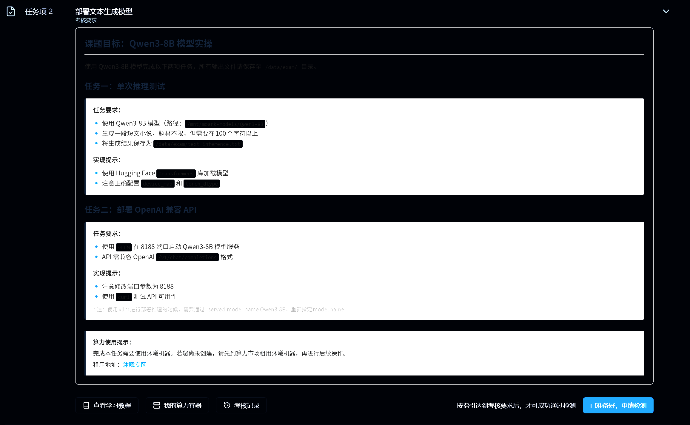
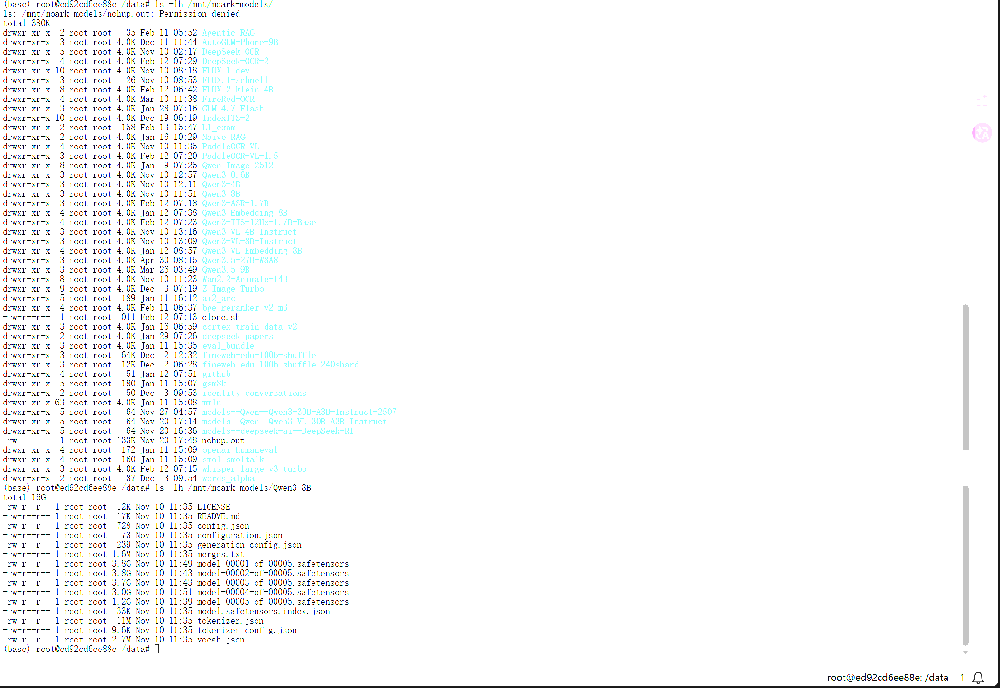
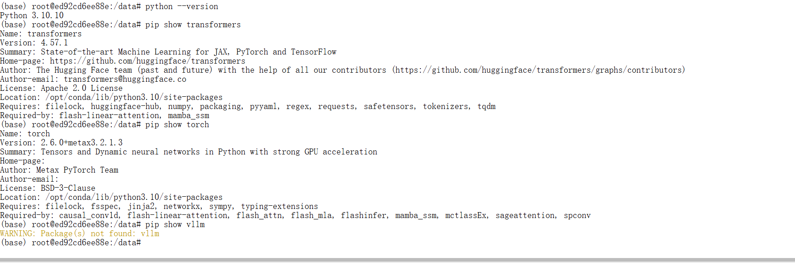

# 05｜任务 2：部署文本生成模型

## 1. 任务目标

任务 2 的名称是：

```text
部署文本生成模型
```

认证页面要求使用指定模型完成文本生成，并部署 OpenAI 兼容 API 服务。

本任务主要分为两部分：

1. 使用 `/mnt/moark-models/Qwen3-8B` 完成一次文本推理；
2. 使用 vLLM 在 `8188` 端口部署 Qwen3-8B 的 OpenAI 兼容服务。

任务要求截图如下：



---

## 2. 我的任务拆解

我把任务 2 拆成以下几个小目标：

1. 检查 Qwen3-8B 模型目录是否存在；
2. 检查当前 Python、Transformers、PyTorch、vLLM 环境；
3. 创建 `/data/exam/` 输出目录；
4. 使用 Qwen3-8B 生成一段 100 字符以上的短篇小说；
5. 将生成内容保存到：

```text
/data/exam/text_inference.txt
```

6. 使用 vLLM 启动 Qwen3-8B 服务；
7. 服务监听端口：

```text
8188
```

8. 接口兼容 OpenAI API：

```text
/v1/chat/completions
```

9. 使用 `curl` 测试 API；
10. 保持服务运行，回到认证页面申请检测。

---

## 3. 任务要求整理

根据任务页面，任务 2 的关键要求如下：

| 项目 | 要求 |
|---|---|
| 模型路径 | `/mnt/moark-models/Qwen3-8B` |
| 推理输出文件 | `/data/exam/text_inference.txt` |
| 文本要求 | 100 字符以上短篇小说 |
| API 部署工具 | vLLM |
| 服务端口 | `8188` |
| API 接口 | `/v1/chat/completions` |
| 模型服务名 | `Qwen3-8B` |
| vLLM 参数 | 需要使用 `--served-model-name Qwen3-8B` |

---

## 4. 前置知识与补充学习

### 4.1 Transformers 单次推理

Transformers 推理适合验证模型是否能被加载、tokenizer 是否可用，以及模型是否能生成文本。

本任务第一部分只需要生成文本并保存到指定路径，因此可以先用 Transformers 完成单次推理。

### 4.2 vLLM 服务部署

vLLM 是高性能大语言模型推理服务框架，可以启动兼容 OpenAI API 格式的 HTTP 服务。

本任务第二部分要求：

```text
使用 vLLM 在 8188 端口启动 Qwen3-8B 服务
```

因此不能只完成本地推理，还必须让平台检测时能够访问：

```text
http://localhost:8188/v1/chat/completions
```

### 4.3 OpenAI 兼容接口

OpenAI 兼容接口的意义是：不同模型服务只要遵守类似的请求和响应格式，就可以用统一方式调用。

本任务用到的接口为：

```text
/v1/chat/completions
```

常见请求格式如下：

```json
{
  "model": "Qwen3-8B",
  "messages": [
    {
      "role": "user",
      "content": "请用一句话介绍模力方舟。"
    }
  ],
  "max_tokens": 128
}
```

---

## 5. 模型目录检查

首先检查模型是否存在。

执行命令：

```bash
ls -lh /mnt/moark-models/
ls -lh /mnt/moark-models/Qwen3-8B
```

检查结果中可以看到 Qwen3-8B 模型目录存在，并包含：

1. `config.json`
2. `tokenizer.json`
3. `tokenizer_config.json`
4. `model-00001-of-00005.safetensors` 等权重文件
5. `model.safetensors.index.json`

截图如下：



我的理解：

这一步先确认模型路径正确。如果模型目录不存在，后续无论是 Transformers 推理还是 vLLM 服务都会失败。因此模型路径检查应该放在任务开始阶段。

---

## 6. PyTorch 镜像环境检查

第一轮我使用的是 PyTorch 镜像，先完成 Transformers 单次推理。

执行命令：

```bash
python --version
pip show transformers
pip show torch
pip show vllm
```

检查结果：

```text
Python 3.10.10
transformers 4.57.1
torch 2.6.0+metax3.2.1.3
vllm 未安装
```

截图如下：



当前判断：

1. Transformers 已安装；
2. torch 是 MetaX 适配版本；
3. 当前 PyTorch 镜像可以先尝试单次推理；
4. 当前 PyTorch 镜像没有 vLLM，后续服务部署需要另行处理。

---

## 7. 创建输出目录

任务要求输出文件保存到：

```text
/data/exam/text_inference.txt
```

因此先创建目录：

```bash
mkdir -p /data/exam
ls -ld /data/exam
```

如果不创建 `/data/exam`，后续写文件时可能会出现：

```text
FileNotFoundError: No such file or directory: '/data/exam/text_inference.txt'
```

---

## 8. 编写 Qwen3-8B 单次推理脚本

创建脚本：

```text
code/task2_text_inference.py
```

脚本内容如下：

```python
from transformers import AutoTokenizer, AutoModelForCausalLM
import torch
import os

MODEL_PATH = "/mnt/moark-models/Qwen3-8B"
OUTPUT_PATH = "/data/exam/text_inference.txt"

def clean_output(text: str) -> str:
    text = text.strip()

    if "</think>" in text:
        text = text.split("</think>", 1)[1].strip()

    text = text.replace("<think>", "").replace("</think>", "").strip()

    return text

def main():
    os.makedirs("/data/exam", exist_ok=True)

    print("Loading tokenizer...")
    tokenizer = AutoTokenizer.from_pretrained(
        MODEL_PATH,
        trust_remote_code=True
    )

    print("Loading model...")
    model = AutoModelForCausalLM.from_pretrained(
        MODEL_PATH,
        dtype=torch.bfloat16,
        device_map="auto",
        trust_remote_code=True
    )

    prompt = (
        "请直接写一段150到250个中文字符的科幻短篇小说。"
        "要求：只输出小说正文，不要解释写作思路，不要列提纲，不要出现<think>。"
        "故事需要有人物、场景、冲突和结尾。"
        "请至少写三句话，正文必须超过100个中文字符。"
    )

    messages = [
        {"role": "user", "content": prompt}
    ]

    try:
        text = tokenizer.apply_chat_template(
            messages,
            tokenize=False,
            add_generation_prompt=True,
            enable_thinking=False
        )
    except TypeError:
        text = tokenizer.apply_chat_template(
            messages,
            tokenize=False,
            add_generation_prompt=True
        )

    inputs = tokenizer([text], return_tensors="pt").to(model.device)

    print("Generating...")
    with torch.no_grad():
        outputs = model.generate(
            **inputs,
            max_new_tokens=260,
            do_sample=True,
            temperature=0.7,
            top_p=0.9
        )

    generated_ids = outputs[0][inputs.input_ids.shape[-1]:]
    result = tokenizer.decode(generated_ids, skip_special_tokens=True)
    result = clean_output(result)

    print("Result:")
    print(result)

    with open(OUTPUT_PATH, "w", encoding="utf-8") as f:
        f.write(result)

    print(f"Saved to {OUTPUT_PATH}")

if __name__ == "__main__":
    main()
```

---

## 9. 问题 1：缺少 accelerate

第一次运行脚本时，出现报错：

```text
Using a `device_map`, `tp_plan`, `torch.device` context manager or setting `torch.set_default_device(device)` requires `accelerate`.
```

截图如下：


原因分析：

脚本中使用了：

```python
device_map="auto"
```

该参数需要依赖 `accelerate` 包来自动分配模型到设备。如果环境中没有安装 `accelerate`，模型加载阶段会失败。

解决方法：

```bash
pip install accelerate
pip show accelerate
```

安装截图如下：


补充记录：

缺少 `accelerate` 时，`/data/exam/text_inference.txt` 不会生成。

相关截图：


---

## 10. 问题 2：模型输出包含 `<think>`

安装 `accelerate` 后，模型可以成功推理，但第一次生成结果包含：

```text
<think>
```

截图如下：


问题分析：

Qwen3 系列模型可能默认输出 thinking / reasoning 内容。  
但任务要求保存的是短篇小说正文，不适合将 `<think>` 或模型的写作分析过程写入最终文件。

处理方式：

1. 在 prompt 中明确要求“只输出小说正文”；
2. 要求不要解释、不要列提纲、不要出现 `<think>`；
3. 尝试在 `apply_chat_template` 中设置：

```python
enable_thinking=False
```

4. 保存前使用 `clean_output()` 清理 `<think>` 和 `</think>`。

---

## 11. 问题 3：输出长度不足

清理 `<think>` 后，第二次生成结果较短，可能不足 100 字符。

截图如下：


处理方式：

将 prompt 改为：

```text
请直接写一段150到250个中文字符的科幻短篇小说。
正文必须超过100个中文字符。
```

并将生成长度调整为：

```python
max_new_tokens=260
```

---

## 12. 单次推理最终成功

最终运行：

```bash
python code/task2_text_inference.py
```

检查输出文件：

```bash
cat /data/exam/text_inference.txt
wc -m /data/exam/text_inference.txt
```

最终文件内容示例：

```text
林夏站在飞船的舷窗前，望着那颗被尘埃覆盖的星球。她知道，这是人类最后的希望。突然，警报响起，飞船系统被未知信号入侵，她必须在五分钟内做出选择——是启动自毁程序，还是冒险尝试破解。她深吸一口气，手指悬在控制台上，心跳如鼓。最终，她按下了解码键，屏幕闪烁了一下，随后，一道耀眼的光芒吞没了整个舱室。
```

字符数：

```text
147 /data/exam/text_inference.txt
```

截图如下：


另外保留了单独的字符数检查截图：


当前结论：

第一部分已经完成，`/data/exam/text_inference.txt` 已生成，且内容超过 100 字符。

---

## 13. 问题 4：PyTorch 镜像没有 vLLM

继续检查 vLLM：

```bash
pip show vllm
pip list | grep -i vllm
```

发现当前 PyTorch 镜像中没有安装 vLLM。

截图如下：


当前判断：

PyTorch 镜像适合做 Transformers 单次推理，但不适合直接完成 vLLM 服务部署。

---

## 14. 根据官方教程切换 vLLM 专用镜像

官方教程说明，vLLM 部署需要使用专用镜像：

```text
vLLM / vllm:0.11.0 / Python 3.10 / maca 3.3.x
```

并提示需要选择带有 vLLM 标识的专用镜像。

截图如下：


因此我决定新建 vLLM 专用实例。

当前理解：

1. PyTorch 镜像适合 Transformers 单次推理；
2. vLLM 镜像适合 OpenAI 兼容 API 服务部署；
3. 为了保证平台检测通过，最终需要在同一个 vLLM 实例中同时满足：
   - `/data/exam/text_inference.txt` 存在；
   - `8188` 端口上的 Qwen3-8B 服务正在运行。

---

## 15. vLLM 专用镜像环境检查

进入 vLLM 专用实例后，检查环境：

```bash
python --version
pip show transformers
pip show torch
pip show vllm
ls -lh /mnt/moark-models/Qwen3-8B
```

检查结果包括：

```text
Python 3.10.10
transformers 4.57.1
torch 2.6.0+metax3.3.0.2
vllm 0.11.0
Qwen3-8B 模型目录存在
```

截图如下：


---

## 16. 问题 5：脚本路径不存在

在新 vLLM 实例中尝试运行脚本时，曾出现路径不存在问题：

```bash
python /data/code/task2_text_inference.py
python /code/task2_text_inference.py
```

报错类似：

```text
python: can't open file '/data/code/task2_text_inference.py': [Errno 2] No such file or directory
```

截图如下：


原因：

新实例是重新创建的环境，之前 PyTorch 实例里的脚本不会自动存在。

解决思路：

需要在新实例中重新创建脚本，或者改用 vLLM API 生成最终文本。

---

## 17. 问题 6：vLLM 镜像中直接用 Transformers 加载 Qwen3-8B 触发底层队列错误

在 vLLM 镜像中直接使用 Transformers 加载 Qwen3-8B 时，出现底层错误：

```text
mxkwCreateQueueBlock ioctl create queue block failed -1
Device::acquireQueue: mxc_queue_acquire failed!
Segmentation fault (core dumped)
```

截图如下：


当前判断：

这不是普通 Python 语法错误，而是沐曦底层运行时或设备队列申请失败。  
vLLM 专用镜像更适合通过 `vllm serve` 启动服务，不适合继续用 Transformers 直接加载 Qwen3-8B。

后续处理：

改用 vLLM API 完成文本生成，并将结果写入 `/data/exam/text_inference.txt`。

---

## 18. 第一台 vLLM 实例中 Qwen3-8B 启动失败

尝试启动 Qwen3-8B：

```bash
vllm serve /mnt/moark-models/Qwen3-8B \
  --host 0.0.0.0 \
  --port 8188 \
  --served-model-name Qwen3-8B \
  --dtype bfloat16 \
  --max-model-len 2048 \
  --max-num-seqs 1 \
  --gpu-memory-utilization 0.80 \
  --enforce-eager
```

出现：

```text
mxkwCreateQueueBlock ioctl create queue block failed -1
DMAQueue create failed
Device::acquireQueue: mxc_queue_acquire failed
RuntimeError: Engine core initialization failed
```

截图如下：


排查结论：

1. 端口 `8188` 没有被占用；
2. 没有残留 vLLM 进程；
3. MetaX 插件可以被识别；
4. MACA 版本匹配成功；
5. Qwen3ForCausalLM 架构可以被识别；
6. 失败发生在 EngineCore 初始化阶段。

---

## 19. 问题 7：`VLLM_USE_V1=0` 失败

尝试关闭 V1 engine：

```bash
VLLM_USE_V1=0 vllm serve /mnt/moark-models/Qwen3-8B \
  --host 0.0.0.0 \
  --port 8188 \
  --served-model-name Qwen3-8B \
  --dtype bfloat16 \
  --max-model-len 2048 \
  --max-num-seqs 1 \
  --gpu-memory-utilization 0.80 \
  --enforce-eager
```

结果报错：

```text
assert envs.VLLM_USE_V1
AssertionError
```

截图如下：


当前判断：

该 vLLM 0.11.0 + MetaX 镜像要求使用 V1 engine，不能通过 `VLLM_USE_V1=0` 关闭 V1。

---

## 20. 第一台 vLLM 实例中 Qwen3-0.6B 也失败

为了判断是否是 Qwen3-8B 过大导致，我按照官方教程测试示例模型 Qwen3-0.6B：

```bash
ls -lh /mnt/moark-models/Qwen3-0.6B
vllm serve /mnt/moark-models/Qwen3-0.6B --port 8188
```

结果 Qwen3-0.6B 也出现 EngineCore 初始化失败。

截图如下：


当前判断：

由于官方示例 Qwen3-0.6B 也失败，所以问题不只是 Qwen3-8B 模型规模，而更可能与第一台 vLLM 实例的底层队列状态或实例环境有关。

处理方式：

释放异常实例，重新创建一个干净的 vLLM 专用实例。

---

## 21. 重建 vLLM 实例后，Qwen3-0.6B 启动成功

重新创建 vLLM 专用实例后，先按照官方教程启动 Qwen3-0.6B：

```bash
vllm serve /mnt/moark-models/Qwen3-0.6B --port 8188
```

这一次服务成功启动，终端显示：

```text
Application startup complete
```

截图如下：


测试模型列表：

```bash
curl http://localhost:8188/v1/models
```

测试 chat 接口：

```bash
curl http://localhost:8188/v1/chat/completions \
  -H "Content-Type: application/json" \
  -d '{
    "model": "/mnt/moark-models/Qwen3-0.6B",
    "messages": [
      {"role": "user", "content": "请用一句话介绍模力方舟。"}
    ],
    "max_tokens": 128
  }'
```

截图如下：


当前结论：

重建实例后，官方示例模型可以正常启动，说明 vLLM 镜像本身是可用的。之前的问题更可能是旧实例状态异常。

---

## 22. 启动认证要求的 Qwen3-8B 服务

停止 Qwen3-0.6B 服务后，启动认证要求的 Qwen3-8B：

```bash
vllm serve /mnt/moark-models/Qwen3-8B \
  --host 0.0.0.0 \
  --port 8188 \
  --served-model-name Qwen3-8B \
  --dtype bfloat16 \
  --max-model-len 2048 \
  --max-num-seqs 1 \
  --gpu-memory-utilization 0.80
```

启动成功后可以看到：

```text
Starting vLLM API server 0 on http://0.0.0.0:8188
Application startup complete
```

截图如下：


---

## 23. 测试 Qwen3-8B OpenAI 兼容接口

在另一个终端中测试模型列表：

```bash
curl http://localhost:8188/v1/models
```

可以看到：

```json
{
  "id": "Qwen3-8B",
  "object": "model"
}
```

测试 `/v1/chat/completions`：

```bash
curl http://localhost:8188/v1/chat/completions \
  -H "Content-Type: application/json" \
  -d '{
    "model": "Qwen3-8B",
    "messages": [
      {"role": "user", "content": "请用一句话介绍模力方舟。"}
    ],
    "max_tokens": 128
  }'
```

API 返回 JSON，说明接口可以正常访问。

截图如下：


当前结论：

任务 2 的 vLLM 服务部分已经跑通。

---

## 24. 使用 Qwen3-8B vLLM API 生成最终 text_inference.txt

由于平台检测大概率检测当前容器，因此需要在最终 vLLM 实例中也生成：

```text
/data/exam/text_inference.txt
```

先创建目录：

```bash
mkdir -p /data/exam
```

使用 Qwen3-8B API 生成文本：

```bash
curl -s http://localhost:8188/v1/chat/completions \
  -H "Content-Type: application/json" \
  -d '{
    "model": "Qwen3-8B",
    "messages": [
      {
        "role": "user",
        "content": "请直接输出一段150到250个中文字符的科幻短篇小说。不要解释，不要分析，不要列提纲，不要出现<think>。正文必须超过100个中文字符。故事需要有人物、场景、冲突和结尾。/no_think"
      }
    ],
    "max_tokens": 512,
    "temperature": 0.7,
    "chat_template_kwargs": {
      "enable_thinking": false
    }
  }' > /tmp/qwen3_8b_story.json
```

提取正文并保存：

```bash
python - <<'PY'
import json
import os

src = "/tmp/qwen3_8b_story.json"
dst = "/data/exam/text_inference.txt"

os.makedirs("/data/exam", exist_ok=True)

with open(src, "r", encoding="utf-8") as f:
    data = json.load(f)

if "error" in data:
    print("API error:")
    print(data)
    raise SystemExit(1)

text = data["choices"][0]["message"]["content"].strip()

if "</think>" in text:
    text = text.split("</think>", 1)[1].strip()

text = text.replace("<think>", "").replace("</think>", "").strip()

with open(dst, "w", encoding="utf-8") as f:
    f.write(text)

print(text)
print("saved to", dst)
print("chars:", len(text))
PY
```

检查最终文件：

```bash
cat /data/exam/text_inference.txt
wc -m /data/exam/text_inference.txt
```

截图如下：


确认条件：

1. `/data/exam/text_inference.txt` 存在；
2. 内容是短篇小说正文；
3. 字符数超过 100；
4. 内容不包含 `<think>`；
5. Qwen3-8B 服务仍然运行在 8188 端口。

---

## 25. 检测结果

在确认：

1. `/data/exam/text_inference.txt` 已生成；
2. Qwen3-8B vLLM 服务正在运行；
3. `/v1/models` 能看到 `Qwen3-8B`；
4. `/v1/chat/completions` 可以正常返回 JSON；

之后，回到认证页面点击：

```text
已准备好，申请检测
```

任务 2 检测通过。

截图如下：


---

## 26. 本任务涉及的命令汇总

### 26.1 模型和环境检查

```bash
python --version
pip show transformers
pip show torch
pip show vllm
ls -lh /mnt/moark-models/Qwen3-8B
mkdir -p /data/exam
```

### 26.2 安装 accelerate

```bash
pip install accelerate
pip show accelerate
```

### 26.3 Transformers 单次推理

```bash
python code/task2_text_inference.py
cat /data/exam/text_inference.txt
wc -m /data/exam/text_inference.txt
```

### 26.4 端口检查

如果系统没有 `ss` 命令，可以用 Python 检查端口：

```bash
python - <<'PY'
import socket

s = socket.socket(socket.AF_INET, socket.SOCK_STREAM)
result = s.connect_ex(("127.0.0.1", 8188))
s.close()

print("Port 8188 is occupied" if result == 0 else "Port 8188 is free")
PY
```

### 26.5 启动 Qwen3-8B vLLM 服务

```bash
vllm serve /mnt/moark-models/Qwen3-8B \
  --host 0.0.0.0 \
  --port 8188 \
  --served-model-name Qwen3-8B \
  --dtype bfloat16 \
  --max-model-len 2048 \
  --max-num-seqs 1 \
  --gpu-memory-utilization 0.80
```

### 26.6 测试 OpenAI 兼容 API

```bash
curl http://localhost:8188/v1/models
```

```bash
curl http://localhost:8188/v1/chat/completions \
  -H "Content-Type: application/json" \
  -d '{
    "model": "Qwen3-8B",
    "messages": [
      {"role": "user", "content": "请用一句话介绍模力方舟。"}
    ],
    "max_tokens": 128
  }'
```

---

## 27. 本任务遇到的问题与解决方案

| 问题 | 现象 | 原因判断 | 解决方式 |
|---|---|---|---|
| 缺少 `accelerate` | `device_map="auto"` 报错 | Transformers 自动设备分配需要 accelerate | `pip install accelerate` |
| 输出包含 `<think>` | 生成内容不是纯小说正文 | Qwen3 默认可能输出 thinking 内容 | prompt 加限制，使用 `/no_think`，保存前清理 |
| 输出长度不足 | 文本可能不到 100 字符 | prompt 要求不够明确 | 改成 150～250 中文字符，增大 `max_new_tokens` |
| PyTorch 镜像无 vLLM | `pip show vllm` 找不到 | PyTorch 镜像不是 vLLM 专用镜像 | 按官方教程切换 vLLM 镜像 |
| 脚本路径不存在 | 新实例中找不到脚本 | 重新创建实例后旧脚本不存在 | 重新创建脚本或改用 API 生成 |
| vLLM 镜像中 Transformers 加载崩溃 | `Segmentation fault` | 底层队列申请失败 | 不再用 Transformers 直接加载，改用 vLLM 服务 |
| 第一台 vLLM 实例启动失败 | EngineCore 初始化失败 | 可能是实例底层队列状态异常 | 重建 vLLM 实例 |
| `VLLM_USE_V1=0` 失败 | `AssertionError` | 当前 vLLM-MetaX 需要 V1 engine | 不再关闭 V1 |
| `/data/exam` 不存在 | 保存文件时报错 | 新实例未创建输出目录 | `mkdir -p /data/exam` |

---

## 28. 我的理解与想法

任务 2 是整个认证中非常关键的一步。

一开始我以为只要用 Transformers 生成文本，再启动 vLLM 就可以。但实际操作后发现，国产 GPU 环境中的模型部署不仅是 Python 代码问题，还涉及：

1. 镜像选择；
2. 硬件适配库；
3. vLLM 与 MetaX 插件；
4. 底层队列资源；
5. 模型服务名；
6. API 格式；
7. 输出路径；
8. 平台自动检测机制。

这次最重要的经验是：

```text
PyTorch 镜像适合单次推理；
vLLM 镜像适合服务部署；
如果 vLLM EngineCore 出现底层队列错误，不要只改 Python 代码，要考虑实例状态、镜像和底层运行时。
```

另外，Qwen3 默认可能产生 `<think>` 内容，这对认证任务不一定合适。对于自动检测任务来说，输出文件应该尽量干净、符合题目要求，而不是把模型的中间思考过程也保存进去。

---

## 29. 录屏记录

任务 2 建议录制一段关键流程复现视频，内容包括：

1. 打开任务 2 页面，展示任务要求；
2. 展示 Qwen3-8B 模型目录；
3. 展示 PyTorch 镜像下的单次推理结果；
4. 说明为什么切换到 vLLM 专用镜像；
5. 展示 vLLM 镜像中 Qwen3-8B 服务启动；
6. 使用 `curl` 测试 `/v1/models`；
7. 使用 `curl` 测试 `/v1/chat/completions`；
8. 展示 `/data/exam/text_inference.txt`；
9. 展示任务 2 检测通过页面。

录屏文件建议保存为：

```text
recordings/02-task2-text-model.mp4
```

录屏目标不是展示所有试错过程，而是让后续同学可以跟着复现关键路径。

---

## 30. 复现检查清单

后续同学复现任务 2 时，可以按下面清单检查：

- [ ] 已进入任务 2 页面；
- [ ] 已确认模型路径 `/mnt/moark-models/Qwen3-8B` 存在；
- [ ] 已确认模型目录中包含 tokenizer 和 safetensors 权重；
- [ ] 已创建 `/data/exam`；
- [ ] 已生成 `/data/exam/text_inference.txt`；
- [ ] `text_inference.txt` 内容超过 100 字符；
- [ ] `text_inference.txt` 不包含 `<think>`；
- [ ] 已选择 vLLM 专用镜像；
- [ ] `pip show vllm` 能看到 vLLM；
- [ ] Qwen3-8B 服务已启动在 8188 端口；
- [ ] 启动命令中包含 `--served-model-name Qwen3-8B`；
- [ ] `curl http://localhost:8188/v1/models` 能看到 Qwen3-8B；
- [ ] `/v1/chat/completions` 能正常返回 JSON；
- [ ] 服务保持运行；
- [ ] 认证页面点击“已准备好，申请检测”；
- [ ] 任务 2 显示“已通过”。

---

## 31. 本任务小结

任务 2 最终完成了以下目标：

1. 使用 Qwen3-8B 生成了 100 字符以上短篇小说；
2. 输出文件保存到了 `/data/exam/text_inference.txt`；
3. 使用 vLLM 专用镜像部署了 Qwen3-8B；
4. 服务监听在 `8188` 端口；
5. `/v1/models` 可以查看模型；
6. `/v1/chat/completions` 可以正常返回 JSON；
7. 任务 2 检测通过。

本任务通过后，当前认证进度为：

```text
已通过 2 项
```

下一步进入：

```text
任务 3：部署图像生成模型
```