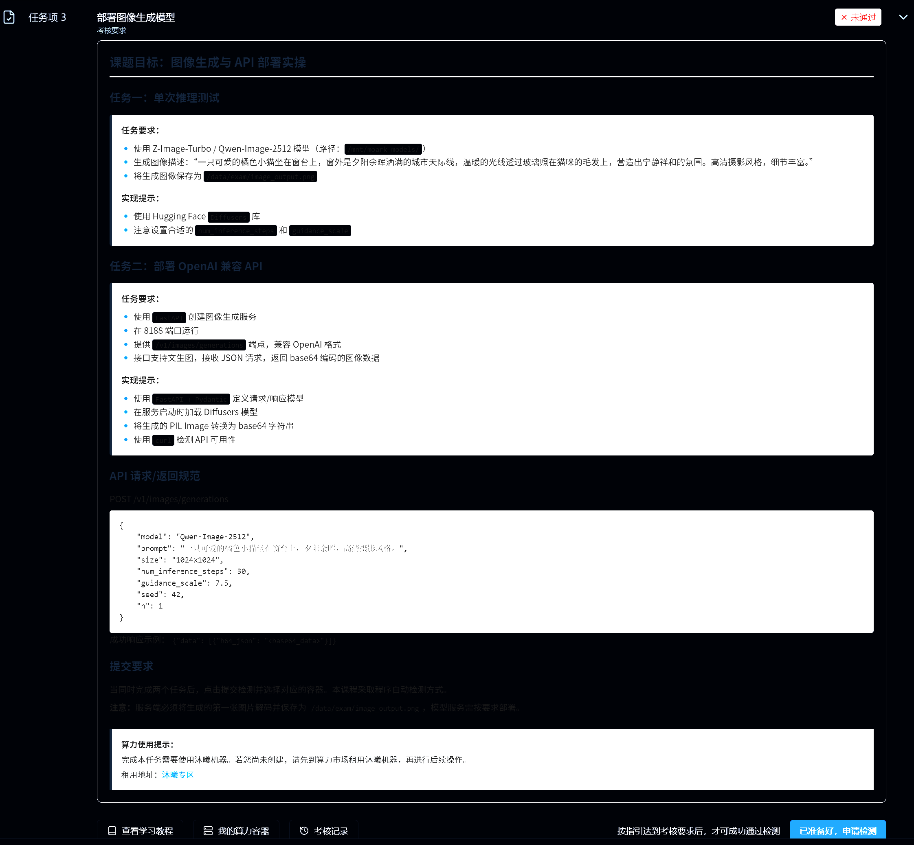
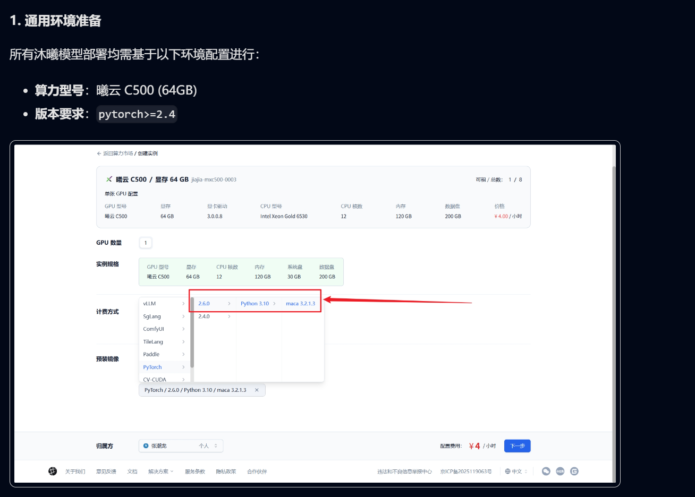
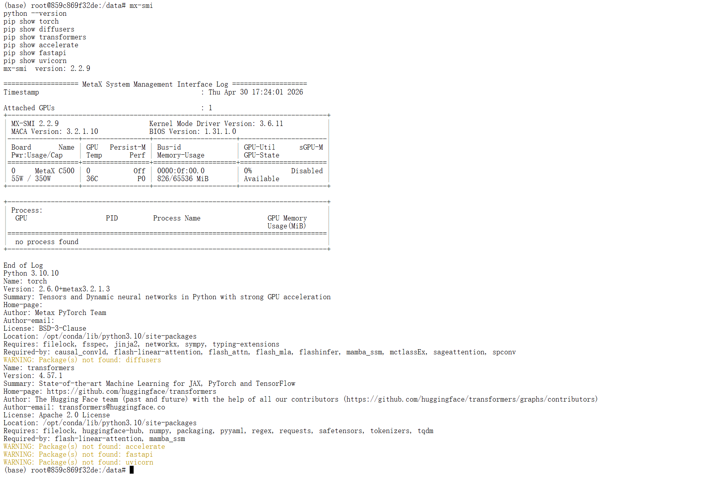
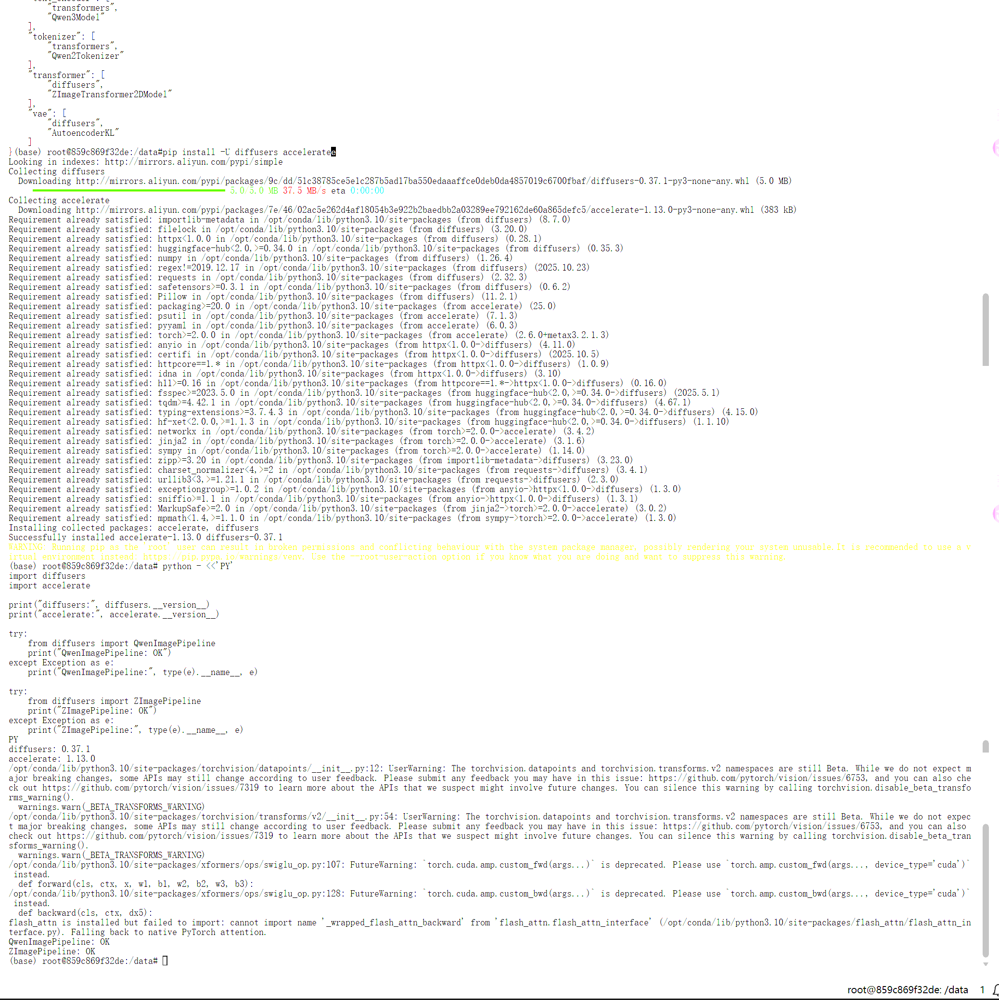
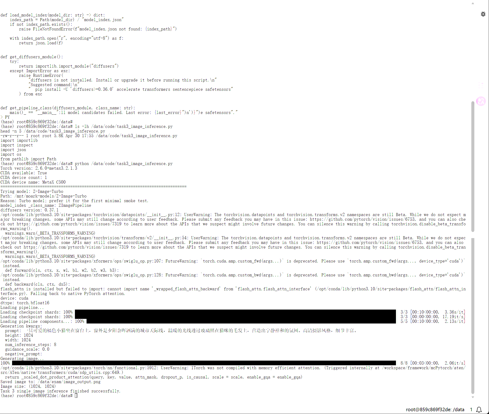
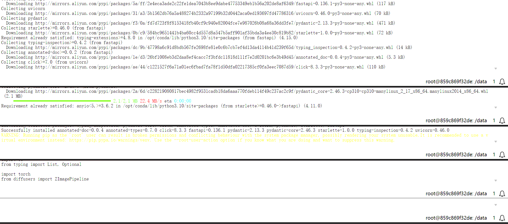
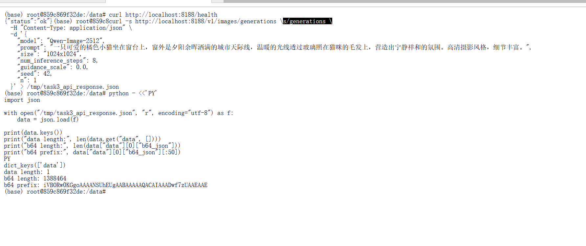
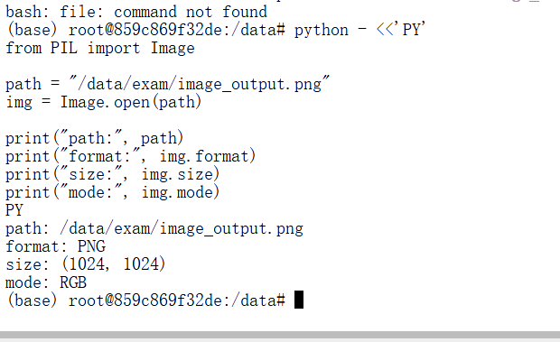
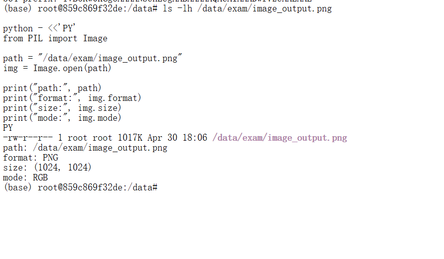

# 06｜任务 3：部署图像生成模型

本文记录模力方舟 L1 认证任务 3 的完整实验过程。目标不是只保留最终成功命令，而是把环境检查、模型选择、单次推理、API 封装、curl 测试、输出检查和排错过程都整理出来，方便后续同学复现。

## 1. 任务目标

任务名称：

```text
部署图像生成模型
```

本任务需要使用本地图像生成模型完成一次图片生成，并部署一个 OpenAI 兼容风格的 FastAPI 服务。

最终完成结果：

| 项目 | 内容 |
|---|---|
| 使用模型 | `Z-Image-Turbo` |
| 模型路径 | `/mnt/moark-models/Z-Image-Turbo` |
| pipeline | `ZImagePipeline` |
| pipeline 判断依据 | `model_index.json` 中 `_class_name` 为 `ZImagePipeline` |
| 输出文件 | `/data/exam/image_output.png` |
| API 端口 | `8188` |
| API 接口 | `/v1/images/generations` |
| API 返回格式 | `{"data": [{"b64_json": "..."}]}` |
| 平台检测 | 已通过 |

任务详情截图：



## 2. 任务要求整理

根据任务页面和实际检测要求，本任务可以拆成下面几步：

1. 检查图像生成相关依赖，重点是 `diffusers` 和 `accelerate`。
2. 检查模型路径 `/mnt/moark-models/Z-Image-Turbo` 是否存在。
3. 根据模型目录中的 `model_index.json` 判断应该使用的 pipeline。
4. 先完成单次推理，生成 `/data/exam/image_output.png`。
5. 检查生成图片是否为有效 PNG 图片。
6. 使用 FastAPI 封装 `/v1/images/generations` 接口。
7. 使用 `curl` 调用接口并确认返回 `b64_json`。
8. API 调用后保存第一张生成图片到 `/data/exam/image_output.png`。
9. 保持服务运行，回到认证平台申请检测。

本任务中使用的提示词主题是：

```text
橘色小猫坐在窗台上，夕阳城市天际线，高清摄影风格
```

参考学习材料截图：



## 3. 环境与模型路径检查

图像生成模型依赖 `diffusers`，同时还需要 `accelerate`、`transformers`、`sentencepiece`、`safetensors` 等包配合运行。初始环境中依赖不完整，所以先做包检查和安装。

示例检查命令：

```bash
python -c "import torch; print(torch.cuda.is_available())"
python -c "import diffusers; print(diffusers.__version__)"
pip list | grep -E "diffusers|accelerate|transformers|torch"
```

包检查截图：



安装或升级依赖截图：



模型路径检查：

```bash
ls -lah /mnt/moark-models/Z-Image-Turbo
cat /mnt/moark-models/Z-Image-Turbo/model_index.json
```

模型路径检查截图：


关键结论：

```text
_class_name = ZImagePipeline
```

所以最终不能随便猜 pipeline，而是应该使用：

```python
from diffusers import ZImagePipeline
```

## 4. 单次推理代码

单次推理脚本：

```text
code/task3_image_inference.py
```

脚本核心逻辑如下：

```python
MODEL_CANDIDATES = [
    {
        "name": "Z-Image-Turbo",
        "path": "/mnt/moark-models/Z-Image-Turbo",
        "reason": "Turbo model; prefer it for the first minimal smoke test.",
        "steps": 8,
        "guidance_scale": 0.0,
    },
]

EXPECTED_PIPELINES = {
    "QwenImagePipeline",
    "ZImagePipeline",
}
```

脚本会读取模型目录下的 `model_index.json`：

```python
def load_model_index(model_dir: str) -> dict:
    index_path = Path(model_dir) / "model_index.json"
    if not index_path.exists():
        raise FileNotFoundError(f"model_index.json not found: {index_path}")

    with index_path.open("r", encoding="utf-8") as f:
        return json.load(f)
```

再根据 `_class_name` 从 diffusers 中取出对应 pipeline：

```python
def get_pipeline_class(diffusers_module, class_name: str):
    if class_name not in EXPECTED_PIPELINES:
        raise RuntimeError(
            f"Unsupported or unexpected pipeline class in model_index.json: {class_name!r}."
        )

    if not hasattr(diffusers_module, class_name):
        installed = getattr(diffusers_module, "__version__", "unknown")
        raise RuntimeError(
            f"Installed diffusers does not export {class_name}.\n"
            f"Installed diffusers version: {installed}"
        )

    return getattr(diffusers_module, class_name)
```

最终保存输出：

```python
OUTPUT_PATH = "/data/exam/image_output.png"
image.save(OUTPUT_PATH)
```

单次推理示例命令：

```bash
python code/task3_image_inference.py
```

## 5. 单次推理结果

单次推理已经成功生成 PNG 图片：

```text
/data/exam/image_output.png
```

推理输出截图：



生成图片结果：

| 项目 | 结果 |
|---|---|
| 文件路径 | `/data/exam/image_output.png` |
| 图片格式 | PNG |
| 图片尺寸 | `1024x1024` |
| 图片模式 | RGB |

## 6. API 服务代码

FastAPI 服务脚本：

```text
code/task3_image_server.py
```

服务端核心配置：

```python
MODEL_PATH = "/mnt/moark-models/Z-Image-Turbo"
OUTPUT_PATH = "/data/exam/image_output.png"

app = FastAPI(title="Task 3 Image Generation API")
```

启动时加载模型：

```python
@app.on_event("startup")
def load_model():
    global pipe

    os.makedirs("/data/exam", exist_ok=True)

    pipe = ZImagePipeline.from_pretrained(
        MODEL_PATH,
        torch_dtype=torch.bfloat16,
    )
    pipe = pipe.to("cuda")
```

接口路径：

```python
@app.post("/v1/images/generations", response_model=ImageGenerationResponse)
def generate_image(req: ImageGenerationRequest):
```

接口返回结构：

```python
class ImageData(BaseModel):
    b64_json: str

class ImageGenerationResponse(BaseModel):
    data: List[ImageData]
```

API 调用后会把第一张图片保存到任务要求路径：

```python
if i == 0:
    os.makedirs(os.path.dirname(OUTPUT_PATH), exist_ok=True)
    image.save(OUTPUT_PATH)
```

服务启动方式：

```bash
python code/task3_image_server.py
```

服务监听：

```text
0.0.0.0:8188
```

服务启动截图：



## 7. curl 测试

接口：

```text
POST http://127.0.0.1:8188/v1/images/generations
```

示例请求：

```bash
curl -X POST "http://127.0.0.1:8188/v1/images/generations" \
  -H "Content-Type: application/json" \
  -d '{
    "model": "Z-Image-Turbo",
    "prompt": "一只可爱的橘色小猫坐在窗台上，窗外是夕阳余晖洒满的城市天际线，温暖的光线透过玻璃照在猫咪的毛发上，高清摄影风格，细节丰富。",
    "size": "1024x1024",
    "num_inference_steps": 8,
    "guidance_scale": 0.0,
    "seed": 42,
    "n": 1
  }'
```

预期返回结构：

```json
{
  "data": [
    {
      "b64_json": "..."
    }
  ]
}
```

说明：实际 curl 响应没有保存为文本日志，所以这里只写请求示例和返回结构，不补写完整响应正文。

curl 测试截图：



## 8. 输出文件检查

任务要求输出文件：

```text
/data/exam/image_output.png
```

一开始想用 `file /data/exam/image_output.png` 检查图片类型，但当前环境里没有 `file` 命令。后续改用 Python PIL 检查图片格式、尺寸和模式。

示例检查方式：

```python
from PIL import Image

img = Image.open("/data/exam/image_output.png")
print(img.format, img.size, img.mode)
```

单次推理输出检查截图：



API 调用后的输出检查截图：



## 9. 检测通过结果

完成单次推理、API 服务启动、curl 测试和输出文件检查后，在认证平台申请检测。

检测结果：

```text
任务 3 已通过
```

平台检测通过截图：


## 10. 遇到的问题与解决方案

### 10.1 初始环境缺少 diffusers / accelerate

| 项目 | 内容 |
|---|---|
| 发生阶段 | 环境检查和单次推理前 |
| 现象 / 报错 | 图像生成相关依赖不完整，不能直接进入稳定推理流程 |
| 原因判断 | `Z-Image-Turbo` 需要通过 diffusers pipeline 加载，依赖缺失会影响模型加载 |
| 解决方法 | 安装或升级 `diffusers`、`accelerate`、`transformers`、`sentencepiece`、`safetensors` |
| 对应截图或文件 | `assets/06-task3-package-check.png`、`assets/06-install-diffusers-accelerate.png` |

### 10.2 需要根据 model_index.json 确认 pipeline

| 项目 | 内容 |
|---|---|
| 发生阶段 | 模型加载方式确认 |
| 现象 / 报错 | 不能只按模型名称猜 pipeline |
| 原因判断 | 本地模型目录中的 `model_index.json` 记录了 `_class_name` |
| 解决方法 | 读取 `model_index.json`，确认 `_class_name` 为 `ZImagePipeline` |
| 对应截图或文件 | `assets/06-image-model-path-check.png`、`code/task3_image_inference.py` |

### 10.3 Vim 编辑时出现 `.swp` 文件

| 项目 | 内容 |
|---|---|
| 发生阶段 | 编辑 `task3_image_inference.py` |
| 现象 / 报错 | Vim 提示存在 `.swp` 交换文件 |
| 原因判断 | 旧 Vim 进程或上次异常退出留下了 swap 文件 |
| 解决方法 | 先清理旧 Vim 进程，再确认并删除旧 swap 文件 |
| 对应截图或文件 | 当时未截图，仅保留文字复盘；相关文件：`code/task3_image_inference.py` |

### 10.4 `file` 命令不存在

| 项目 | 内容 |
|---|---|
| 发生阶段 | 生成图片后的文件检查 |
| 现象 / 报错 | 环境中没有 `file` 命令 |
| 原因判断 | 当前镜像没有安装该系统工具 |
| 解决方法 | 改用 PIL 检查图片格式、尺寸和模式 |
| 对应截图或文件 | `assets/06-image-output-file-check.png`、`assets/06-fastapi-image-output-check.png` |

### 10.5 本地仓库后来缺少 `task3_image_server.py`

| 项目 | 内容 |
|---|---|
| 发生阶段 | 本地仓库复核 |
| 现象 / 报错 | 任务 3 已通过，但本地仓库曾缺少 FastAPI 服务脚本 |
| 原因判断 | 云端实验环境和本地仓库文件不同步 |
| 解决方法 | 补回 `code/task3_image_server.py` |
| 对应截图或文件 | 当时未截图，仅保留文字复盘；相关文件：`code/task3_image_server.py` |

### 10.6 pyc 缓存曾被 Git 跟踪

| 项目 | 内容 |
|---|---|
| 发生阶段 | Git 清理 |
| 现象 / 报错 | `task3_image_inference.cpython-314.pyc` 这类 Python 字节码缓存曾进入版本控制 |
| 原因判断 | `.gitignore` 初始没有及时忽略 Python 缓存 |
| 解决方法 | 增加 `.gitignore` 规则，并用 `git rm --cached` 清理已跟踪缓存文件 |
| 对应截图或文件 | 当时未截图，仅保留文字复盘；相关文件：`.gitignore` |

## 11. 截图记录

| 截图 | 说明 |
|---|---|
| `assets/06-task3-detail.png` | 任务 3 详情 |
| `assets/06-task3-learning-guide-diffusers.png` | diffusers 学习材料 |
| `assets/06-task3-package-check.png` | 依赖包检查 |
| `assets/06-image-model-path-check.png` | 模型路径和配置检查 |
| `assets/06-install-diffusers-accelerate.png` | 安装 diffusers / accelerate |
| `assets/06-image-inference-output.png` | 单次推理输出 |
| `assets/06-image-output-file-check.png` | 单次推理图片检查 |
| `assets/06-fastapi-server-start.png` | FastAPI 服务启动 |
| `assets/06-fastapi-curl-test.png` | curl 接口测试 |
| `assets/06-fastapi-image-output-check.png` | API 调用后图片检查 |
| `assets/06-task3-pass.png` | 平台检测通过 |
| 无截图记录 | Vim `.swp` 问题 |
| 无截图记录 | 本地仓库缺少 `task3_image_server.py` |
| 无截图记录 | pyc 缓存清理过程 |

## 12. 复现检查清单

| 检查项 | 应满足的结果 |
|---|---|
| 模型目录存在 | `/mnt/moark-models/Z-Image-Turbo` |
| `model_index.json` 可读取 | `_class_name` 为 `ZImagePipeline` |
| 依赖可导入 | `diffusers`、`accelerate`、`torch` 可用 |
| 单次推理脚本存在 | `code/task3_image_inference.py` |
| 服务脚本存在 | `code/task3_image_server.py` |
| 单次推理输出 | `/data/exam/image_output.png` |
| 图片格式 | PNG |
| 图片尺寸 | `1024x1024` |
| 图片模式 | RGB |
| 服务端口 | `8188` |
| 服务接口 | `/v1/images/generations` |
| curl 返回 | 包含 `data[0].b64_json` |
| 平台检测 | 任务 3 通过 |

## 13. 本任务小结

任务 3 最终使用 `/mnt/moark-models/Z-Image-Turbo` 中的本地模型完成图像生成。通过读取 `model_index.json`，确认该模型需要使用 `ZImagePipeline`。实验流程先跑通单次推理，再封装 FastAPI 服务，避免把模型加载问题和接口问题混在一起排查。

最终生成了 `/data/exam/image_output.png`，图片为 PNG、`1024x1024`、RGB。FastAPI 服务运行在 `8188` 端口，接口为 `/v1/images/generations`，curl 调用后返回 `b64_json`，并保存第一张图片到任务要求路径。认证平台检测结果为任务 3 通过。
