# 07｜任务 4：部署语音识别模型

本文记录模力方舟 L1 认证任务 4 的完整实验过程。文档保留了失败尝试、模型配置判断、依赖安装、单次推理、FastAPI 封装、curl 测试和平台检测结果，方便后续同学复现和排错。

## 1. 任务目标

任务名称：

```text
部署语音识别模型
```

本任务需要使用本地 ASR 模型识别一段音频，并部署一个接收 `multipart/form-data` 上传音频的 FastAPI 服务。

最终完成结果：

| 项目 | 内容 |
|---|---|
| 使用模型 | `Qwen3-ASR-1.7B` |
| 模型路径 | `/mnt/moark-models/Qwen3-ASR-1.7B` |
| 测试音频 | `/mnt/moark-models/L1_exam/asr_demo.wav` |
| 推理包 | `qwen-asr` |
| 模型类 | `Qwen3ASRModel` |
| 输出文件 | `/data/exam/asr_output.txt` |
| API 端口 | `8188` |
| API 接口 | `/v1/audio/transcriptions` |
| 上传方式 | `multipart/form-data` |
| 文件字段 | `file` |
| API 返回格式 | `{"text": "..."}` |
| 平台检测 | 已通过 |

任务详情截图：

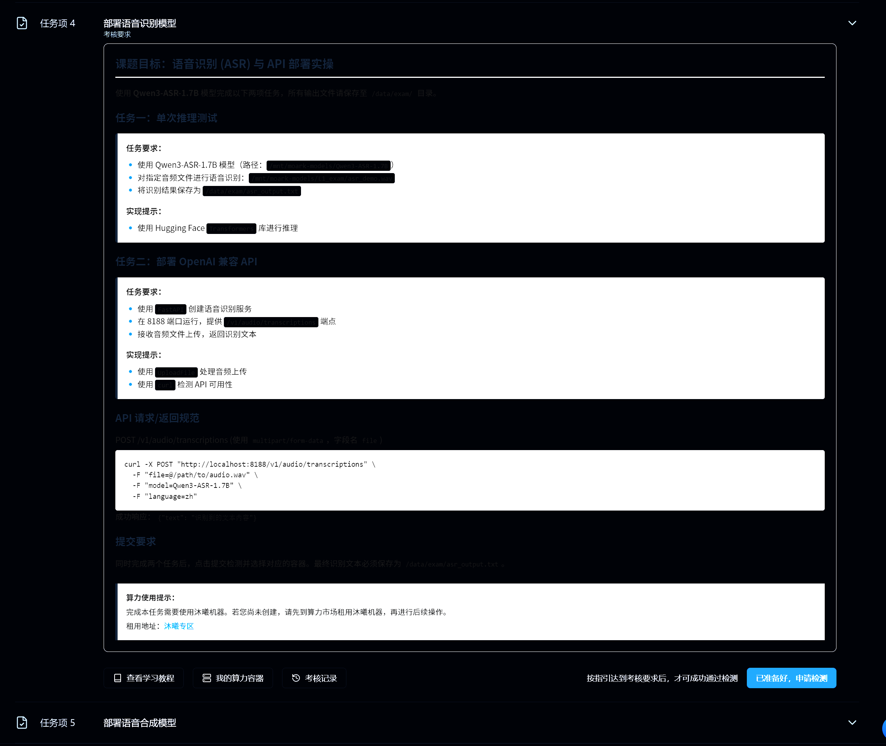

## 2. 任务要求整理

根据任务页面和实际检测要求，本任务可以拆成下面几步：

1. 检查 ASR 模型路径和测试音频路径。
2. 检查并安装 ASR 推理、音频处理和 FastAPI 上传所需依赖。
3. 尝试加载模型，记录失败路径。
4. 发现 Transformers 自动类不识别 `qwen3_asr` 后，检查 `config.json`。
5. 查看 README，改用 `qwen-asr` 包和 `Qwen3ASRModel`。
6. 先完成单次音频识别，生成 `/data/exam/asr_output.txt`。
7. 使用 FastAPI 封装 `/v1/audio/transcriptions` 接口。
8. 使用 `curl` 以 `multipart/form-data` 上传音频测试接口。
9. API 调用后保存识别结果到 `/data/exam/asr_output.txt`。
10. 保持服务运行，回到认证平台申请检测。

## 3. 环境与模型路径检查

本任务需要同时确认模型路径和测试音频路径：

```text
/mnt/moark-models/Qwen3-ASR-1.7B
/mnt/moark-models/L1_exam/asr_demo.wav
```

路径检查截图：

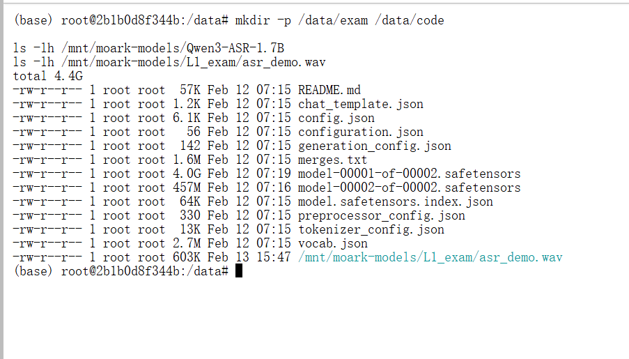

依赖检查示例：

```bash
python -c "import torch; print(torch.cuda.is_available())"
pip list | grep -E "accelerate|librosa|soundfile|fastapi|uvicorn|python-multipart|qwen"
```

包检查截图：

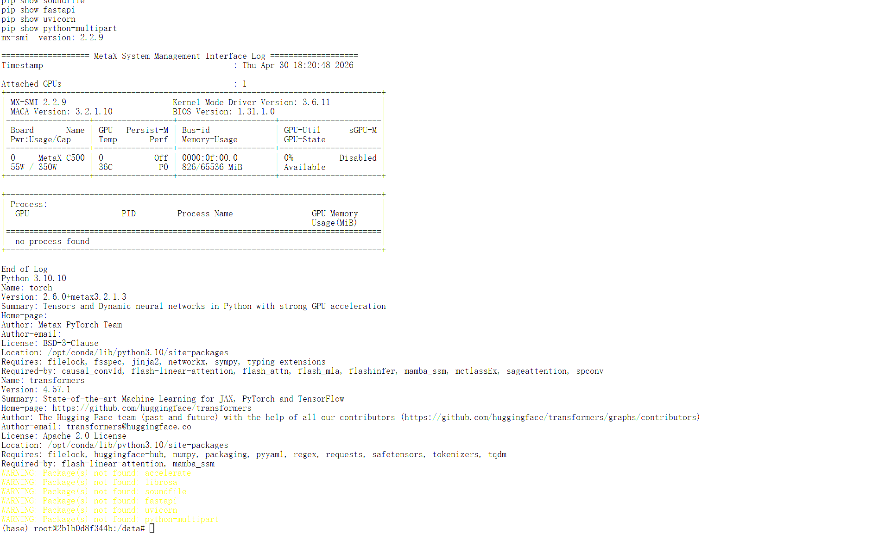

基础依赖安装截图：

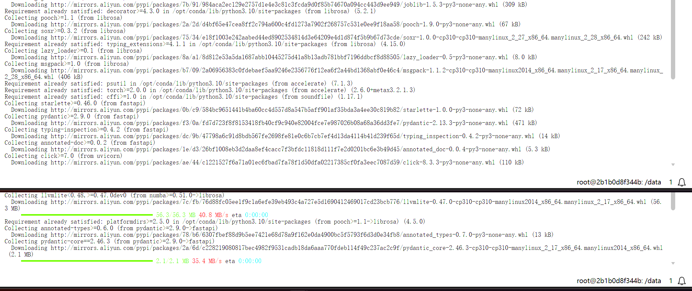

安装 `qwen-asr`：

```bash
pip install -U qwen-asr
```

安装截图：

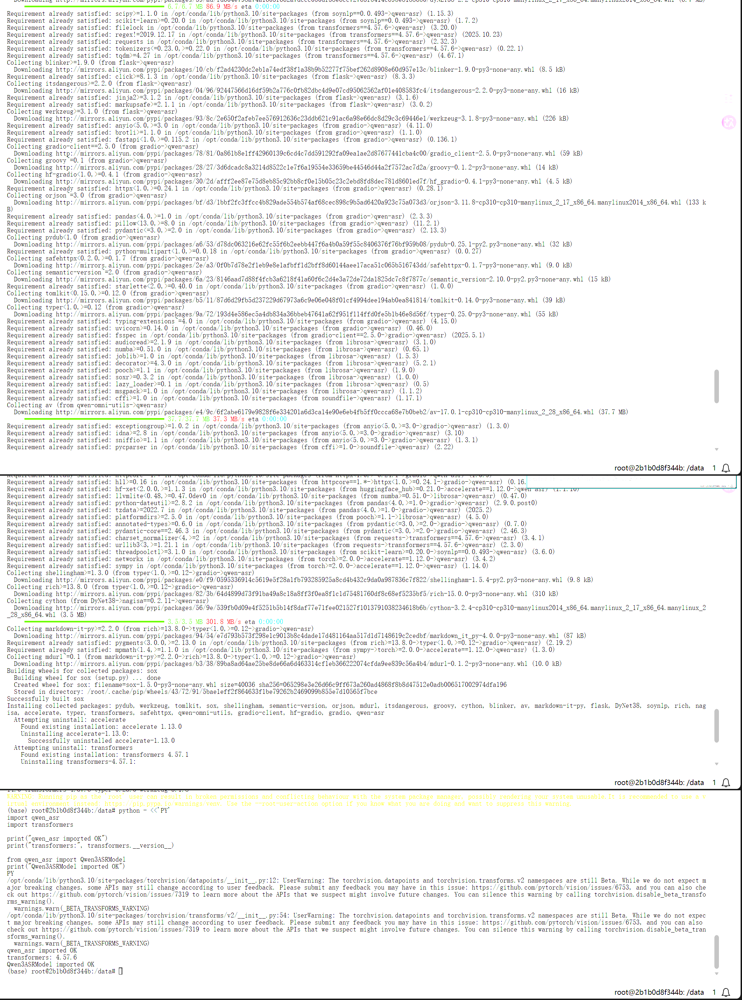

模型配置检查中确认：

| 配置项 | 值 |
|---|---|
| `model_type` | `qwen3_asr` |
| `architectures` | `Qwen3ASRForConditionalGeneration` |
| `auto_map` | None |

这个配置说明单纯加 `trust_remote_code=True` 不能让 Transformers 自动识别该模型，后续需要改用 `qwen-asr` 包。

## 4. 单次推理代码

单次推理脚本：

```text
code/task4_asr_inference.py
```

脚本核心配置：

```python
MODEL_PATH = "/mnt/moark-models/Qwen3-ASR-1.7B"
AUDIO_PATH = "/mnt/moark-models/L1_exam/asr_demo.wav"
OUTPUT_PATH = "/data/exam/asr_output.txt"
```

正确的模型加载方式：

```python
from qwen_asr import Qwen3ASRModel

model = Qwen3ASRModel.from_pretrained(
    MODEL_PATH,
    torch_dtype=torch.bfloat16,
    low_cpu_mem_usage=True,
    use_safetensors=True,
)
```

注意：这里不能传 `backend="transformers"`，否则会出现 unexpected keyword argument `backend`。

正确的语言参数：

```python
result = model.transcribe(
    AUDIO_PATH,
    language="Chinese",
)
```

注意：`language="zh"` 不被支持，单次推理中需要传 `language="Chinese"`。

输出保存：

```python
with open(OUTPUT_PATH, "w", encoding="utf-8") as f:
    f.write(text)
```

单次推理示例命令：

```bash
python code/task4_asr_inference.py
```

## 5. 单次推理结果

单次推理已经成功识别测试音频，并保存结果到：

```text
/data/exam/asr_output.txt
```

推理输出截图：

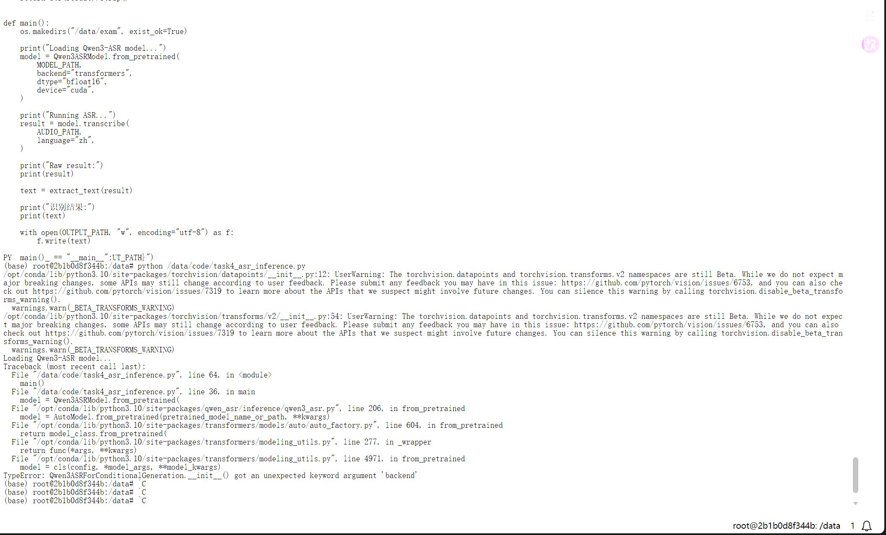

输出文件检查截图：

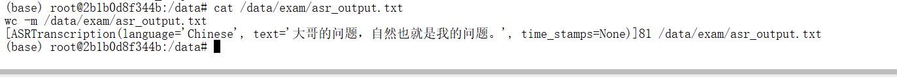

说明：识别文本内容以截图和 `/data/exam/asr_output.txt` 为准，仓库中没有单独保存完整命令文本日志。

## 6. API 服务代码

FastAPI 服务脚本：

```text
code/task4_asr_server.py
```

服务端核心配置：

```python
MODEL_PATH = "/mnt/moark-models/Qwen3-ASR-1.7B"
OUTPUT_PATH = "/data/exam/asr_output.txt"

app = FastAPI(title="Task 4 ASR API")
```

启动时加载模型：

```python
@app.on_event("startup")
def load_model():
    global model

    os.makedirs("/data/exam", exist_ok=True)

    model = Qwen3ASRModel.from_pretrained(
        MODEL_PATH,
        torch_dtype=torch.bfloat16,
        low_cpu_mem_usage=True,
        use_safetensors=True,
    )
```

语言参数归一化：

```python
def normalize_language(language: Optional[str]) -> str:
    if not language:
        return "Chinese"

    mapping = {
        "zh": "Chinese",
        "zh-cn": "Chinese",
        "cn": "Chinese",
        "chinese": "Chinese",
        "en": "English",
        "english": "English",
    }

    return mapping.get(language.strip().lower(), language.strip())
```

接口路径和上传字段：

```python
@app.post("/v1/audio/transcriptions")
async def transcribe_audio(
    file: UploadFile = File(...),
    model_name: Optional[str] = Form(default="Qwen3-ASR-1.7B", alias="model"),
    language: Optional[str] = Form(default="zh"),
):
```

API 调用后会把识别文本保存到任务要求路径：

```python
with open(OUTPUT_PATH, "w", encoding="utf-8") as f:
    f.write(text)
```

服务启动方式：

```bash
python code/task4_asr_server.py
```

服务监听：

```text
0.0.0.0:8188
```

服务启动截图：

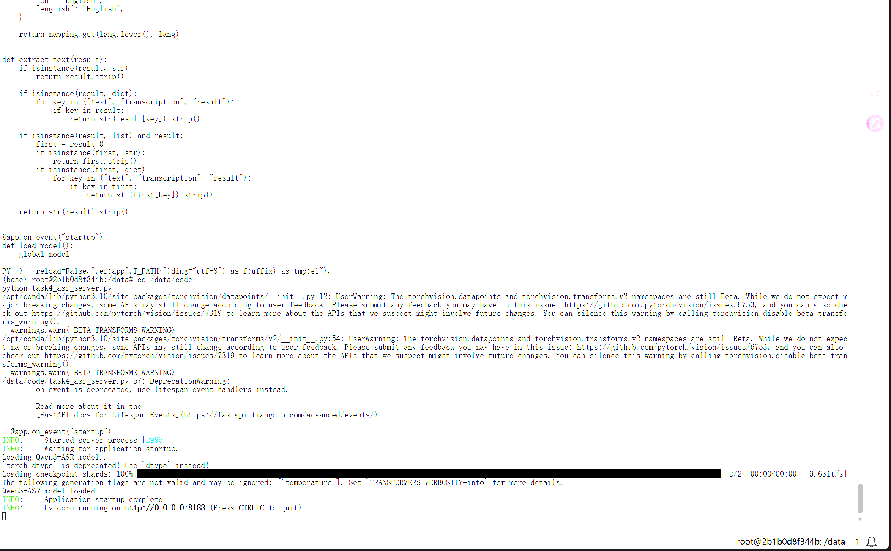

## 7. curl 测试

接口：

```text
POST http://127.0.0.1:8188/v1/audio/transcriptions
```

上传方式：

```text
multipart/form-data
```

字段：

| 字段 | 是否必填 | 说明 |
|---|---|---|
| `file` | 是 | 上传音频文件 |
| `model` | 否 | 默认 `Qwen3-ASR-1.7B` |
| `language` | 否 | 默认 `zh`，服务内部归一化为 `Chinese` |

示例请求：

```bash
curl -X POST "http://127.0.0.1:8188/v1/audio/transcriptions" \
  -F "file=@/mnt/moark-models/L1_exam/asr_demo.wav" \
  -F "model=Qwen3-ASR-1.7B" \
  -F "language=zh"
```

预期返回结构：

```json
{
  "text": "..."
}
```

说明：实际 curl 响应没有保存为文本日志，所以这里只写请求示例和返回结构，不补写完整识别文本。

curl 测试截图：

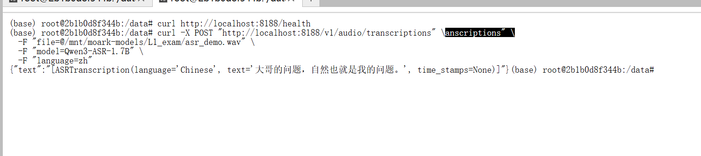

## 8. 输出文件检查

任务要求输出文件：

```text
/data/exam/asr_output.txt
```

API 调用后，服务会把识别结果写入该文件。

输出文件检查截图：

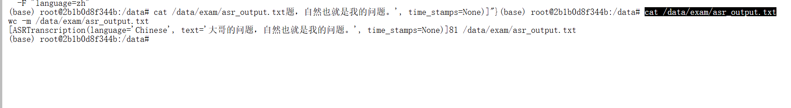

## 9. 检测通过结果

完成单次推理、API 服务启动、curl 测试和输出文件检查后，在认证平台申请检测。

检测结果：

```text
任务 4 已通过
```

平台检测通过截图：


## 10. 遇到的问题与解决方案

### 10.1 初始环境缺少 ASR 相关依赖

| 项目 | 内容 |
|---|---|
| 发生阶段 | 环境检查和服务封装前 |
| 现象 / 报错 | 缺少 `accelerate`、`librosa`、`soundfile`、`fastapi`、`uvicorn`、`python-multipart` 等依赖 |
| 原因判断 | ASR 推理需要音频处理依赖，FastAPI 接收 `multipart/form-data` 需要 `python-multipart` |
| 解决方法 | 安装基础依赖后再安装 `qwen-asr` |
| 对应截图或文件 | `assets/07-task4-install-deps.png`、`assets/07-task4-package-check.png` |

### 10.2 使用 Whisper 示例加载失败

| 项目 | 内容 |
|---|---|
| 发生阶段 | 第一次尝试加载 ASR 模型 |
| 现象 / 报错 | 参考 Whisper 示例使用 `AutoModelForSpeechSeq2Seq`，Transformers 不识别 `qwen3_asr` |
| 原因判断 | Qwen3-ASR 不是普通 Whisper 架构 |
| 解决方法 | 停止套用 Whisper 示例，检查 `config.json` 和 README |
| 对应截图或文件 | `assets/11-task4-transformers-qwen3-asr-unsupported.png` |

截图：

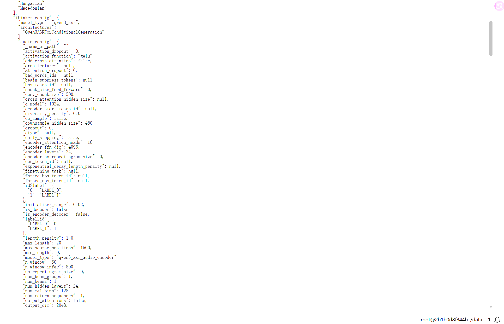

### 10.3 `trust_remote_code=True` 不能解决

| 项目 | 内容 |
|---|---|
| 发生阶段 | 模型配置检查 |
| 现象 / 报错 | `config.json` 中 `model_type` 为 `qwen3_asr`，`architectures` 为 `Qwen3ASRForConditionalGeneration`，但 `auto_map` 为 None |
| 原因判断 | 没有 `auto_map` 时，Transformers 自动类没有可用的 remote code 映射 |
| 解决方法 | 改按 README 使用 `qwen-asr` 包 |
| 对应截图或文件 | `assets/07-asr-model-audio-path-check.png` |

### 10.4 改用 qwen-asr 包

| 项目 | 内容 |
|---|---|
| 发生阶段 | 加载方案切换 |
| 现象 / 报错 | Transformers 自动类路径不适合该模型 |
| 原因判断 | README 指向 `qwen-asr` 和 `Qwen3ASRModel` |
| 解决方法 | 执行 `pip install -U qwen-asr`，脚本中使用 `from qwen_asr import Qwen3ASRModel` |
| 对应截图或文件 | `assets/07-task4-install-qwen-asr.png`、`code/task4_asr_inference.py` |

### 10.5 `backend="transformers"` 参数错误

| 项目 | 内容 |
|---|---|
| 发生阶段 | 第一次使用 `Qwen3ASRModel.from_pretrained()` |
| 现象 / 报错 | 传 `backend="transformers"` 导致 unexpected keyword argument `backend` |
| 原因判断 | 当前 `qwen-asr` 的 `from_pretrained()` 不接受该参数 |
| 解决方法 | 移除 `backend` 参数，保留 `torch_dtype=torch.bfloat16`、`low_cpu_mem_usage=True`、`use_safetensors=True` |
| 对应截图或文件 | `assets/11-task4-qwen-asr-backend-arg-error.png` |

截图：

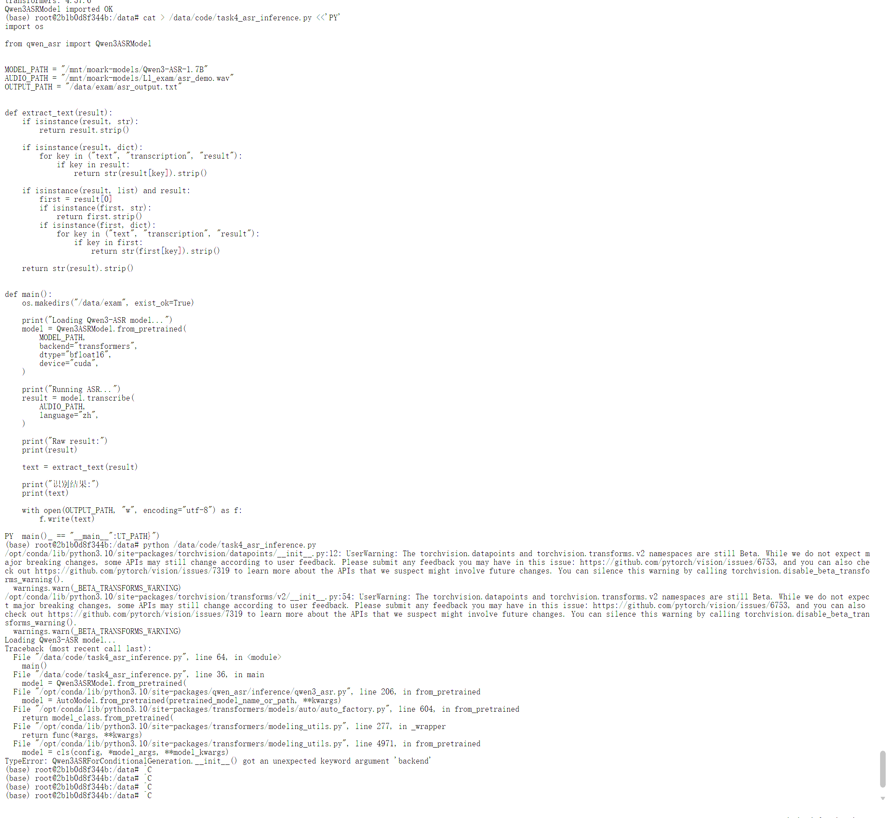

### 10.6 `language="zh"` 不被支持

| 项目 | 内容 |
|---|---|
| 发生阶段 | 模型加载成功后的转写调用 |
| 现象 / 报错 | `language="zh"` 不被支持 |
| 原因判断 | `qwen-asr` 需要完整语言名称 |
| 解决方法 | 单次推理使用 `language="Chinese"`；API 服务允许传 `zh`，但服务内部归一化为 `Chinese` |
| 对应截图或文件 | 当时未截图，已在错误记录中保留文字复盘；相关文件：`code/task4_asr_inference.py`、`code/task4_asr_server.py` |

### 10.7 heredoc 粘贴脚本结尾污染

| 项目 | 内容 |
|---|---|
| 发生阶段 | 脚本编辑 |
| 现象 / 报错 | 使用 heredoc 粘贴脚本时，结尾可能混入多余文本 |
| 原因判断 | 多行终端粘贴容易受到结束符或复制范围影响 |
| 解决方法 | 后续改用 Python `Path.write_text()` 或重新覆盖脚本 |
| 对应截图或文件 | 当时未截图，已在错误记录中保留文字复盘；相关文件：`code/task4_asr_inference.py`、`code/task4_asr_server.py` |

### 10.8 本地仓库后来缺少 Task 4 脚本

| 项目 | 内容 |
|---|---|
| 发生阶段 | 本地仓库复核 |
| 现象 / 报错 | 任务 4 已通过，但本地仓库曾缺少推理脚本和服务脚本 |
| 原因判断 | 云端实验环境和本地仓库文件不同步 |
| 解决方法 | 补回 `code/task4_asr_inference.py` 和 `code/task4_asr_server.py` |
| 对应截图或文件 | 当时未截图，已在错误记录中保留文字复盘；相关文件：`code/task4_asr_inference.py`、`code/task4_asr_server.py` |

## 11. 截图记录

| 截图 | 说明 |
|---|---|
| `assets/07-task4-detail.png` | 任务 4 详情 |
| `assets/07-asr-model-audio-path-check.png` | ASR 模型和音频路径检查 |
| `assets/07-task4-package-check.png` | 包检查 |
| `assets/07-task4-install-deps.png` | 安装基础依赖 |
| `assets/07-task4-install-qwen-asr.png` | 安装 qwen-asr |
| `assets/07-asr-inference-output.png` | 单次推理输出 |
| `assets/07-asr-output-file-check.png` | 单次推理输出文件检查 |
| `assets/07-fastapi-asr-server-start.png` | FastAPI 服务启动 |
| `assets/07-fastapi-asr-curl-test.png` | curl 接口测试 |
| `assets/07-fastapi-asr-output-file-check.png` | API 调用后输出文件检查 |
| `assets/07-task4-pass.png` | 平台检测通过 |
| `assets/11-task4-transformers-qwen3-asr-unsupported.png` | Transformers 不识别 qwen3_asr |
| `assets/11-task4-qwen-asr-backend-arg-error.png` | qwen-asr backend 参数错误 |
| 无截图记录 | `language="zh"` 不被支持 |
| 无截图记录 | heredoc 粘贴脚本结尾污染 |
| 无截图记录 | 本地仓库缺少 Task 4 脚本 |

## 12. 复现检查清单

| 检查项 | 应满足的结果 |
|---|---|
| 模型目录存在 | `/mnt/moark-models/Qwen3-ASR-1.7B` |
| 测试音频存在 | `/mnt/moark-models/L1_exam/asr_demo.wav` |
| 依赖可导入 | `torch`、`qwen_asr`、`fastapi`、`uvicorn` 可用 |
| 上传依赖可用 | `python-multipart` 已安装 |
| 单次推理脚本存在 | `code/task4_asr_inference.py` |
| 服务脚本存在 | `code/task4_asr_server.py` |
| 模型加载方式 | `Qwen3ASRModel.from_pretrained()` |
| `from_pretrained` 参数 | 不传 `backend` |
| 单次推理语言参数 | `language="Chinese"` |
| API 入参语言 | 可传 `language=zh`，服务内归一化为 `Chinese` |
| 单次推理输出 | `/data/exam/asr_output.txt` |
| 服务端口 | `8188` |
| 服务接口 | `/v1/audio/transcriptions` |
| 上传字段 | `file` |
| curl 返回 | 包含 `text` |
| 平台检测 | 任务 4 通过 |

## 13. 本任务小结

任务 4 最终使用 `/mnt/moark-models/Qwen3-ASR-1.7B` 中的本地模型完成语音识别。最开始参考 Whisper 示例使用 `AutoModelForSpeechSeq2Seq` 失败，排查 `config.json` 后确认 Transformers 自动类不能直接识别 `qwen3_asr`。随后根据 README 改用 `qwen-asr` 包和 `Qwen3ASRModel`。

推理过程中还处理了两个关键参数问题：`from_pretrained()` 不能传 `backend="transformers"`，转写时不能传 `language="zh"`，需要使用 `language="Chinese"`。最终单次推理生成 `/data/exam/asr_output.txt`，FastAPI 服务运行在 `8188` 端口，接口为 `/v1/audio/transcriptions`，支持 `multipart/form-data` 上传音频，并在 API 调用后保存识别结果。认证平台检测结果为任务 4 通过。
