# 08｜任务 5：部署语音合成模型 TTS

本文记录模力方舟 L1 认证任务 5 的完整实验过程。任务 5 的重点是使用 IndexTTS-2 完成语音合成，生成指定输出文件，并部署一个兼容平台检测请求格式的 FastAPI 服务。

## 1. 任务目标

本任务需要完成：

1. 部署语音合成模型；
2. 完成一次本地 TTS 推理；
3. 生成 `/data/exam/tts_output.wav`；
4. 部署 FastAPI 服务；
5. 提供 `/v1/audio/speech` 接口；
6. 同时兼容 `application/json` 和 `multipart/form-data`；
7. 返回包含有效 `b64_json` 字段的 JSON；
8. 通过平台检测。

最终结果：

```text
任务 5 已通过
```

平台检测通过截图：


## 2. 任务要求整理

本次任务使用的模型和路径如下：

| 项目 | 内容 |
|---|---|
| 模型 | `IndexTTS-2` |
| IndexTTS 仓库路径 | `/mnt/moark-models/github/index-tts` |
| 模型目录 | `/mnt/moark-models/IndexTTS-2` |
| 配置文件 | `/mnt/moark-models/github/index-tts/checkpoints/config.yaml` |
| 参考音频 | `/mnt/moark-models/github/index-tts/emo_sad.wav` |
| 单次推理输出 | `/data/exam/tts_output.wav` |
| curl 测试输出 | `/data/exam/tts_curl_output.wav` |
| 服务端口 | `8188` |
| 服务接口 | `/v1/audio/speech` |

任务拆解：

1. 检查模型、仓库、配置文件和参考音频路径；
2. 检查 PyTorch / MetaX 环境；
3. 安装并修复 IndexTTS-2 运行依赖；
4. 完成单次推理；
5. 检查输出 WAV 文件；
6. 封装 FastAPI 服务；
7. 用 JSON 请求测试；
8. 用 multipart/form-data 请求测试；
9. 确认响应中包含 `b64_json`；
10. 提交平台检测。

## 3. 环境与模型路径检查

路径检查截图：

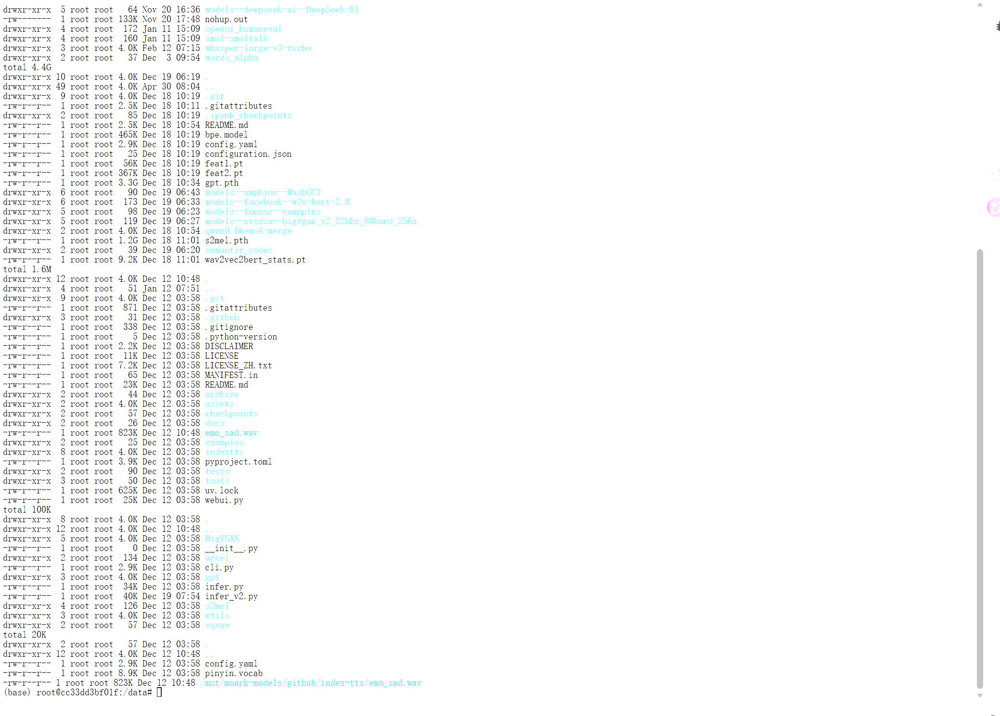

关键环境检查结果：

| 项目 | 结果 |
|---|---|
| torch | `2.6.0+metax3.2.1.3` |
| cuda available | `True` |
| transformers | 最终回退到 `4.52.1` |
| tokenizers | 最终回退到 `0.21.0` |
| accelerate | `1.8.1` |
| IndexTTS2 import | OK |

依赖和 PyTorch 检查截图：

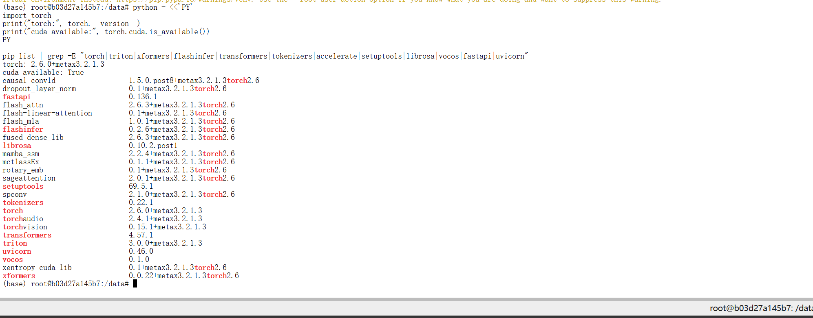

IndexTTS2 import 成功截图：

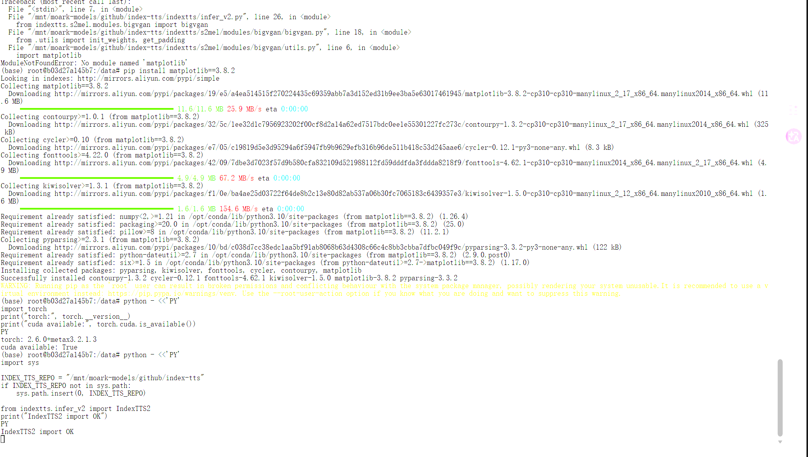

依赖版本修复截图：

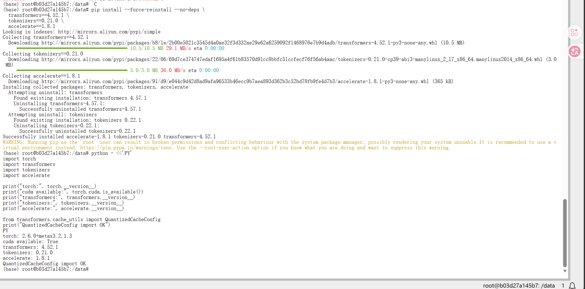

## 4. 单次推理代码

单次推理脚本：

```text
code/task5_tts_inference.py
```

脚本使用真实路径：

```python
INDEX_TTS_REPO = Path("/mnt/moark-models/github/index-tts")
MODEL_DIR = Path("/mnt/moark-models/IndexTTS-2")
CONFIG_PATH = INDEX_TTS_REPO / "checkpoints" / "config.yaml"
REF_AUDIO = INDEX_TTS_REPO / "emo_sad.wav"
OUTPUT_PATH = Path("/data/exam/tts_output.wav")
```

为了避免 `indextts/utils/tagger_cache` 位于 `/mnt/moark-models` 时触发只读文件系统问题，脚本将缓存目录放到 `/tmp`：

```python
os.environ.setdefault("XDG_CACHE_HOME", "/tmp/indextts-cache")
os.environ.setdefault("HF_HOME", "/tmp/indextts-hf-home")
os.environ.setdefault("MPLCONFIGDIR", "/tmp/indextts-matplotlib")
```

模型加载方式：

```python
from indextts.infer_v2 import IndexTTS2

tts = IndexTTS2(
    cfg_path=str(CONFIG_PATH),
    model_dir=str(MODEL_DIR),
    use_fp16=True,
    use_cuda_kernel=False,
    use_deepspeed=False,
)
```

推理输出：

```python
tts.infer(
    spk_audio_prompt=str(REF_AUDIO),
    text=text,
    output_path=str(output_path),
    emo_audio_prompt=str(REF_AUDIO),
    prompt_text=DEFAULT_REF_TEXT,
    verbose=True,
)
```

运行命令：

```bash
python code/task5_tts_inference.py
```

## 5. 单次推理结果

单次推理成功生成：

```text
/data/exam/tts_output.wav
```

推理输出截图：

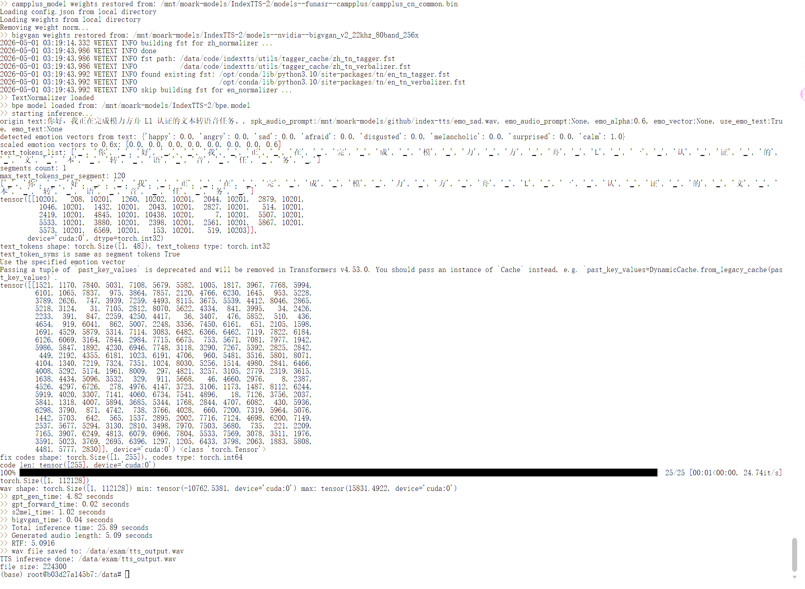

输出 WAV 检查结果：

| 项目 | 结果 |
|---|---|
| channels | `1` |
| sample_width | `2` |
| framerate | `22050` |
| duration | 约 5 秒左右 |

输出文件检查截图：

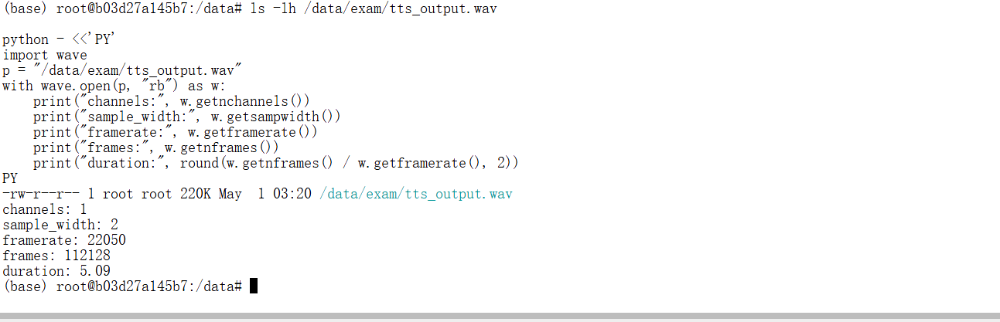

## 6. API 服务代码

FastAPI 服务脚本：

```text
code/task5_tts_server.py
```

服务接口：

```text
GET /
POST /v1/audio/speech
```

健康检查返回：

```json
{
  "status": "ok",
  "model": "IndexTTS-2",
  "output_path": "/data/exam/tts_output.wav"
}
```

平台检测实际会发送 `multipart/form-data`，字段包含：

| 字段 | 说明 |
|---|---|
| `input` | 待合成文本 |
| `model` | 模型名称 |
| `ref_text` | 参考音频文本 |
| `ref_audio` | 参考音频文件 |

服务需要同时兼容：

1. `application/json`
2. `multipart/form-data`

最终响应中同时保留顶层 `b64_json` 和 `data[0].b64_json`，确保平台能检测到有效字段：

```json
{
  "data": [
    {
      "b64_json": "..."
    }
  ],
  "b64_json": "...",
  "path": "/data/exam/tts_output.wav",
  "audio_format": "wav"
}
```

服务启动截图：

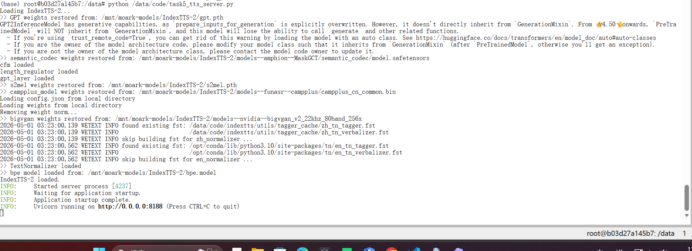

健康检查截图：

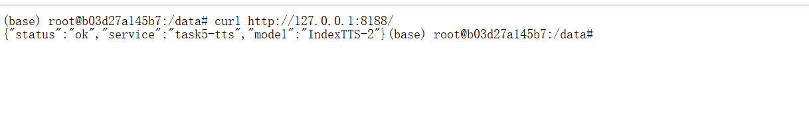

## 7. curl 测试

JSON 请求示例：

```bash
curl -X POST "http://127.0.0.1:8188/v1/audio/speech" \
  -H "Content-Type: application/json" \
  -d '{
    "model": "IndexTTS-2",
    "input": "模力方舟语音合成任务测试。",
    "ref_text": "参考音频用于提供说话人音色和情感。",
    "ref_audio": "/mnt/moark-models/github/index-tts/emo_sad.wav"
  }'
```

multipart/form-data 请求示例：

```bash
curl -X POST "http://127.0.0.1:8188/v1/audio/speech" \
  -F "model=IndexTTS-2" \
  -F "input=模力方舟语音合成任务测试。" \
  -F "ref_text=参考音频用于提供说话人音色和情感。" \
  -F "ref_audio=@/mnt/moark-models/github/index-tts/emo_sad.wav"
```

curl 测试截图：

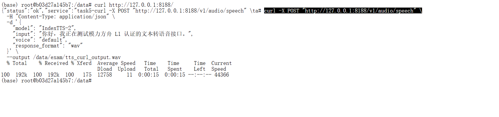

JSON 响应包含 `b64_json` 的检查截图：


form 响应包含 `b64_json` 的检查截图：


## 8. 输出文件检查

API 调用后保存输出：

```text
/data/exam/tts_output.wav
```

curl 测试输出：

```text
/data/exam/tts_curl_output.wav
```

FastAPI 输出文件检查截图：

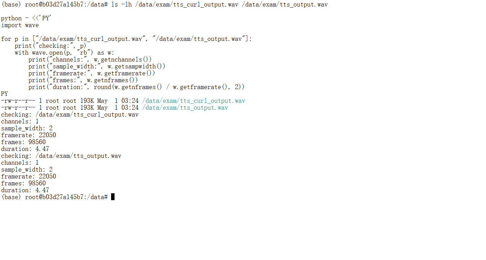

音频文件有效性检查截图：

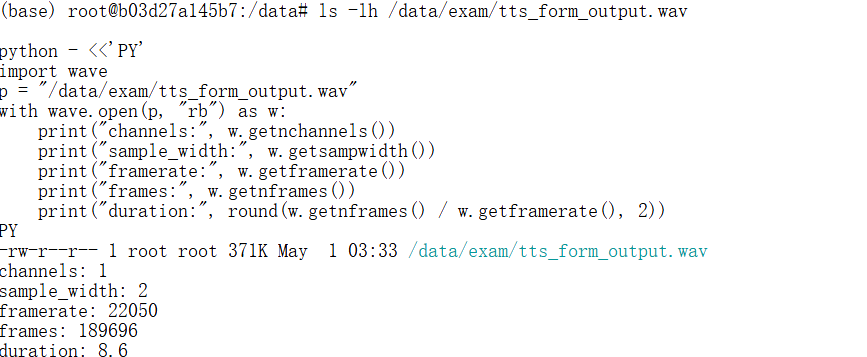

## 9. 平台检测结果

第一次平台检测失败：

```text
API 返回 HTTP 状态码 500
```

失败截图：


后续发现平台实际使用 `multipart/form-data` 调用接口，初始服务只按 JSON 处理，因此需要补 multipart 支持。

第二次平台检测失败：

```text
API 响应格式错误，未包含有效的 b64_json 字段
```

修复响应格式，确保返回有效 `b64_json` 后，平台检测通过。

最终通过截图：


## 10. 遇到的问题与解决方案

### 10.1 缺少 matplotlib

| 项目 | 内容 |
|---|---|
| 发生阶段 | `IndexTTS2` import |
| 现象 / 报错 | 缺少 `matplotlib`，导致 IndexTTS2 import 失败 |
| 原因判断 | IndexTTS 仓库运行依赖不完整 |
| 解决方法 | 安装缺失依赖后重新 import |
| 对应截图 | `assets/08-tts-import-error-matplotlib.png` |


### 10.2 缺少 audiotools

| 项目 | 内容 |
|---|---|
| 发生阶段 | 模型加载 |
| 现象 / 报错 | 缺少 `audiotools`，导致模型加载失败 |
| 原因判断 | IndexTTS-2 依赖音频处理相关包 |
| 解决方法 | 安装 `audiotools` 后继续加载模型 |
| 对应截图 | `assets/08-tts-inference-error-audiotools.png` |


### 10.3 缺少 tn

| 项目 | 内容 |
|---|---|
| 发生阶段 | Normalizer 加载 |
| 现象 / 报错 | 缺少 `tn`，导致 Normalizer 加载失败 |
| 原因判断 | 文本归一化组件依赖未安装 |
| 解决方法 | 安装 `tn` 相关依赖后继续推理 |
| 对应截图 | `assets/08-tts-inference-error-tn.png` |


### 10.4 tagger_cache 只读文件系统

| 项目 | 内容 |
|---|---|
| 发生阶段 | IndexTTS 文本处理组件初始化 |
| 现象 / 报错 | `indextts/utils/tagger_cache` 位于 `/mnt/moark-models` 下，触发 read-only file system |
| 原因判断 | 模型目录不可写，缓存不能写入该路径 |
| 解决方法 | 将缓存目录改到 `/tmp/indextts-cache` |
| 对应截图 | `assets/08-tts-inference-error-readonly-cache.png` |


### 10.5 平台 multipart/form-data 导致 500

| 项目 | 内容 |
|---|---|
| 发生阶段 | 第一次平台检测 |
| 现象 / 报错 | 本地 JSON curl 可成功，但平台检测返回 HTTP 500 |
| 原因判断 | 初始服务只按 JSON 请求处理，平台实际发送 `multipart/form-data` |
| 解决方法 | 服务端改为同时解析 JSON 和 multipart/form-data |
| 对应截图 | `assets/08-task5-check-failed-500.png`、`assets/08-tts-multipart-curl-success.png` |


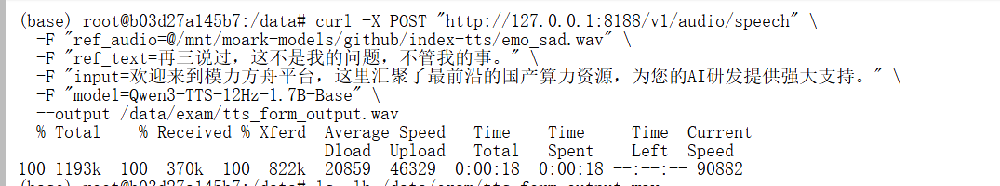

### 10.6 FastAPI 校验异常包含音频二进制

| 项目 | 内容 |
|---|---|
| 发生阶段 | multipart/form-data 请求异常处理 |
| 现象 / 报错 | FastAPI 校验异常中包含音频二进制，`jsonable_encoder` 尝试 utf-8 decode bytes，触发 `UnicodeDecodeError` |
| 原因判断 | 不能让包含二进制文件内容的校验异常直接进入默认 JSON 编码路径 |
| 解决方法 | 手动解析 request，根据 `content-type` 区分 JSON 和 form，避免把音频 bytes 放进错误响应 |
| 对应截图 | 当时未截图，仅保留文字复盘 |

### 10.7 缺少 b64_json 导致检测失败

| 项目 | 内容 |
|---|---|
| 发生阶段 | 第二次平台检测 |
| 现象 / 报错 | API 响应格式错误，未包含有效 `b64_json` 字段 |
| 原因判断 | 平台检测不仅要求生成音频，还要求响应 JSON 中能读到 `b64_json` |
| 解决方法 | 响应中加入顶层 `b64_json` 和 `data[0].b64_json` |
| 对应截图 | `assets/08-tts-json-has-b64-json.png`、`assets/08-tts-form-has-b64-json.png` |

## 11. 截图记录

| 截图 | 说明 |
|---|---|
| `assets/08-tts-model-path-check.png` | 模型和路径检查 |
| `assets/08-tts-deps-installed-torch-ok.png` | torch 与依赖检查 |
| `assets/08-tts-indextts-import-ok.png` | IndexTTS2 import 成功 |
| `assets/08-tts-inference-output.png` | 单次推理输出 |
| `assets/08-tts-output-file-check.png` | 单次推理 WAV 检查 |
| `assets/08-fastapi-tts-server-start.png` | FastAPI 服务启动 |
| `assets/08-fastapi-tts-health-check.png` | 健康检查 |
| `assets/08-fastapi-tts-curl-test.png` | curl 测试 |
| `assets/08-fastapi-tts-output-file-check.png` | API 输出文件检查 |
| `assets/08-task5-check-failed-500.png` | 平台 500 失败 |
| `assets/08-tts-json-has-b64-json.png` | JSON 响应包含 b64_json |
| `assets/08-tts-form-has-b64-json.png` | form 响应包含 b64_json |
| `assets/08-tts-audio-file-valid.png` | 音频文件有效性检查 |
| `assets/08-task5-pass.png` | 平台检测通过 |
| 无截图记录 | FastAPI 校验异常包含音频二进制导致 UnicodeDecodeError |

## 12. 复现检查清单

| 检查项 | 应满足的结果 |
|---|---|
| IndexTTS 仓库存在 | `/mnt/moark-models/github/index-tts` |
| 模型目录存在 | `/mnt/moark-models/IndexTTS-2` |
| 配置文件存在 | `/mnt/moark-models/github/index-tts/checkpoints/config.yaml` |
| 参考音频存在 | `/mnt/moark-models/github/index-tts/emo_sad.wav` |
| torch 版本 | `2.6.0+metax3.2.1.3` |
| CUDA | available 为 `True` |
| IndexTTS2 | import OK |
| 单次推理脚本 | `code/task5_tts_inference.py` |
| 服务脚本 | `code/task5_tts_server.py` |
| 单次推理输出 | `/data/exam/tts_output.wav` |
| WAV 参数 | 单声道、16 bit、22050 Hz、约 5 秒 |
| 服务端口 | `8188` |
| 服务接口 | `/v1/audio/speech` |
| JSON 请求 | 可返回 `b64_json` |
| form 请求 | 可返回 `b64_json` |
| 平台检测 | 任务 5 已通过 |

## 13. 本任务小结

任务 5 最终使用 IndexTTS-2 完成了语音合成模型部署。排错重点集中在依赖补齐、只读缓存目录、平台请求格式和响应字段格式上。

一开始单次推理阶段需要解决 `matplotlib`、`audiotools`、`tn` 等依赖问题，并将 tagger cache 改到 `/tmp`。服务阶段本地 JSON curl 成功并不代表平台检测一定通过，因为平台实际使用 `multipart/form-data`。最终服务同时兼容 JSON 和 form，并返回有效 `b64_json` 后，任务 5 平台检测通过。
