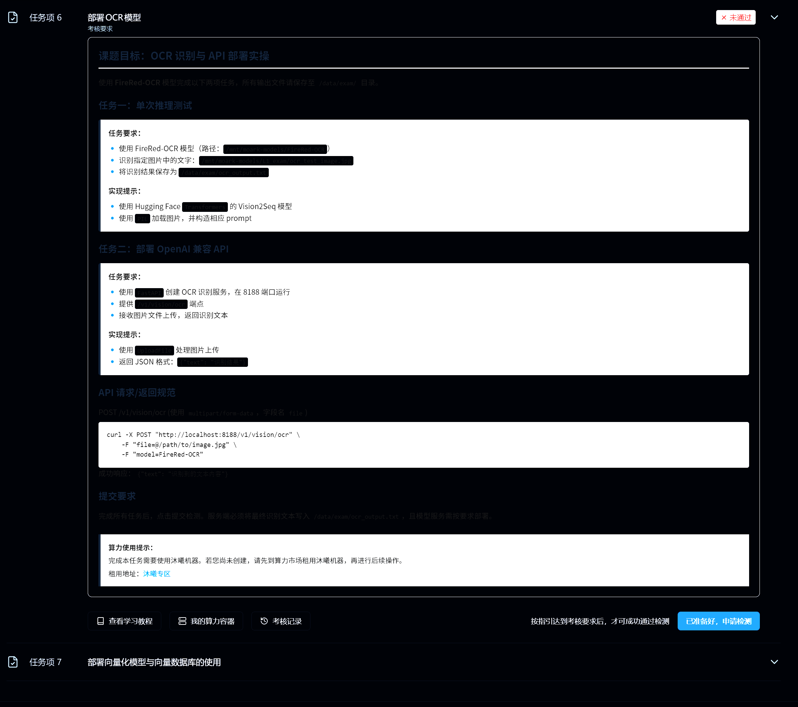
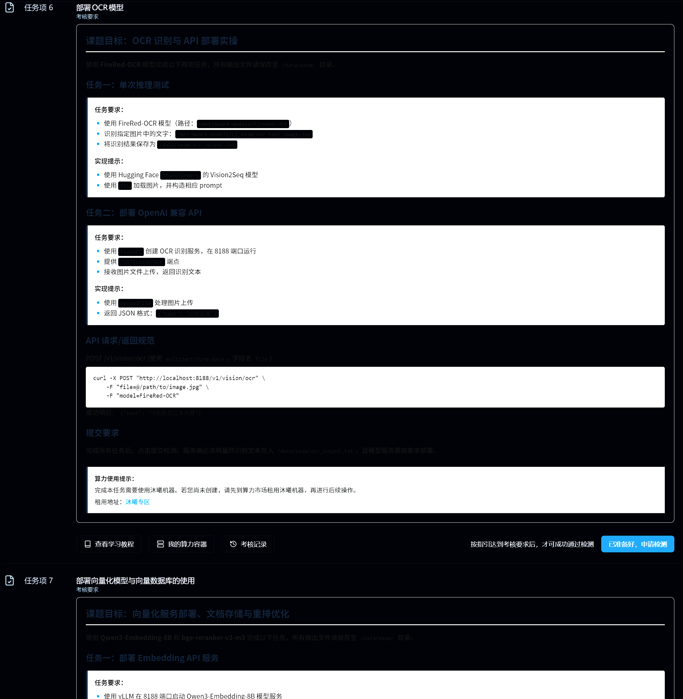
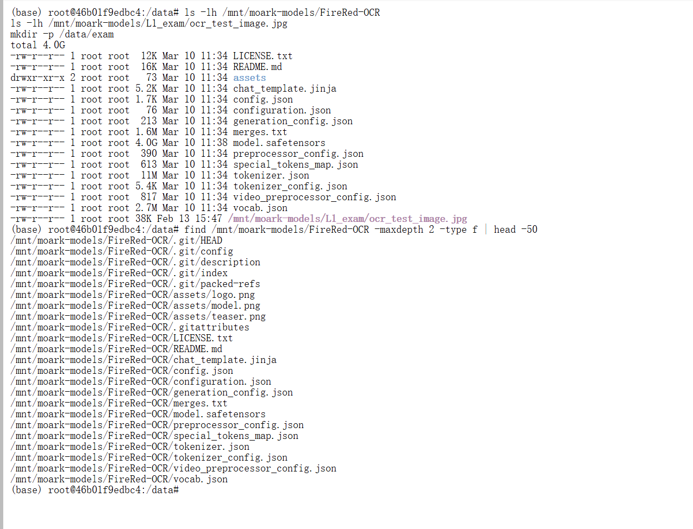
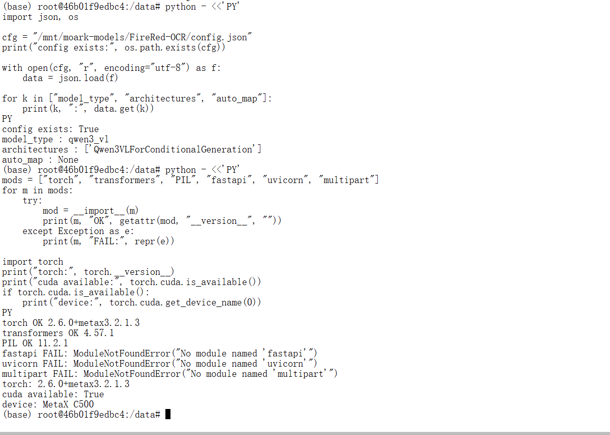
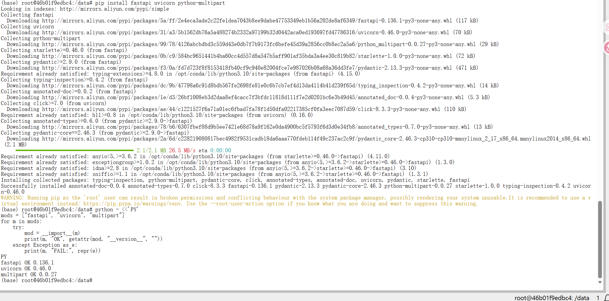
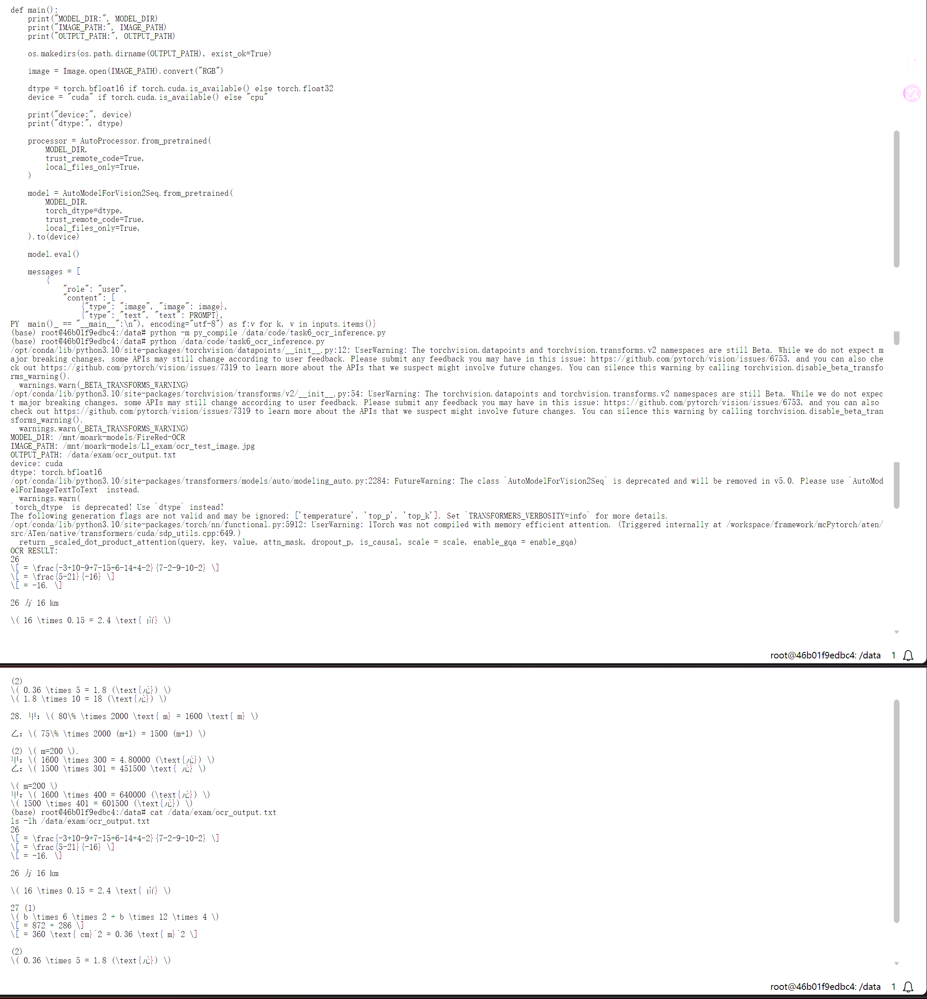
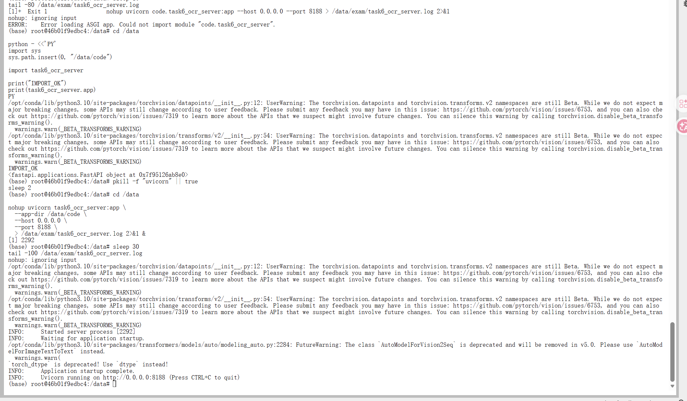
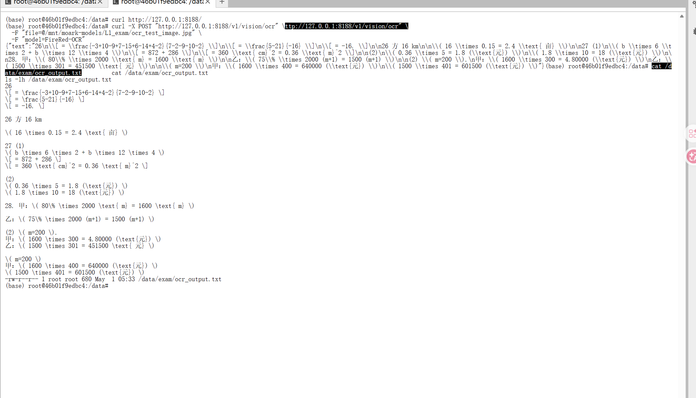

# 09｜任务 6：部署 OCR 模型

本文记录模力方舟 L1 认证任务 6 的 OCR 模型部署过程。任务目标是使用本地 FireRed-OCR 模型完成一次图片文字识别，并部署 FastAPI 服务供平台检测调用。

## 1. 任务目标

任务名称：

```text
部署 OCR 模型
```

本任务需要完成：

1. 使用 FireRed-OCR 完成单次 OCR 推理；
2. 将识别结果保存到 `/data/exam/ocr_output.txt`；
3. 使用 FastAPI 部署 OCR 服务；
4. 服务监听 `8188` 端口；
5. 提供 `/v1/vision/ocr` 接口；
6. 接收图片文件上传；
7. 返回 JSON：`{"text": "识别结果"}`；
8. 通过平台检测。

任务要求截图：



历史任务详情截图：



## 2. 任务要求整理

| 项目 | 内容 |
|---|---|
| 模型 | `FireRed-OCR` |
| 模型路径 | `/mnt/moark-models/FireRed-OCR` |
| 测试图片 | `/mnt/moark-models/L1_exam/ocr_test_image.jpg` |
| 输出文件 | `/data/exam/ocr_output.txt` |
| 推理脚本 | `code/task6_ocr_inference.py` |
| 服务脚本 | `code/task6_ocr_server.py` |
| 服务端口 | `8188` |
| API 路径 | `/v1/vision/ocr` |
| 请求方式 | `multipart/form-data` 上传图片 |
| 返回格式 | `{"text": "识别结果"}` |

## 3. 环境与模型路径检查

需要先确认模型路径、测试图片和 Python 依赖。

模型与测试图片：

```text
/mnt/moark-models/FireRed-OCR
/mnt/moark-models/L1_exam/ocr_test_image.jpg
```

环境检查项：

```text
torch
transformers
PIL
fastapi
uvicorn
python-multipart
```

模型路径检查截图：



环境检查截图：



FastAPI 依赖安装截图：



## 4. config.json 检查结论

检查 `/mnt/moark-models/FireRed-OCR/config.json` 后，关键结论如下：

| 配置项 | 结果 |
|---|---|
| `model_type` | `qwen3_vl` |
| `architectures` | `Qwen3VLForConditionalGeneration` |
| `auto_map` | None |

这个结论说明 FireRed-OCR 更接近 Qwen3-VL 条件生成模型，而不是传统 OCR 小工具。加载时应优先使用 Transformers 中的 Qwen3-VL 类或兼容的图文生成 AutoModel，并配合 `AutoProcessor` 和 PIL 图片输入。

## 5. 单次推理流程

单次推理脚本：

```text
code/task6_ocr_inference.py
```

脚本核心路径：

```python
MODEL_PATH = "/mnt/moark-models/FireRed-OCR"
IMAGE_PATH = "/mnt/moark-models/L1_exam/ocr_test_image.jpg"
OUTPUT_PATH = "/data/exam/ocr_output.txt"
```

推理逻辑：

1. 使用 `AutoProcessor.from_pretrained()` 加载本地 processor；
2. 优先尝试 `Qwen3VLForConditionalGeneration`；
3. 如果当前 Transformers 版本没有该类，再回退到图文生成 AutoModel；
4. 使用 PIL 读取测试图片；
5. prompt 要求模型只输出识别结果；
6. 将识别文本写入 `/data/exam/ocr_output.txt`。

运行命令：

```bash
python code/task6_ocr_inference.py
```

单次推理输出截图：



输出文件：

```text
/data/exam/ocr_output.txt
```

## 6. FastAPI 服务部署流程

服务脚本：

```text
code/task6_ocr_server.py
```

服务端核心接口：

```text
GET /
POST /v1/vision/ocr
```

启动服务：

```bash
python code/task6_ocr_server.py
```

或者在云端 `/data/code` 目录结构下使用：

```bash
uvicorn --app-dir /data/code task6_ocr_server:app --host 0.0.0.0 --port 8188
```

注意：不要使用下面这种方式：

```bash
uvicorn code.task6_ocr_server:app --host 0.0.0.0 --port 8188
```

原因是 `code` 容易与 Python 标准库 `code` 模块冲突，或者 `/data/code` 不是 package，导致 uvicorn 无法正确导入应用。

服务启动截图：



## 7. curl 测试流程

curl 测试命令：

```bash
curl -X POST "http://127.0.0.1:8188/v1/vision/ocr" \
  -F "file=@/mnt/moark-models/L1_exam/ocr_test_image.jpg"
```

预期返回：

```json
{"text": "识别结果"}
```

curl 测试截图：



## 8. 平台检测结果

完成单次推理、输出文件检查、服务启动和 curl 测试后，在平台申请检测。

检测结果：

```text
任务 6 已通过
```

平台检测通过截图：


## 9. 遇到的问题与解决方案

### 9.1 uvicorn 使用 `code.task6_ocr_server:app` 启动失败

| 项目 | 内容 |
|---|---|
| 问题名称 | uvicorn 使用 `code.task6_ocr_server:app` 启动失败 |
| 发生阶段 | FastAPI 服务启动 |
| 现象 / 报错 | uvicorn 无法正确导入 `code.task6_ocr_server:app` |
| 原因判断 | `code` 可能与 Python 标准库 `code` 模块冲突；或者 `/data/code` 目录不是 Python package |
| 解决方法 | 使用 `--app-dir /data/code`，并启动 `task6_ocr_server:app` |
| 正确命令 | `uvicorn --app-dir /data/code task6_ocr_server:app --host 0.0.0.0 --port 8188` |
| 对应文件 | `code/task6_ocr_server.py` |

这个问题和模型本身无关，是 uvicorn 的模块导入路径问题。后续部署 FastAPI 时，如果脚本在 `/data/code` 下，更推荐用 `--app-dir` 指定目录。

## 10. 截图记录

| 截图 | 说明 |
|---|---|
| `assets/09-task6-requirement.png` | 任务 6 要求截图 |
| `assets/01-task6-detail.png` | 任务 6 历史详情截图 |
| `assets/09-ocr-model-path-check.png` | 模型路径与配置检查 |
| `assets/09-ocr-env-check.png` | OCR 环境检查 |
| `assets/09-ocr-fastapi-deps-installed.png` | FastAPI / multipart 依赖安装 |
| `assets/09-ocr-inference-output.png` | 单次 OCR 推理输出 |
| `assets/09-ocr-fastapi-server-start.png` | FastAPI 服务启动 |
| `assets/09-ocr-fastapi-curl-test.png` | curl 上传图片测试 |
| `assets/09-task6-pass.png` | 平台检测通过 |

## 11. 复现检查清单

| 检查项 | 应满足的结果 |
|---|---|
| 模型目录存在 | `/mnt/moark-models/FireRed-OCR` |
| 测试图片存在 | `/mnt/moark-models/L1_exam/ocr_test_image.jpg` |
| config 结论 | `model_type=qwen3_vl`，`architectures=Qwen3VLForConditionalGeneration` |
| 依赖可用 | `torch`、`transformers`、`PIL`、`fastapi`、`uvicorn`、`python-multipart` |
| 单次推理脚本存在 | `code/task6_ocr_inference.py` |
| 服务脚本存在 | `code/task6_ocr_server.py` |
| 单次推理输出 | `/data/exam/ocr_output.txt` |
| 服务端口 | `8188` |
| API 路径 | `/v1/vision/ocr` |
| curl 上传 | `-F "file=@/mnt/moark-models/L1_exam/ocr_test_image.jpg"` |
| API 返回 | `{"text": "识别结果"}` |
| 平台检测 | 任务 6 已通过 |

## 12. 本任务小结

任务 6 使用 `/mnt/moark-models/FireRed-OCR` 完成 OCR 单次推理和 FastAPI 服务部署。模型配置显示它是 `qwen3_vl` 架构，因此实现上按图文生成模型处理：PIL 读取图片，Transformers 加载 processor 和模型，再让模型输出识别文本。

服务部署阶段的主要坑是 uvicorn 导入路径。`code.task6_ocr_server:app` 容易因为 `code` 名称冲突或目录不是 package 而失败，最终使用 `--app-dir /data/code task6_ocr_server:app` 启动服务。完成 curl 上传图片测试后，平台检测通过。
