# 10｜任务 7：部署向量化模型与向量数据库

本文记录模力方舟 L1 认证任务 7 的完成过程。任务目标是部署 Qwen3-Embedding-8B 的 Embedding API，使用 Chroma 完成文档切片和向量入库，再使用 bge-reranker-v2-m3 对 Top-10 检索结果进行重排，最终生成 `/data/exam/reranking_results.json` 并通过平台检测。

## 1. 任务目标

任务名称：

```text
部署向量化模型与向量数据库
```

本任务包含三部分：

1. 使用 vLLM 部署 Qwen3-Embedding-8B 的 `/v1/embeddings` 接口；
2. 对测试文档切片，并将 chunk 向量写入 Chroma；
3. 使用 bge-reranker-v2-m3 对 Top-10 候选结果重排；
4. 输出 `/data/exam/reranking_results.json`；
5. 通过平台检测。

任务要求截图：

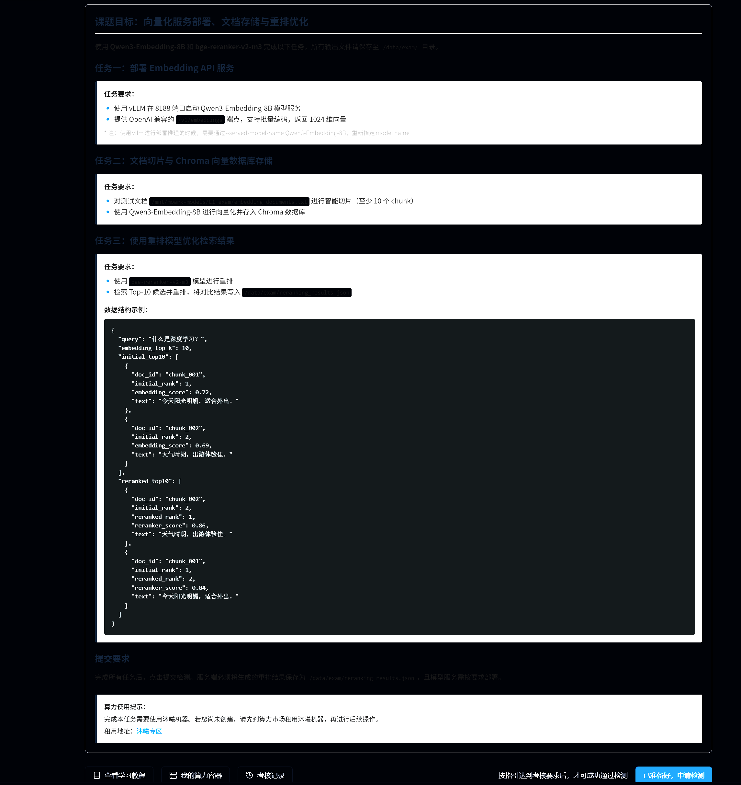

历史任务详情截图：

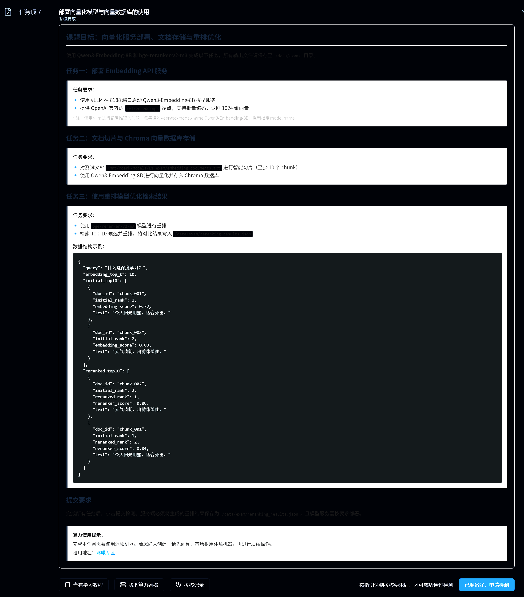

## 2. 任务要求整理

| 项目 | 内容 |
|---|---|
| Embedding 模型 | `Qwen3-Embedding-8B` |
| Reranker 模型 | `bge-reranker-v2-m3` |
| 文档路径 | `/mnt/moark-models/L1_exam/embedding_documents.txt` |
| 输出文件 | `/data/exam/reranking_results.json` |
| 向量数据库 | Chroma |
| Embedding 服务工具 | vLLM |
| 服务端口 | `8188` |
| API 路径 | `/v1/embeddings` |
| 向量维度 | `1024` |
| 推理脚本 | `code/task7_embedding_rerank.py` |

## 3. 环境与模型路径检查

本任务需要使用 vLLM 镜像。普通 PyTorch 镜像中没有 `vllm`，不能直接部署 Embedding API。

需要检查：

```bash
python -c "import chromadb, requests; print('ok')"
vllm --version
ls -lh /mnt/moark-models/Qwen3-Embedding-8B
ls -lh /mnt/moark-models/bge-reranker-v2-m3
ls -lh /mnt/moark-models/L1_exam/embedding_documents.txt
```

非 vLLM 镜像缺少 vLLM 的截图：

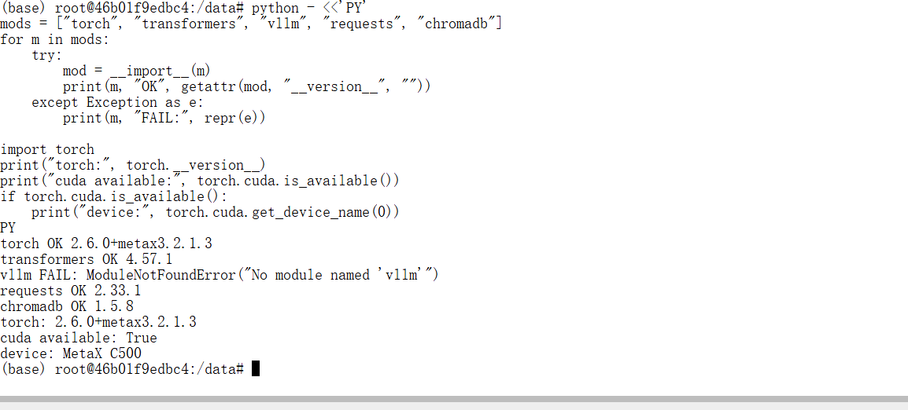

vLLM 环境检查截图：

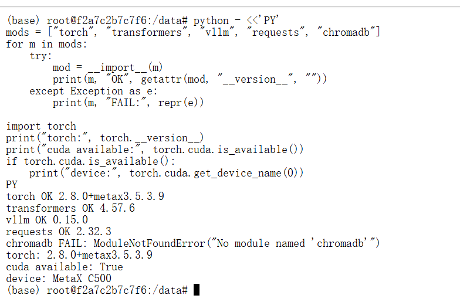

模型路径检查截图：

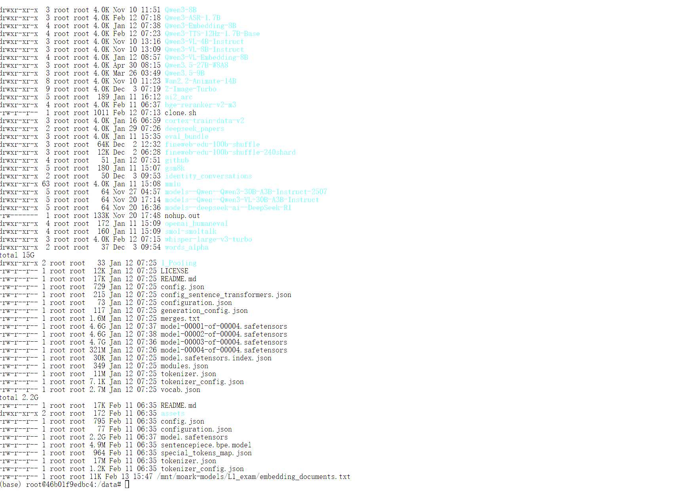

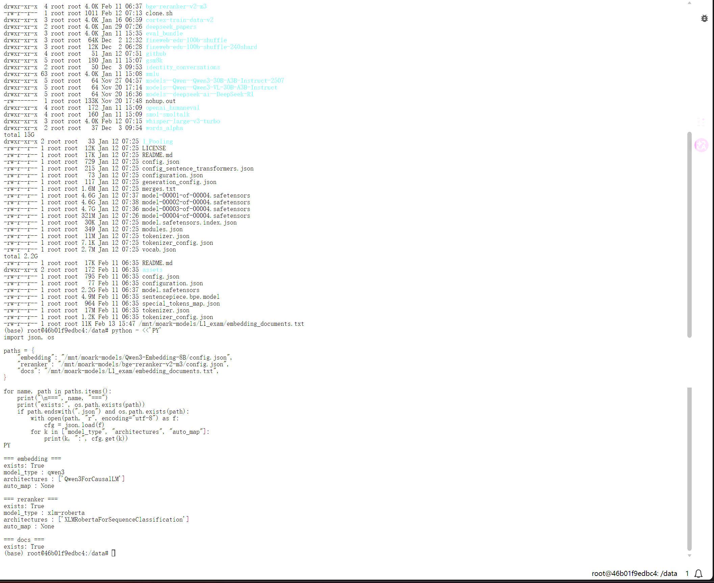

安装 ChromaDB 截图：

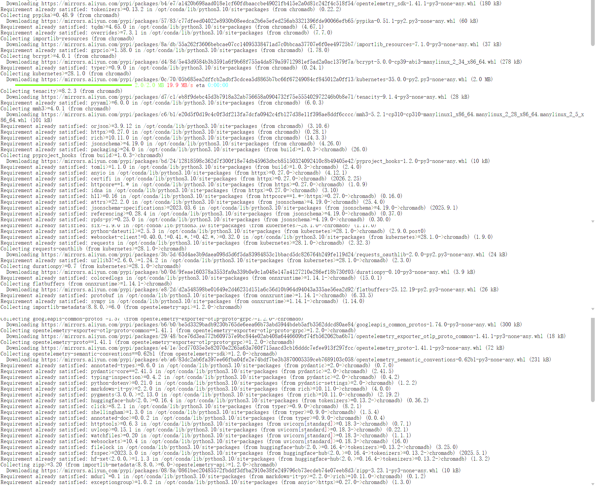

## 4. Embedding API 部署

启动 Qwen3-Embedding-8B 服务时，需要使用 vLLM，并指定 served model name：

```bash
vllm serve /mnt/moark-models/Qwen3-Embedding-8B \
  --host 0.0.0.0 \
  --port 8188 \
  --served-model-name Qwen3-Embedding-8B
```

本任务过程中遇到一个参数问题：当前 vLLM 0.15.0 不识别 `--task embed`，因此不能沿用该参数。

错误截图：

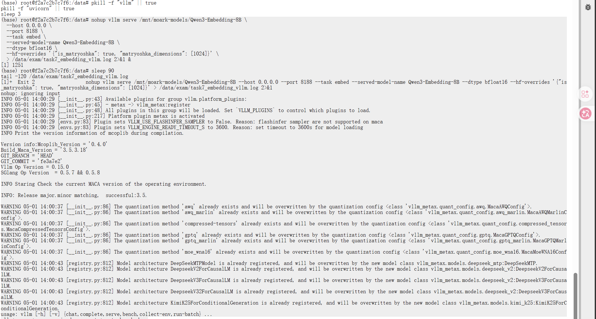

服务启动后检查模型列表：

```bash
curl http://127.0.0.1:8188/v1/models
```

模型列表检查截图：

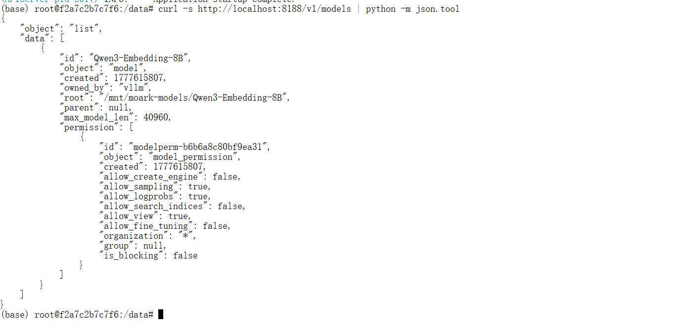

## 5. Embedding 维度验证

直接请求 `/v1/embeddings` 时，默认返回 4096 维向量，不满足任务要求。

修复方式是在请求体中加入：

```json
{
  "dimensions": 1024
}
```

示例请求：

```bash
curl -X POST "http://127.0.0.1:8188/v1/embeddings" \
  -H "Content-Type: application/json" \
  -d '{
    "model": "Qwen3-Embedding-8B",
    "input": ["测试文本"],
    "dimensions": 1024
  }'
```

1024 维验证截图：

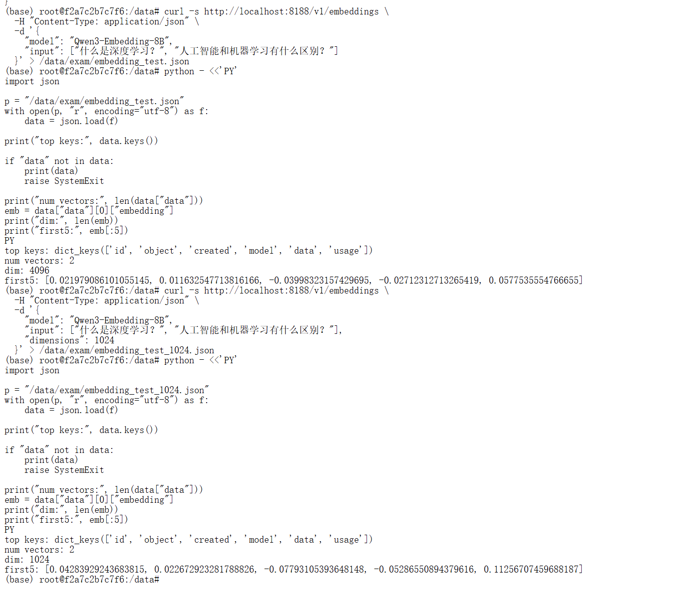

## 6. 文档切片、Chroma 入库和 rerank

任务脚本：

```text
code/task7_embedding_rerank.py
```

脚本流程：

1. 读取 `/mnt/moark-models/L1_exam/embedding_documents.txt`；
2. 将文档切成至少 10 个 chunk；
3. 调用 vLLM `/v1/embeddings`，并设置 `dimensions=1024`；
4. 将 chunk、metadata、embedding 写入 Chroma；
5. 对查询文本检索 Top-10；
6. 使用 `/mnt/moark-models/bge-reranker-v2-m3` 对 Top-10 重排；
7. 写出 `/data/exam/reranking_results.json`。

运行命令：

```bash
python code/task7_embedding_rerank.py
```

运行成功截图：

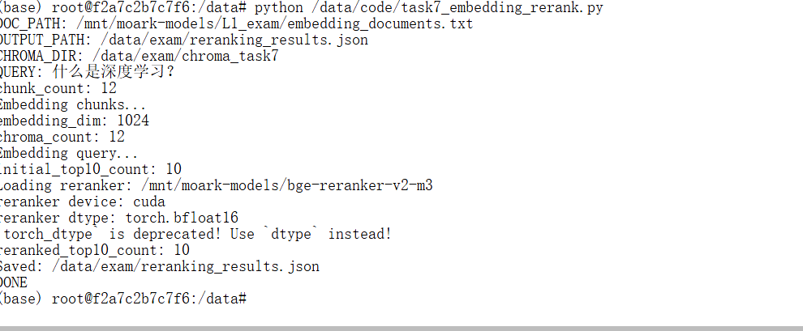

结果 JSON 检查截图：

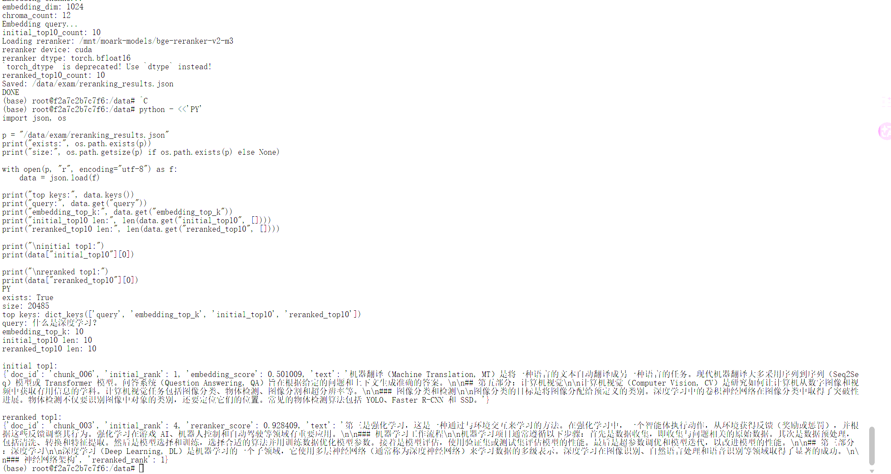

最终检查截图：

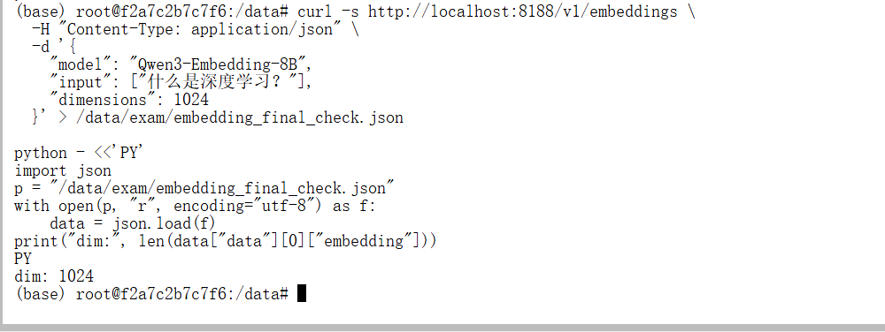

## 7. 输出文件

任务要求输出：

```text
/data/exam/reranking_results.json
```

输出 JSON 中记录：

| 字段 | 说明 |
|---|---|
| `query` | 查询文本 |
| `embedding_model` | `Qwen3-Embedding-8B` |
| `embedding_dimensions` | `1024` |
| `reranker_model` | `/mnt/moark-models/bge-reranker-v2-m3` |
| `document_path` | 测试文档路径 |
| `chunk_count` | 文档切片数量 |
| `top10_before_rerank` | Chroma Top-10 检索结果 |
| `top10_after_rerank` | bge reranker 重排结果 |

## 8. 平台检测结果

完成 vLLM Embedding API、Chroma 入库、Top-10 检索、reranker 重排和结果文件生成后，提交平台检测。

检测结果：

```text
任务 7 已通过
```

平台检测通过截图：

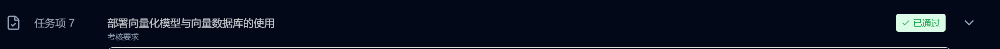

## 9. 遇到的问题与解决方案

### 9.1 非 vLLM 镜像没有 vllm

| 项目 | 内容 |
|---|---|
| 发生阶段 | 环境检查 |
| 现象 / 报错 | 普通镜像中没有 `vllm` 命令或包 |
| 原因判断 | Task 7 要求部署 Embedding API，适合使用 vLLM 镜像 |
| 解决方法 | 切换到 vLLM 镜像继续任务 |
| 对应截图 | `assets/10-env-check-vllm-missing.png` |

### 9.2 vLLM 0.15.0 不识别 `--task embed`

| 项目 | 内容 |
|---|---|
| 发生阶段 | vLLM 服务启动 |
| 现象 / 报错 | `--task embed` 参数不被识别 |
| 原因判断 | 当前 vLLM 版本参数不兼容 |
| 解决方法 | 去掉 `--task embed`，使用 `vllm serve` 和 `--served-model-name Qwen3-Embedding-8B` |
| 对应截图 | `assets/10-vllm-task-arg-error.png` |

### 9.3 默认 embeddings 返回 4096 维

| 项目 | 内容 |
|---|---|
| 发生阶段 | `/v1/embeddings` 接口验证 |
| 现象 / 报错 | 直接请求 embeddings 默认返回 4096 维 |
| 原因判断 | Qwen3-Embedding-8B 默认输出维度不是任务要求的 1024 |
| 解决方法 | 请求中加入 `dimensions=1024` |
| 对应截图 | `assets/10-embedding-api-1024-ok.png` |

### 9.4 `/data/exam` 不存在导致日志重定向失败

| 项目 | 内容 |
|---|---|
| 发生阶段 | 启动服务或运行脚本前 |
| 现象 / 报错 | 将日志重定向到 `/data/exam/...` 时失败 |
| 原因判断 | `/data/exam` 目录尚未创建 |
| 解决方法 | 先执行 `mkdir -p /data/exam`，脚本中也使用 `os.makedirs(..., exist_ok=True)` |
| 对应截图 | 截图待补 |

## 10. 截图记录

| 截图 | 说明 |
|---|---|
| `assets/10-task7-requirement.png` | 任务 7 要求截图 |
| `assets/01-task7-detail.png` | 任务 7 历史详情截图 |
| `assets/10-env-check-vllm-missing.png` | 非 vLLM 镜像缺少 vLLM |
| `assets/10-vllm-env-check.png` | vLLM 环境检查 |
| `assets/10-embedding-model-path-check.png` | Embedding 模型路径检查 |
| `assets/10-model-path-check.png` | 模型和测试文档路径检查 |
| `assets/10-chromadb-installed.png` | ChromaDB 安装 |
| `assets/10-vllm-task-arg-error.png` | vLLM 参数错误 |
| `assets/10-vllm-models-ok.png` | `/v1/models` 检查 |
| `assets/10-embedding-api-1024-ok.png` | 1024 维 embedding 检查 |
| `assets/10-chroma-rerank-run-ok.png` | Chroma + rerank 运行成功 |
| `assets/10-reranking-json-check.png` | JSON 结果检查 |
| `assets/10-embedding-final-check.png` | 最终输出检查 |
| `assets/10-task7-pass.png` | 平台检测通过 |

## 11. 复现检查清单

| 检查项 | 应满足的结果 |
|---|---|
| vLLM 镜像 | 可使用 `vllm serve` |
| Embedding 模型 | `/mnt/moark-models/Qwen3-Embedding-8B` |
| Reranker 模型 | `/mnt/moark-models/bge-reranker-v2-m3` |
| 测试文档 | `/mnt/moark-models/L1_exam/embedding_documents.txt` |
| Python 依赖 | `chromadb`、`requests`、`torch`、`transformers` |
| Embedding API | `http://127.0.0.1:8188/v1/embeddings` |
| 向量维度 | 请求中设置 `dimensions=1024` |
| Chroma | 至少写入 10 个 chunk |
| 检索 | Top-10 |
| rerank | 使用 `bge-reranker-v2-m3` |
| 输出文件 | `/data/exam/reranking_results.json` |
| 平台检测 | 任务 7 已通过 |

## 12. 本任务小结

任务 7 的关键点不是单独生成 embedding，而是把 embedding、向量库检索和 rerank 串成完整流程。实际过程中需要使用 vLLM 镜像部署 Qwen3-Embedding-8B，并在 `/v1/embeddings` 请求中显式传入 `dimensions=1024`，否则默认向量维度不符合任务要求。

最终流程为：vLLM 提供 Embedding API，脚本读取测试文档并切片，使用 Chroma 存储向量，检索 Top-10 后用 bge-reranker-v2-m3 重排，最后生成 `/data/exam/reranking_results.json`。平台检测已通过。
