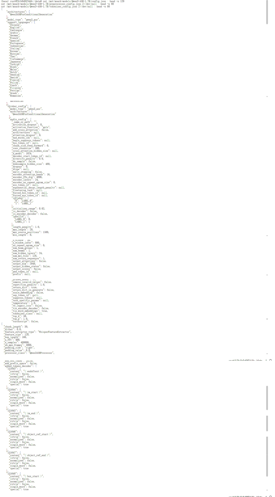
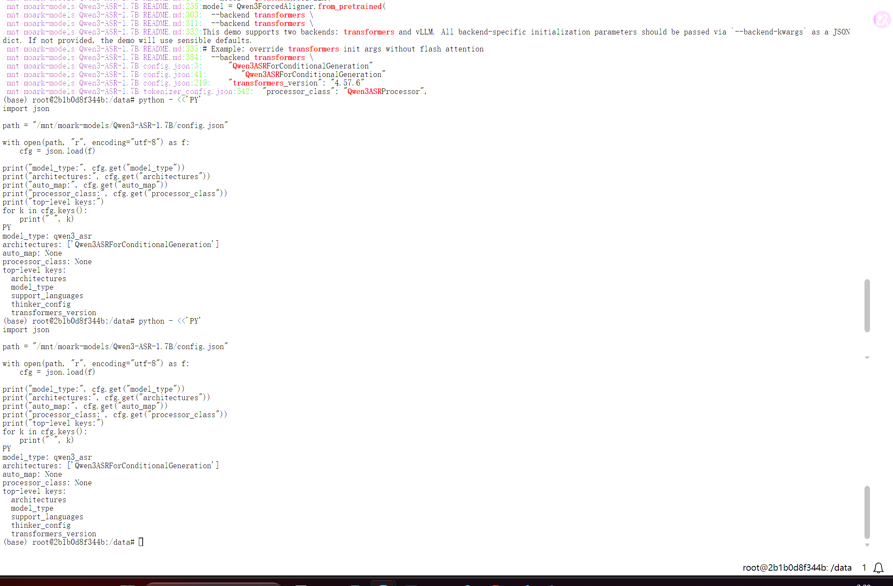
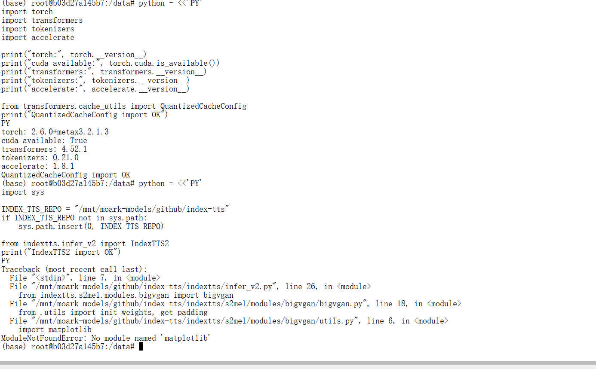
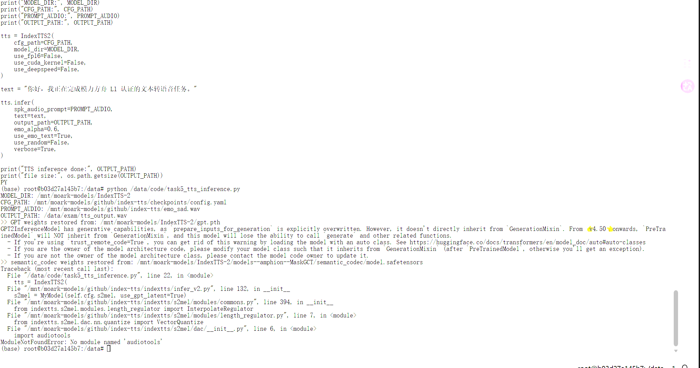
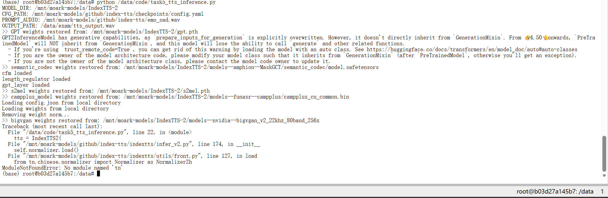
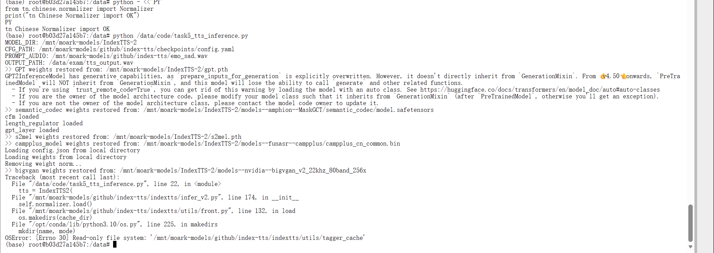
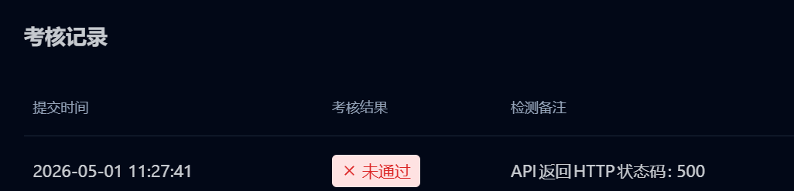
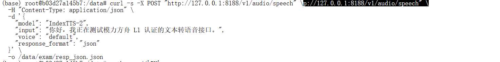
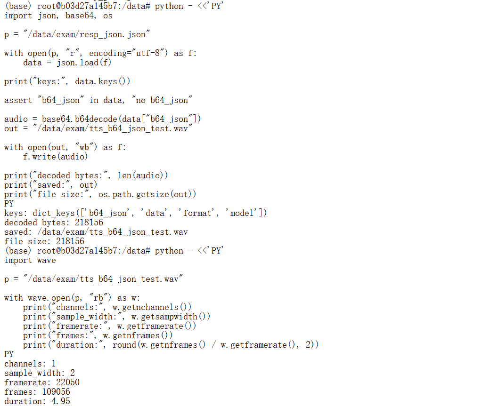

# 11｜问题与解决记录

本文记录任务 2、任务 3、任务 4 中真实发生过的问题与解决过程，信息来源为：

- `05-task2-text-model.md`
- `06-task3-image-model.md`
- `07-task4-asr.md`
- `00-running-log.md`
- `docs-check-report.md`
- `assets/rename-report.md`
- `assets/`
- `code/`

重点是保留文本生成、图像生成、ASR 语音识别中的真实排错链，不把失败过程删掉。失败过程本身也是实验手册的一部分，可以帮助后续同学判断问题发生在 Python 代码、依赖安装、模型路径、模型调用方式、接口封装，还是底层实例状态。

---

## 1. 排错链总览

| 编号 | 问题名称 | 发生阶段 | 关键现象 | 处理结果 |
|---|---|---|---|---|
| 1 | 缺少 `accelerate` | Transformers 单次推理 | `device_map="auto"` 加载模型时报错 | 安装 `accelerate` 后继续推理 |
| 2 | 输出包含 `<think>` | Transformers 单次推理 | 生成文本包含思考过程 | 调整提示词并在保存前清理输出 |
| 3 | 输出长度不足 | Transformers 单次推理 | 清理后正文偏短，可能不满足 100 字符要求 | 强化字数要求并增大生成长度 |
| 4 | PyTorch 镜像没有 vLLM | vLLM 部署前检查 | `pip show vllm` 找不到包 | 切换到 vLLM 专用镜像 |
| 5 | 新实例中脚本路径不存在 | 新 vLLM 实例 | `/data/code/` 或 `/code/` 下找不到旧脚本 | 在新环境重建脚本，或改用 vLLM API 生成 |
| 6 | vLLM 镜像中 Transformers 触发 MetaX queue segfault | vLLM 实例排错 | 出现 queue 申请失败和 `Segmentation fault` | 停止用 Transformers 直加载，改走 vLLM 服务 |
| 7 | 第一台 vLLM 实例 Qwen3-8B EngineCore 初始化失败 | vLLM 服务启动 | `Engine core initialization failed` | 排查后判断实例状态异常，准备重建 |
| 8 | `VLLM_USE_V1=0` 触发 `AssertionError` | vLLM 参数排查 | 关闭 V1 engine 后直接断言失败 | 不再关闭 V1 engine |
| 9 | 第一台 vLLM 实例 Qwen3-0.6B 也启动失败 | 官方示例模型验证 | 小模型同样 EngineCore 初始化失败 | 判断不是模型大小单一原因，释放并重建实例 |
| 10 | 重建 vLLM 实例后成功 | 最终验证 | Qwen3-0.6B 和 Qwen3-8B 服务均跑通 | 任务 2 最终检测通过 |
| 11 | 缺少 diffusers / accelerate | Task 3 依赖检查 | 图像模型推理前依赖不完整 | 安装并检查 diffusers、accelerate 等依赖 |
| 12 | 需要根据 `model_index.json` 判断 pipeline | Task 3 模型加载 | 不能直接猜 pipeline 类 | 读取 `model_index.json`，确认 Z-Image-Turbo 使用 `ZImagePipeline` |
| 13 | Vim 编辑时出现 `.swp` 交换文件 | Task 3 脚本编辑 | 旧 Vim 进程或 swap 文件阻塞编辑 | 清理旧 Vim 进程和 swap 文件后继续 |
| 14 | `file` 命令不可用 | Task 3 输出检查 | 生成图片后无法用 `file` 检查 | 改用 PIL 检查图片格式、尺寸和模式 |
| 15 | 本地仓库缺少 `task3_image_server.py` | Task 3 文档整理后复核 | 服务脚本没有在本地仓库中保留 | 补回 `code/task3_image_server.py` |
| 16 | 误提交 `__pycache__` 文件 | Task 3 Git 清理 | `.pyc` 文件进入版本控制 | 增加 `.gitignore` 并 `git rm --cached` 清理 |
| 17 | 缺少 ASR 相关依赖 | Task 4 依赖检查 | ASR 推理和 FastAPI 上传依赖不完整 | 安装 accelerate、librosa、soundfile、fastapi、uvicorn、python-multipart |
| 18 | Whisper 示例加载 Qwen3-ASR 失败 | Task 4 模型加载尝试 | Transformers 不识别 `qwen3_asr` | 放弃 Whisper 示例路径，继续检查模型配置和 README |
| 19 | `trust_remote_code=True` 不能解决 Qwen3-ASR 加载 | Task 4 模型配置检查 | `auto_map` 为 None | 确认需要使用官方 `qwen-asr` 包 |
| 20 | 改用 `qwen-asr` 和 `Qwen3ASRModel` | Task 4 方案切换 | README 指向专用加载方式 | 安装 `qwen-asr` 并改用 `Qwen3ASRModel` |
| 21 | `backend` 参数不被接受 | Task 4 qwen-asr 调用 | `from_pretrained()` 出现 unexpected keyword argument | 移除 `backend="transformers"` |
| 22 | `language="zh"` 不被支持 | Task 4 ASR 推理 | 语言参数需要完整名称 | 改为 `language="Chinese"`，服务内做归一化 |
| 23 | heredoc 粘贴脚本结尾污染 | Task 4 脚本编辑 | 脚本结尾混入多余文本 | 用可靠方式重新覆盖脚本 |
| 24 | 本地仓库缺少 Task 4 脚本 | Task 4 文档整理后复核 | 推理和服务脚本没有在本地仓库中保留 | 补回 `code/task4_asr_inference.py` 和 `code/task4_asr_server.py` |
| 25 | 缺少 matplotlib | Task 5 IndexTTS2 import | IndexTTS2 import 失败 | 安装 matplotlib |
| 26 | 缺少 audiotools | Task 5 模型加载 | 模型加载失败 | 安装 audiotools |
| 27 | 缺少 tn | Task 5 Normalizer 加载 | 文本归一化组件加载失败 | 安装 tn |
| 28 | tagger_cache 只读文件系统 | Task 5 推理初始化 | `/mnt/moark-models` 下缓存不可写 | 将缓存改到 `/tmp` |
| 29 | 平台 multipart/form-data 导致 500 | Task 5 平台检测 | 本地 JSON 成功，平台检测 HTTP 500 | 服务端兼容 multipart/form-data |
| 30 | FastAPI 异常包含音频二进制 | Task 5 form 异常处理 | `jsonable_encoder` 解码 bytes 触发 UnicodeDecodeError | 手动解析请求并避免返回二进制错误体 |
| 31 | 响应缺少 b64_json | Task 5 平台检测 | API 响应格式错误 | 返回顶层 `b64_json` 和 `data[0].b64_json` |

---

## 2. 缺少 `accelerate`

| 项目 | 内容 |
|---|---|
| 问题名称 | 缺少 `accelerate` |
| 发生阶段 | Transformers 单次推理，第一次运行 `python code/task2_text_inference.py` |
| 现象 | 模型加载阶段失败，`/data/exam/text_inference.txt` 没有生成 |
| 报错信息 | `Using a device_map, tp_plan, torch.device context manager or setting torch.set_default_device(device) requires accelerate.` |
| 原因判断 | 脚本中使用了 `device_map="auto"`，Transformers 自动设备分配需要 `accelerate` 支持 |
| 解决方法 | 执行 `pip install accelerate`，然后用 `pip show accelerate` 确认安装成功 |
| 对应截图 | `assets/11-task2-missing-accelerate.png`、`assets/05-install-accelerate.png`、`assets/11-task2-missing-accelerate-output-file-missing.png` |

截图：


说明：

这个问题发生在最早的 PyTorch 镜像中。由于模型没有成功加载，任务要求的输出文件也不会生成，所以后续需要先安装 `accelerate`，再继续验证单次文本推理。

---

## 3. 输出包含 `<think>`

| 项目 | 内容 |
|---|---|
| 问题名称 | 输出包含 `<think>` |
| 发生阶段 | Transformers 单次推理，安装 `accelerate` 后第一次成功生成文本 |
| 现象 | 模型能生成内容，但输出中包含 thinking / reasoning 过程 |
| 报错信息 | 不是程序异常，表现为生成文本中出现 `<think>` |
| 原因判断 | Qwen3 系列模型可能默认输出思考过程；任务需要保存短篇小说正文，不适合把思考过程写入最终文件 |
| 解决方法 | 在提示词中要求只输出小说正文；尝试设置 `enable_thinking=False`；保存前清理 `<think>` 和 `</think>` |
| 对应截图 | `assets/05-text-inference-thinking-output.png` |

截图：


说明：

这不是运行失败，而是结果格式不符合任务要求。保留这一步可以解释为什么后续脚本中加入了 `clean_output()` 之类的清理逻辑。

---

## 4. 输出长度不足

| 项目 | 内容 |
|---|---|
| 问题名称 | 输出长度不足 |
| 发生阶段 | Transformers 单次推理，清理 `<think>` 之后 |
| 现象 | 生成正文偏短，可能不足 100 个字符 |
| 报错信息 | 不是程序异常，表现为输出文本长度不满足任务要求 |
| 原因判断 | 提示词对“正文长度”和“只输出正文”的约束不够强，模型可能生成较短回复 |
| 解决方法 | 修改提示词，明确要求 150 到 250 个中文字符，并要求正文必须超过 100 个字符；同时增大 `max_new_tokens` |
| 对应截图 | `assets/05-text-inference-short-output.png`、`assets/05-text-inference-final-output.png`、`assets/05-text-inference-final-output-wc-check.png` |

截图：


说明：

最终普通 Transformers 推理阶段已经生成 `/data/exam/text_inference.txt`，并通过 `wc -m` 检查确认字符数超过 100。

---

## 5. PyTorch 镜像没有 vLLM

| 项目 | 内容 |
|---|---|
| 问题名称 | PyTorch 镜像没有 vLLM |
| 发生阶段 | 准备部署 vLLM 服务之前 |
| 现象 | 在 PyTorch 镜像中检查 vLLM，发现当前环境不能直接启动 vLLM 服务 |
| 报错信息 | `No module named vllm` 或 `Package(s) not found: vllm` |
| 原因判断 | 当前 PyTorch 镜像适合做 Transformers 单次推理，但不是 vLLM 专用镜像 |
| 解决方法 | 按官方教程切换到 vLLM 专用镜像：`vLLM / vllm:0.11.0 / Python 3.10 / maca 3.3.x` |
| 对应截图 | `assets/05-vllm-not-installed-check.png`、`assets/05-task2-learning-guide-vllm.png` |

截图：


说明：

这一步确认任务 2 需要分两段处理：先用 PyTorch 镜像完成普通 Transformers 单次推理，再用 vLLM 专用镜像完成 OpenAI 兼容 API 服务部署。

---

## 6. 新实例中脚本路径不存在

| 项目 | 内容 |
|---|---|
| 问题名称 | 新实例中脚本路径不存在 |
| 发生阶段 | 新建 vLLM 实例后，尝试复用旧脚本 |
| 现象 | 在 `/data/code/` 或 `/code/` 路径下找不到 `task2_text_inference.py` |
| 报错信息 | `python: can't open file '/data/code/task2_text_inference.py': [Errno 2] No such file or directory` |
| 原因判断 | vLLM 实例是重新创建的环境，之前 PyTorch 实例里的脚本不会自动存在 |
| 解决方法 | 在新实例中重新创建脚本；或者改用 vLLM API 生成最终文本并写入 `/data/exam/text_inference.txt` |
| 对应截图 | `assets/11-task2-text-inference-script-path-missing.png` |

截图：


说明：

同一张截图后半部分也出现了 queue 报错，但这里主要记录脚本路径缺失。queue / segfault 问题在下一节单独记录。

---

## 7. vLLM 镜像中 Transformers 触发 MetaX queue segfault

| 项目 | 内容 |
|---|---|
| 问题名称 | vLLM 镜像中 Transformers 触发 MetaX queue segfault |
| 发生阶段 | vLLM 专用镜像中，尝试直接用 Transformers 加载 Qwen3-8B |
| 现象 | 模型加载或运行过程中底层队列申请失败，进程崩溃 |
| 报错信息 | `mxkwCreateQueueBlock ioctl create queue block failed -1`、`Device::acquireQueue: mxc_queue_acquire failed!`、`Segmentation fault (core dumped)` |
| 原因判断 | 这不是普通 Python 语法错误，更像是 MetaX 底层队列或设备资源申请失败；vLLM 专用镜像更适合通过 `vllm serve` 启动服务 |
| 解决方法 | 不再在 vLLM 镜像中直接用 Transformers 加载 Qwen3-8B，改走 vLLM API 生成文本和保存文件 |
| 对应截图 | `assets/11-task2-metax-queue-segfault.png` |

截图：


说明：

这个问题是后续 EngineCore 初始化失败排查链中的重要线索，说明问题已经进入底层运行时或实例状态层面。

---

## 8. 第一台 vLLM 实例 Qwen3-8B EngineCore 初始化失败

| 项目 | 内容 |
|---|---|
| 问题名称 | 第一台 vLLM 实例 Qwen3-8B EngineCore 初始化失败 |
| 发生阶段 | 启动 Qwen3-8B vLLM 服务 |
| 现象 | `vllm serve` 启动失败，服务无法稳定监听 8188 端口 |
| 报错信息 | `DMAQueue create failed`、`Device::acquireQueue: mxc_queue_acquire failed`、`RuntimeError: Engine core initialization failed` |
| 原因判断 | 已排查端口、残留进程、MetaX 插件识别、MACA 版本匹配等方向；失败集中在 EngineCore 初始化阶段，更像是第一台 vLLM 实例底层队列状态或环境状态异常 |
| 解决方法 | 不继续只改 Python 代码或启动参数，释放异常实例，重新创建干净的 vLLM 专用实例 |
| 对应截图 | `assets/11-task2-vllm-qwen3-8b-engine-init-failed.png` |

截图：


失败命令记录：

```bash
vllm serve /mnt/moark-models/Qwen3-8B \
  --host 0.0.0.0 \
  --port 8188 \
  --served-model-name Qwen3-8B \
  --dtype bfloat16 \
  --max-model-len 2048 \
  --max-num-seqs 1 \
  --gpu-memory-utilization 0.80 \
  --enforce-eager
```

---

## 9. `VLLM_USE_V1=0` 触发 `AssertionError`

| 项目 | 内容 |
|---|---|
| 问题名称 | `VLLM_USE_V1=0` 触发 `AssertionError` |
| 发生阶段 | 排查 vLLM EngineCore 初始化失败 |
| 现象 | 尝试关闭 V1 engine 后，vLLM 直接断言失败 |
| 报错信息 | `assert envs.VLLM_USE_V1`、`AssertionError` |
| 原因判断 | 当前 vLLM 0.11.0 + MetaX 镜像要求使用 V1 engine，不能通过 `VLLM_USE_V1=0` 关闭 |
| 解决方法 | 放弃关闭 V1 engine 的方向，继续使用默认 V1 engine |
| 对应截图 | `assets/11-task2-vllm-use-v1-assertion.png` |

截图：


失败命令记录：

```bash
VLLM_USE_V1=0 vllm serve /mnt/moark-models/Qwen3-8B \
  --host 0.0.0.0 \
  --port 8188 \
  --served-model-name Qwen3-8B \
  --dtype bfloat16 \
  --max-model-len 2048 \
  --max-num-seqs 1 \
  --gpu-memory-utilization 0.80 \
  --enforce-eager
```

---

## 10. 第一台 vLLM 实例 Qwen3-0.6B 也启动失败

| 项目 | 内容 |
|---|---|
| 问题名称 | 第一台 vLLM 实例 Qwen3-0.6B 也启动失败 |
| 发生阶段 | 用官方示例小模型验证 vLLM 环境 |
| 现象 | 为判断是否是 Qwen3-8B 模型过大导致失败，改用 Qwen3-0.6B 测试，但同样启动失败 |
| 报错信息 | `Engine core initialization failed` |
| 原因判断 | 更小的官方示例模型也失败，说明问题不只是 Qwen3-8B 模型规模，更可能与第一台 vLLM 实例的底层状态或运行环境有关 |
| 解决方法 | 释放第一台异常 vLLM 实例，重新创建干净的 vLLM 专用实例；重建后先验证 Qwen3-0.6B，再启动 Qwen3-8B |
| 对应截图 | `assets/11-task2-vllm-qwen3-0_6b-engine-init-failed.png`、`assets/05-vllm-qwen3-0_6b-server-start.png`、`assets/05-vllm-qwen3-0_6b-curl-test.png` |

截图：


说明：

这个对照实验很关键。它说明“换小模型”并不能解决第一台实例的问题，因此最终选择重建 vLLM 实例。

---

## 11. 重建 vLLM 实例后成功

| 项目 | 内容 |
|---|---|
| 问题名称 | 重建 vLLM 实例后成功 |
| 发生阶段 | 最终验证 |
| 现象 | 重建干净的 vLLM 专用实例后，先跑通 Qwen3-0.6B，再跑通 Qwen3-8B |
| 报错信息 | 无新的报错；服务成功启动并返回 JSON |
| 原因判断 | 第一台 vLLM 实例更可能存在底层队列状态或环境状态异常；重建实例后同样镜像和模型路径可以正常工作 |
| 解决方法 | 使用新 vLLM 实例，启动 Qwen3-8B 服务，确认 8188 端口、`/v1/models`、`/v1/chat/completions`、`/data/exam/text_inference.txt` 均满足任务要求 |
| 对应截图 | `assets/05-vllm-new-instance-package-check.png`、`assets/05-vllm-qwen3-8b-server-start.png`、`assets/05-vllm-qwen3-8b-curl-test.png`、`assets/05-vllm-api-generated-text-output.png`、`assets/05-task2-pass.png` |

截图：


最终通过条件：

| 检查项 | 结果 |
|---|---|
| `/data/exam/text_inference.txt` | 已生成 |
| 文本长度 | 超过 100 字符 |
| Qwen3-8B vLLM 服务 | 运行在 8188 端口 |
| `/v1/models` | 能看到 Qwen3-8B |
| `/v1/chat/completions` | 可以正常返回 JSON |
| 平台检测 | 任务 2 已通过 |

---

## 12. Task 3 缺少 diffusers / accelerate

| 项目 | 内容 |
|---|---|
| 问题名称 | Task 3 缺少 diffusers / accelerate |
| 发生阶段 | 图像生成模型环境检查和单次推理前 |
| 现象 / 报错 | 初始环境不能直接满足图像生成模型推理要求，需要补充或检查 diffusers、accelerate 等依赖 |
| 原因判断 | `Z-Image-Turbo` 需要通过 diffusers pipeline 加载，相关依赖不完整时无法进入稳定推理流程 |
| 解决方法 | 安装或升级 diffusers、accelerate、transformers、sentencepiece、safetensors 等依赖，并用包检查确认环境 |
| 对应截图或相关文件 | `assets/06-task3-package-check.png`、`assets/06-install-diffusers-accelerate.png`、`code/task3_image_inference.py` |

截图：


---

## 13. Task 3 需要根据 `model_index.json` 判断 pipeline

| 项目 | 内容 |
|---|---|
| 问题名称 | 需要根据 `model_index.json` 判断 pipeline |
| 发生阶段 | 图像模型加载方式确认 |
| 现象 / 报错 | 不能只凭模型名称猜测 pipeline 类；不同图像模型的 `_class_name` 不同 |
| 原因判断 | 本地模型目录中的 `model_index.json` 才是判断 diffusers pipeline 的依据；最终确认 `Z-Image-Turbo` 对应 `ZImagePipeline` |
| 解决方法 | 在 `code/task3_image_inference.py` 中读取 `model_index.json`，检查 `_class_name`，再从 diffusers 中选择对应 pipeline |
| 对应截图或相关文件 | `assets/06-image-model-path-check.png`、`code/task3_image_inference.py`、`code/task3_image_server.py` |

截图：


---

## 14. Task 3 Vim 编辑时出现 `.swp` 交换文件

| 项目 | 内容 |
|---|---|
| 问题名称 | Vim 编辑 `task3_image_inference.py` 时出现 `.swp` 交换文件 |
| 发生阶段 | 图像推理脚本编辑 |
| 现象 / 报错 | Vim 提示存在交换文件，说明可能有旧 Vim 进程或上次编辑异常退出 |
| 原因判断 | 之前编辑脚本时 Vim 会创建 swap 文件；如果会话异常退出或旧进程未清理，再次打开文件会触发提示 |
| 解决方法 | 先确认没有仍在编辑该文件的 Vim 进程，再清理旧 swap 文件，然后重新编辑脚本 |
| 对应截图或相关文件 | 截图待补；相关文件：`code/task3_image_inference.py` |

说明：

这个问题属于编辑过程问题，不是模型推理错误。记录它是为了提醒后续同学不要直接覆盖未确认来源的 swap 文件，先判断是否有仍在运行的编辑进程。

---

## 15. Task 3 生成图片后 `file` 命令不可用

| 项目 | 内容 |
|---|---|
| 问题名称 | 生成图片后 `file` 命令不可用 |
| 发生阶段 | 图像输出文件检查 |
| 现象 / 报错 | 生成 `/data/exam/image_output.png` 后，环境中没有可用的 `file` 命令用于检查文件类型 |
| 原因判断 | 当前镜像没有提供 `file` 工具，不能依赖系统命令判断图片格式 |
| 解决方法 | 改用 Python PIL 打开图片，检查格式、尺寸和模式，确认输出是有效图片 |
| 对应截图或相关文件 | `assets/06-image-output-file-check.png`、`assets/06-fastapi-image-output-check.png`、`code/task3_image_inference.py` |

截图：


---

## 16. Task 3 本地仓库缺少 `task3_image_server.py`

| 项目 | 内容 |
|---|---|
| 问题名称 | 本地仓库后来缺少 `code/task3_image_server.py` |
| 发生阶段 | 本地仓库复核和文档整理 |
| 现象 / 报错 | 任务 3 已完成 FastAPI 部署，但本地仓库中曾缺少对应服务脚本 |
| 原因判断 | 云端实验环境和本地仓库文件不同步，导致已通过检测的服务脚本没有完整保留到仓库 |
| 解决方法 | 按已通过检测的接口行为补回 `code/task3_image_server.py`，接口为 `/v1/images/generations`，服务端口为 `8188` |
| 对应截图或相关文件 | 截图待补；相关文件：`code/task3_image_server.py` |

说明：

该问题不是重新设计任务 3 服务，而是补齐本地仓库记录，方便后续复现。

---

## 17. Task 3 误提交 `__pycache__` 文件

| 项目 | 内容 |
|---|---|
| 问题名称 | 误提交 `task3_image_inference.cpython-314.pyc` |
| 发生阶段 | Git 提交和仓库清理 |
| 现象 / 报错 | Python 字节码缓存文件进入版本控制 |
| 原因判断 | 初始 `.gitignore` 没有及时覆盖 `__pycache__/` 和 `*.pyc`，导致缓存文件被纳入提交 |
| 解决方法 | 更新 `.gitignore` 忽略 Python 缓存文件，并通过 `git rm --cached` 从版本控制中移除已跟踪的 `.pyc` |
| 对应截图或相关文件 | 截图待补；相关文件：`.gitignore`、`code/task3_image_inference.py` |

说明：

这个问题不会影响任务平台检测，但会污染仓库历史和代码审查，所以需要记录清理方式。

---

## 18. Task 4 缺少 ASR 相关依赖

| 项目 | 内容 |
|---|---|
| 问题名称 | Task 4 缺少 ASR 相关依赖 |
| 发生阶段 | ASR 模型环境检查和服务封装前 |
| 现象 / 报错 | 初始环境缺少 accelerate、librosa、soundfile、fastapi、uvicorn、python-multipart 等依赖 |
| 原因判断 | ASR 单次推理需要模型和音频处理依赖；FastAPI 上传音频还需要 `python-multipart` 支持 `multipart/form-data` |
| 解决方法 | 安装并检查 accelerate、librosa、soundfile、fastapi、uvicorn、python-multipart，再继续安装 `qwen-asr` |
| 对应截图或相关文件 | `assets/07-task4-package-check.png`、`assets/07-task4-install-deps.png`、`code/task4_asr_inference.py`、`code/task4_asr_server.py` |

截图：


---

## 19. Task 4 参考 Whisper 示例使用 AutoModelForSpeechSeq2Seq 失败

| 项目 | 内容 |
|---|---|
| 问题名称 | Whisper 示例加载 Qwen3-ASR 失败 |
| 发生阶段 | 第一次尝试加载 ASR 模型 |
| 现象 / 报错 | 参考 Whisper 示例使用 `AutoModelForSpeechSeq2Seq`，Transformers 不识别 `qwen3_asr` |
| 原因判断 | Qwen3-ASR 不是普通 Whisper 架构，不能直接套用 Whisper 的 `AutoModelForSpeechSeq2Seq` 示例 |
| 解决方法 | 停止沿用 Whisper 示例，转为检查模型 `config.json` 和 README，确认正确加载方式 |
| 对应截图或相关文件 | `assets/11-task4-transformers-qwen3-asr-unsupported.png`、`assets/07-asr-model-config-check.png` |

截图：




---

## 20. Task 4 `trust_remote_code=True` 不能解决 Qwen3-ASR 加载

| 项目 | 内容 |
|---|---|
| 问题名称 | `trust_remote_code=True` 不能解决 Qwen3-ASR 加载 |
| 发生阶段 | 检查 ASR 模型配置 |
| 现象 / 报错 | `config.json` 显示 `model_type` 是 `qwen3_asr`，`architectures` 是 `Qwen3ASRForConditionalGeneration`，但 `auto_map` 为 None |
| 原因判断 | `trust_remote_code=True` 依赖模型配置中的 remote code 映射；当前配置没有 `auto_map`，所以单纯打开 trust remote code 不能让 Transformers 自动识别模型 |
| 解决方法 | 不再继续沿用 Transformers 自动类路径，改按 README 使用 `qwen-asr` 包 |
| 对应截图或相关文件 | `assets/07-asr-model-config-check.png`、`assets/07-asr-model-config-detail-check.png` |

截图：




---

## 21. Task 4 改用 `qwen-asr` 和 `Qwen3ASRModel`

| 项目 | 内容 |
|---|---|
| 问题名称 | 改用 `qwen-asr` 和 `Qwen3ASRModel` |
| 发生阶段 | ASR 加载方案切换 |
| 现象 / 报错 | Whisper / Transformers 自动类路径不适合该模型，需要使用模型 README 指向的专用包 |
| 原因判断 | Qwen3-ASR 的正确使用方式是安装 `qwen-asr`，再通过 `Qwen3ASRModel.from_pretrained()` 加载本地模型 |
| 解决方法 | 安装 `qwen-asr`，脚本中改为 `from qwen_asr import Qwen3ASRModel` |
| 对应截图或相关文件 | `assets/07-task4-install-qwen-asr.png`、`code/task4_asr_inference.py`、`code/task4_asr_server.py` |

截图：


---

## 22. Task 4 `backend` 参数不被接受

| 项目 | 内容 |
|---|---|
| 问题名称 | `Qwen3ASRModel.from_pretrained()` 不接受 `backend` 参数 |
| 发生阶段 | 第一次使用 `Qwen3ASRModel` 加载模型 |
| 现象 / 报错 | 传入 `backend="transformers"` 后报 unexpected keyword argument `backend` |
| 原因判断 | 当前安装的 `qwen-asr` 接口不支持 `backend` 参数，示例或猜测参数不能直接套用 |
| 解决方法 | 移除 `backend="transformers"`，只保留模型路径、`torch_dtype`、`low_cpu_mem_usage`、`use_safetensors` 等实际支持的参数 |
| 对应截图或相关文件 | `assets/11-task4-qwen-asr-backend-arg-error.png`、`code/task4_asr_inference.py` |

截图：


---

## 23. Task 4 `language="zh"` 不被支持

| 项目 | 内容 |
|---|---|
| 问题名称 | `language="zh"` 不被支持 |
| 发生阶段 | Qwen3-ASR 单次推理和服务接口参数整理 |
| 现象 / 报错 | 模型加载成功后，语言参数使用 `zh` 不能满足 `qwen-asr` 的语言参数要求 |
| 原因判断 | `qwen-asr` 需要使用完整语言名称，中文应传 `Chinese` |
| 解决方法 | 单次推理中使用 `language="Chinese"`；FastAPI 服务中保留接口入参 `language=zh`，再通过 `normalize_language()` 归一化为 `Chinese` |
| 对应截图或相关文件 | 截图待补；相关文件：`code/task4_asr_inference.py`、`code/task4_asr_server.py` |

说明：

这个问题解释了为什么服务脚本中需要保留语言归一化逻辑。

---

## 24. Task 4 heredoc 粘贴脚本结尾污染

| 项目 | 内容 |
|---|---|
| 问题名称 | heredoc 粘贴脚本时出现结尾污染 |
| 发生阶段 | ASR 脚本编辑和覆盖 |
| 现象 / 报错 | 使用 heredoc 粘贴脚本时，结尾标记或后续命令可能混入脚本文本 |
| 原因判断 | 多行粘贴在终端中容易受到结束符、复制范围或提示符影响，尤其是在快速覆盖脚本时 |
| 解决方法 | 后续改用更可靠的方式重新覆盖脚本，例如 Python `Path.write_text()` 或重新完整覆盖目标脚本 |
| 对应截图或相关文件 | 截图待补；相关文件：`code/task4_asr_inference.py`、`code/task4_asr_server.py` |

说明：

这是脚本编辑过程问题，不是 ASR 模型本身问题。后续复现时应优先检查脚本文件结尾是否混入多余文本。

---

## 25. Task 4 本地仓库缺少推理和服务脚本

| 项目 | 内容 |
|---|---|
| 问题名称 | 本地仓库后来缺少 `task4_asr_inference.py` 和 `task4_asr_server.py` |
| 发生阶段 | 本地仓库复核和文档整理 |
| 现象 / 报错 | 任务 4 已完成单次推理和 FastAPI 部署，但本地仓库中曾缺少对应脚本 |
| 原因判断 | 云端实验环境和本地仓库文件不同步，导致已通过检测的推理脚本和服务脚本没有完整保留到仓库 |
| 解决方法 | 补回 `code/task4_asr_inference.py` 和 `code/task4_asr_server.py`，保留 `/v1/audio/transcriptions`、`multipart/form-data` 上传和语言归一化逻辑 |
| 对应截图或相关文件 | 截图待补；相关文件：`code/task4_asr_inference.py`、`code/task4_asr_server.py` |

说明：

该问题是仓库整理问题。补回脚本的目标是让本地项目能完整表达已经通过检测的任务 4 实现。

---

## 26. Task 5 缺少 matplotlib

| 项目 | 内容 |
|---|---|
| 问题名称 | 缺少 matplotlib |
| 发生阶段 | `IndexTTS2` import |
| 现象 / 报错 | 缺少 `matplotlib`，导致 IndexTTS2 import 失败 |
| 原因判断 | IndexTTS 仓库运行依赖不完整 |
| 解决方法 | 安装缺失依赖后重新 import |
| 对应截图或相关文件 | `assets/08-tts-import-error-matplotlib.png` |

截图：



---

## 27. Task 5 缺少 audiotools

| 项目 | 内容 |
|---|---|
| 问题名称 | 缺少 audiotools |
| 发生阶段 | IndexTTS-2 模型加载 |
| 现象 / 报错 | 缺少 `audiotools`，导致模型加载失败 |
| 原因判断 | IndexTTS-2 需要音频处理相关依赖 |
| 解决方法 | 安装 `audiotools` 后继续加载模型 |
| 对应截图或相关文件 | `assets/08-tts-inference-error-audiotools.png` |

截图：



---

## 28. Task 5 缺少 tn

| 项目 | 内容 |
|---|---|
| 问题名称 | 缺少 tn |
| 发生阶段 | Normalizer 加载 |
| 现象 / 报错 | 缺少 `tn`，导致文本归一化组件加载失败 |
| 原因判断 | IndexTTS-2 的文本处理链路依赖 `tn` |
| 解决方法 | 安装 `tn` 相关依赖后继续推理 |
| 对应截图或相关文件 | `assets/08-tts-inference-error-tn.png` |

截图：



---

## 29. Task 5 tagger_cache 只读文件系统

| 项目 | 内容 |
|---|---|
| 问题名称 | `indextts/utils/tagger_cache` 位于只读目录 |
| 发生阶段 | IndexTTS 文本处理组件初始化 |
| 现象 / 报错 | `indextts/utils/tagger_cache` 位于 `/mnt/moark-models` 下，触发 read-only file system |
| 原因判断 | 模型和仓库目录在实验环境中不可写，缓存不能写回该路径 |
| 解决方法 | 将缓存目录改到 `/tmp/indextts-cache`，避免写入 `/mnt/moark-models` |
| 对应截图或相关文件 | `assets/08-tts-inference-error-readonly-cache.png`、`code/task5_tts_inference.py`、`code/task5_tts_server.py` |

截图：



---

## 30. Task 5 平台 multipart/form-data 导致 500

| 项目 | 内容 |
|---|---|
| 问题名称 | 平台 multipart/form-data 导致 500 |
| 发生阶段 | 第一次平台检测 |
| 现象 / 报错 | 本地 JSON curl 可成功，但平台检测返回 HTTP 状态码 500 |
| 原因判断 | 初始服务只按 JSON 请求处理，平台实际发送 `multipart/form-data`，字段包含 `input`、`model`、`ref_text`、`ref_audio` 等 |
| 解决方法 | 服务端同时兼容 `application/json` 和 `multipart/form-data` |
| 对应截图或相关文件 | `assets/08-task5-check-failed-500.png`、`assets/3_task5_multipart_curl_success.png`、`code/task5_tts_server.py` |

截图：




---

## 31. Task 5 FastAPI 校验异常包含音频二进制

| 项目 | 内容 |
|---|---|
| 问题名称 | FastAPI 校验异常包含音频二进制 |
| 发生阶段 | multipart/form-data 请求异常处理 |
| 现象 / 报错 | FastAPI 校验异常中包含音频二进制，`jsonable_encoder` 尝试 utf-8 decode bytes，触发 `UnicodeDecodeError` |
| 原因判断 | 不能让包含二进制音频内容的异常对象进入默认 JSON 编码路径 |
| 解决方法 | 手动解析 `Request`，根据 `content-type` 区分 JSON 和 form，并在错误响应中只返回字符串错误信息 |
| 对应截图或相关文件 | 截图待补；相关文件：`code/task5_tts_server.py` |

说明：

这个问题和平台 500 有关，核心是不要把上传音频的 bytes 放进错误响应。

---

## 32. Task 5 响应缺少 b64_json

| 项目 | 内容 |
|---|---|
| 问题名称 | API 响应缺少有效 `b64_json` 字段 |
| 发生阶段 | 第二次平台检测 |
| 现象 / 报错 | 平台提示 API 响应格式错误，未包含有效的 `b64_json` 字段 |
| 原因判断 | 平台检测不仅要求生成音频文件，还会检查 JSON 响应中是否存在可读取的 `b64_json` |
| 解决方法 | 响应中同时返回顶层 `b64_json` 和 `data[0].b64_json` |
| 对应截图或相关文件 | `assets/2_json_has_b64_json.png`、`assets/3_form_has_b64_json.png`、`code/task5_tts_server.py` |

截图：





---

## 33. Task 5 最终通过

| 项目 | 内容 |
|---|---|
| 问题名称 | Task 5 最终通过 |
| 发生阶段 | 平台检测 |
| 现象 / 报错 | 无新的报错，任务 5 检测通过 |
| 原因判断 | 单次推理、WAV 输出、FastAPI 服务、multipart/form-data 兼容和 `b64_json` 响应均满足平台要求 |
| 解决方法 | 保持服务运行后重新提交检测 |
| 对应截图或相关文件 | `assets/5_submit_pass.png`、`assets/4_task5_audio_file_valid.png` |

截图：


---

## 34. 经验总结

| 经验 | 说明 |
|---|---|
| PyTorch 镜像和 vLLM 镜像用途不同 | PyTorch 镜像适合普通 Transformers 推理，vLLM 镜像适合 API 服务部署 |
| `device_map="auto"` 报错先查 `accelerate` | 缺少 `accelerate` 会直接导致模型加载失败 |
| Qwen3 输出需要清理 | 最终提交文件应尽量只保留正文，不要保留 `<think>` |
| MetaX queue 错误不能只改 Python 代码 | 出现 queue、EngineCore、底层设备错误时，要考虑实例状态和运行时环境 |
| 小模型对照很有价值 | Qwen3-0.6B 也失败时，可以排除“只是 Qwen3-8B 太大”的单一判断 |
| 重建实例是有效排查手段 | 当同一镜像在旧实例失败、新实例成功时，说明实例状态本身可能是关键变量 |
| 图像模型先读 `model_index.json` | diffusers pipeline 应以本地模型配置为准，不要直接猜类名 |
| 图像输出检查不要只依赖系统命令 | 如果镜像缺少 `file`，可以用 PIL 检查格式、尺寸和模式 |
| ASR 不要直接套 Whisper 示例 | Qwen3-ASR 需要按自身 README 和 `qwen-asr` 包加载 |
| `trust_remote_code=True` 不是万能解法 | 如果模型配置没有 `auto_map`，Transformers 自动类仍然可能无法识别 |
| 上传音频接口要安装 `python-multipart` | FastAPI 接收 `multipart/form-data` 时缺少该包会影响服务启动或请求处理 |
| 实验环境和本地仓库要及时同步 | 已通过检测的脚本需要及时补回仓库，避免后续文档无法复现 |
| TTS 服务不能只测 JSON | 平台可能使用 `multipart/form-data`，需要同时兼容两种请求格式 |
| 生成音频接口要关注响应格式 | 任务 5 平台会检查 `b64_json`，只保存 WAV 文件还不够 |
| 模型目录只读时要迁移缓存 | `/mnt/moark-models` 下的缓存写入失败时，可以把缓存目录改到 `/tmp` |
