# 11｜问题与解决记录

本文记录“任务 2：部署文本生成模型”中真实发生过的问题与解决过程，信息来源为：

- `05-task2-text-model.md`
- `00-running-log.md`
- `docs-check-report.md`
- `assets/rename-report.md`

重点是保留 vLLM / MetaX 的排错链，不把失败过程删掉。失败过程本身也是实验手册的一部分，可以帮助后续同学判断问题发生在 Python 代码、镜像选择、模型输出、vLLM 引擎，还是底层实例状态。

---

## 1. 排错链总览

| 编号 | 问题名称 | 发生阶段 | 关键现象 | 处理结果 |
|---|---|---|---|---|
| 1 | 缺少 `accelerate` | Transformers 单次推理 | `device_map="auto"` 加载模型时报错 | 安装 `accelerate` 后继续推理 |
| 2 | 输出包含 `<think>` | Transformers 单次推理 | 生成文本包含思考过程 | 调整提示词并在保存前清理输出 |
| 3 | 输出长度不足 | Transformers 单次推理 | 清理后正文偏短，可能不满足 100 字符要求 | 强化字数要求并增大生成长度 |
| 4 | PyTorch 镜像没有 vLLM | vLLM 部署前检查 | `pip show vllm` 找不到包 | 切换到 vLLM 专用镜像 |
| 5 | 新实例中脚本路径不存在 | 新 vLLM 实例 | `/data/code/` 或 `/code/` 下找不到旧脚本 | 在新环境重建脚本，或改用 vLLM API 生成 |
| 6 | vLLM 镜像中 Transformers 触发 MetaX queue segfault | vLLM 实例排错 | 出现 queue 申请失败和 `Segmentation fault` | 停止用 Transformers 直加载，改走 vLLM 服务 |
| 7 | 第一台 vLLM 实例 Qwen3-8B EngineCore 初始化失败 | vLLM 服务启动 | `Engine core initialization failed` | 排查后判断实例状态异常，准备重建 |
| 8 | `VLLM_USE_V1=0` 触发 `AssertionError` | vLLM 参数排查 | 关闭 V1 engine 后直接断言失败 | 不再关闭 V1 engine |
| 9 | 第一台 vLLM 实例 Qwen3-0.6B 也启动失败 | 官方示例模型验证 | 小模型同样 EngineCore 初始化失败 | 判断不是模型大小单一原因，释放并重建实例 |
| 10 | 重建 vLLM 实例后成功 | 最终验证 | Qwen3-0.6B 和 Qwen3-8B 服务均跑通 | 任务 2 最终检测通过 |

---

## 2. 缺少 `accelerate`

| 项目 | 内容 |
|---|---|
| 问题名称 | 缺少 `accelerate` |
| 发生阶段 | Transformers 单次推理，第一次运行 `python code/task2_text_inference.py` |
| 现象 | 模型加载阶段失败，`/data/exam/text_inference.txt` 没有生成 |
| 报错信息 | `Using a device_map, tp_plan, torch.device context manager or setting torch.set_default_device(device) requires accelerate.` |
| 原因判断 | 脚本中使用了 `device_map="auto"`，Transformers 自动设备分配需要 `accelerate` 支持 |
| 解决方法 | 执行 `pip install accelerate`，然后用 `pip show accelerate` 确认安装成功 |
| 对应截图 | `assets/11-task2-missing-accelerate.png`、`assets/05-install-accelerate.png`、`assets/11-task2-missing-accelerate-output-file-missing.png` |

截图：

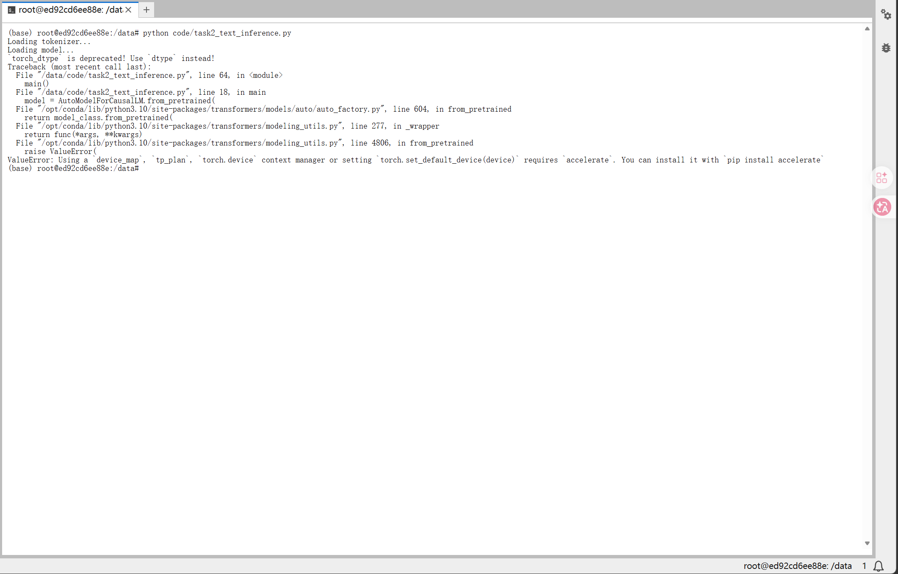

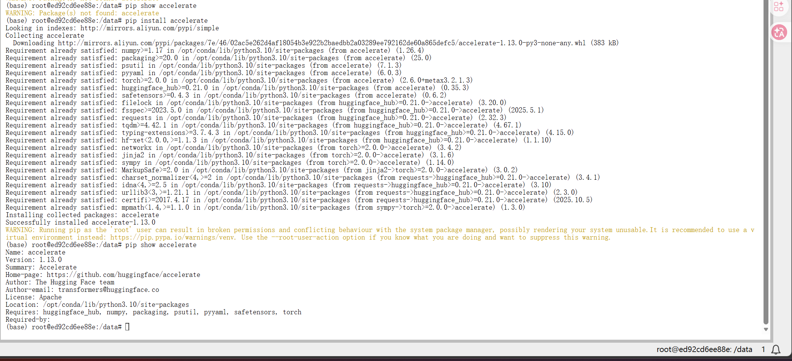

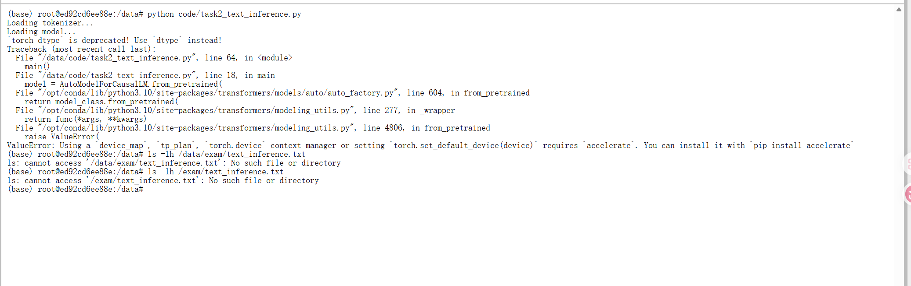

说明：

这个问题发生在最早的 PyTorch 镜像中。由于模型没有成功加载，任务要求的输出文件也不会生成，所以后续需要先安装 `accelerate`，再继续验证单次文本推理。

---

## 3. 输出包含 `<think>`

| 项目 | 内容 |
|---|---|
| 问题名称 | 输出包含 `<think>` |
| 发生阶段 | Transformers 单次推理，安装 `accelerate` 后第一次成功生成文本 |
| 现象 | 模型能生成内容，但输出中包含 thinking / reasoning 过程 |
| 报错信息 | 不是程序异常，表现为生成文本中出现 `<think>` |
| 原因判断 | Qwen3 系列模型可能默认输出思考过程；任务需要保存短篇小说正文，不适合把思考过程写入最终文件 |
| 解决方法 | 在提示词中要求只输出小说正文；尝试设置 `enable_thinking=False`；保存前清理 `<think>` 和 `</think>` |
| 对应截图 | `assets/05-text-inference-thinking-output.png` |

截图：

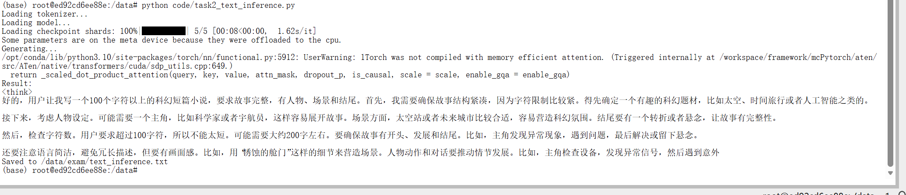

说明：

这不是运行失败，而是结果格式不符合任务要求。保留这一步可以解释为什么后续脚本中加入了 `clean_output()` 之类的清理逻辑。

---

## 4. 输出长度不足

| 项目 | 内容 |
|---|---|
| 问题名称 | 输出长度不足 |
| 发生阶段 | Transformers 单次推理，清理 `<think>` 之后 |
| 现象 | 生成正文偏短，可能不足 100 个字符 |
| 报错信息 | 不是程序异常，表现为输出文本长度不满足任务要求 |
| 原因判断 | 提示词对“正文长度”和“只输出正文”的约束不够强，模型可能生成较短回复 |
| 解决方法 | 修改提示词，明确要求 150 到 250 个中文字符，并要求正文必须超过 100 个字符；同时增大 `max_new_tokens` |
| 对应截图 | `assets/05-text-inference-short-output.png`、`assets/05-text-inference-final-output.png`、`assets/05-text-inference-final-output-wc-check.png` |

截图：

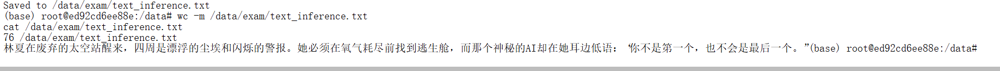

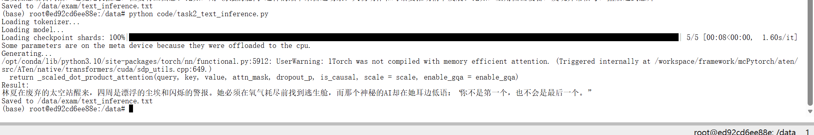

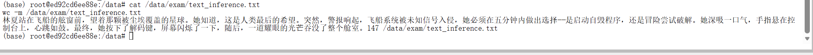

说明：

最终普通 Transformers 推理阶段已经生成 `/data/exam/text_inference.txt`，并通过 `wc -m` 检查确认字符数超过 100。

---

## 5. PyTorch 镜像没有 vLLM

| 项目 | 内容 |
|---|---|
| 问题名称 | PyTorch 镜像没有 vLLM |
| 发生阶段 | 准备部署 vLLM 服务之前 |
| 现象 | 在 PyTorch 镜像中检查 vLLM，发现当前环境不能直接启动 vLLM 服务 |
| 报错信息 | `No module named vllm` 或 `Package(s) not found: vllm` |
| 原因判断 | 当前 PyTorch 镜像适合做 Transformers 单次推理，但不是 vLLM 专用镜像 |
| 解决方法 | 按官方教程切换到 vLLM 专用镜像：`vLLM / vllm:0.11.0 / Python 3.10 / maca 3.3.x` |
| 对应截图 | `assets/05-vllm-not-installed-check.png`、`assets/05-task2-learning-guide-vllm.png` |

截图：

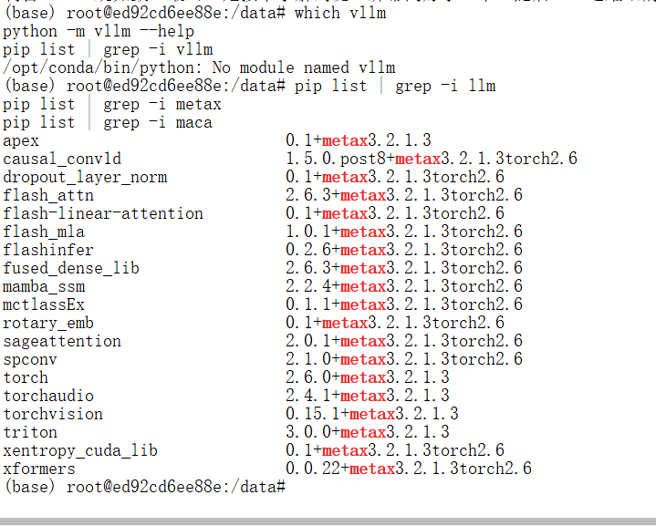

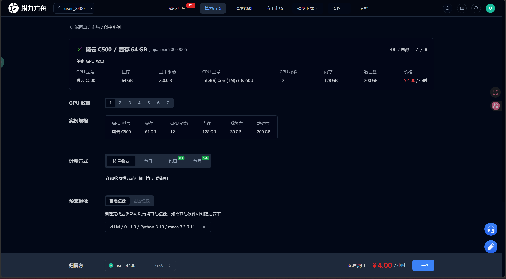

说明：

这一步确认任务 2 需要分两段处理：先用 PyTorch 镜像完成普通 Transformers 单次推理，再用 vLLM 专用镜像完成 OpenAI 兼容 API 服务部署。

---

## 6. 新实例中脚本路径不存在

| 项目 | 内容 |
|---|---|
| 问题名称 | 新实例中脚本路径不存在 |
| 发生阶段 | 新建 vLLM 实例后，尝试复用旧脚本 |
| 现象 | 在 `/data/code/` 或 `/code/` 路径下找不到 `task2_text_inference.py` |
| 报错信息 | `python: can't open file '/data/code/task2_text_inference.py': [Errno 2] No such file or directory` |
| 原因判断 | vLLM 实例是重新创建的环境，之前 PyTorch 实例里的脚本不会自动存在 |
| 解决方法 | 在新实例中重新创建脚本；或者改用 vLLM API 生成最终文本并写入 `/data/exam/text_inference.txt` |
| 对应截图 | `assets/11-task2-text-inference-script-path-missing.png` |

截图：

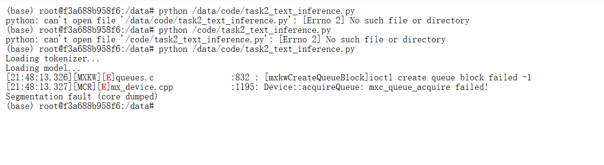

说明：

同一张截图后半部分也出现了 queue 报错，但这里主要记录脚本路径缺失。queue / segfault 问题在下一节单独记录。

---

## 7. vLLM 镜像中 Transformers 触发 MetaX queue segfault

| 项目 | 内容 |
|---|---|
| 问题名称 | vLLM 镜像中 Transformers 触发 MetaX queue segfault |
| 发生阶段 | vLLM 专用镜像中，尝试直接用 Transformers 加载 Qwen3-8B |
| 现象 | 模型加载或运行过程中底层队列申请失败，进程崩溃 |
| 报错信息 | `mxkwCreateQueueBlock ioctl create queue block failed -1`、`Device::acquireQueue: mxc_queue_acquire failed!`、`Segmentation fault (core dumped)` |
| 原因判断 | 这不是普通 Python 语法错误，更像是 MetaX 底层队列或设备资源申请失败；vLLM 专用镜像更适合通过 `vllm serve` 启动服务 |
| 解决方法 | 不再在 vLLM 镜像中直接用 Transformers 加载 Qwen3-8B，改走 vLLM API 生成文本和保存文件 |
| 对应截图 | `assets/11-task2-metax-queue-segfault.png` |

截图：

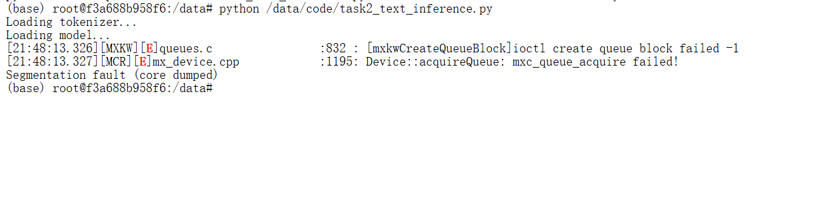

说明：

这个问题是后续 EngineCore 初始化失败排查链中的重要线索，说明问题已经进入底层运行时或实例状态层面。

---

## 8. 第一台 vLLM 实例 Qwen3-8B EngineCore 初始化失败

| 项目 | 内容 |
|---|---|
| 问题名称 | 第一台 vLLM 实例 Qwen3-8B EngineCore 初始化失败 |
| 发生阶段 | 启动 Qwen3-8B vLLM 服务 |
| 现象 | `vllm serve` 启动失败，服务无法稳定监听 8188 端口 |
| 报错信息 | `DMAQueue create failed`、`Device::acquireQueue: mxc_queue_acquire failed`、`RuntimeError: Engine core initialization failed` |
| 原因判断 | 已排查端口、残留进程、MetaX 插件识别、MACA 版本匹配等方向；失败集中在 EngineCore 初始化阶段，更像是第一台 vLLM 实例底层队列状态或环境状态异常 |
| 解决方法 | 不继续只改 Python 代码或启动参数，释放异常实例，重新创建干净的 vLLM 专用实例 |
| 对应截图 | `assets/11-task2-vllm-qwen3-8b-engine-init-failed.png` |

截图：

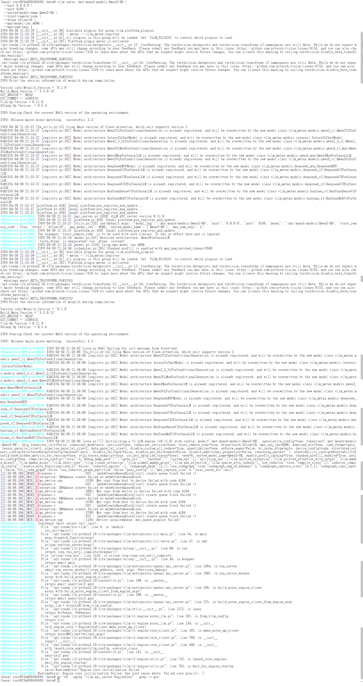

失败命令记录：

```bash
vllm serve /mnt/moark-models/Qwen3-8B \
  --host 0.0.0.0 \
  --port 8188 \
  --served-model-name Qwen3-8B \
  --dtype bfloat16 \
  --max-model-len 2048 \
  --max-num-seqs 1 \
  --gpu-memory-utilization 0.80 \
  --enforce-eager
```

---

## 9. `VLLM_USE_V1=0` 触发 `AssertionError`

| 项目 | 内容 |
|---|---|
| 问题名称 | `VLLM_USE_V1=0` 触发 `AssertionError` |
| 发生阶段 | 排查 vLLM EngineCore 初始化失败 |
| 现象 | 尝试关闭 V1 engine 后，vLLM 直接断言失败 |
| 报错信息 | `assert envs.VLLM_USE_V1`、`AssertionError` |
| 原因判断 | 当前 vLLM 0.11.0 + MetaX 镜像要求使用 V1 engine，不能通过 `VLLM_USE_V1=0` 关闭 |
| 解决方法 | 放弃关闭 V1 engine 的方向，继续使用默认 V1 engine |
| 对应截图 | `assets/11-task2-vllm-use-v1-assertion.png` |

截图：

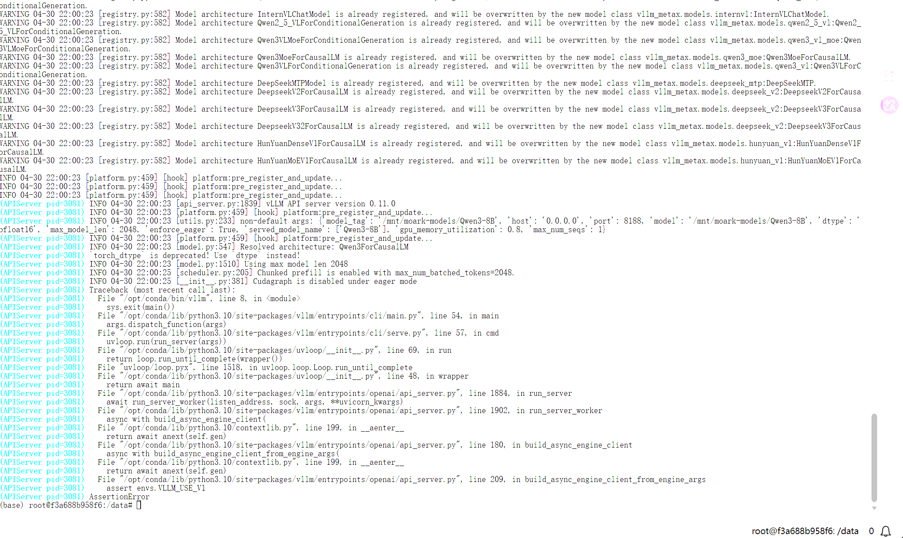

失败命令记录：

```bash
VLLM_USE_V1=0 vllm serve /mnt/moark-models/Qwen3-8B \
  --host 0.0.0.0 \
  --port 8188 \
  --served-model-name Qwen3-8B \
  --dtype bfloat16 \
  --max-model-len 2048 \
  --max-num-seqs 1 \
  --gpu-memory-utilization 0.80 \
  --enforce-eager
```

---

## 10. 第一台 vLLM 实例 Qwen3-0.6B 也启动失败

| 项目 | 内容 |
|---|---|
| 问题名称 | 第一台 vLLM 实例 Qwen3-0.6B 也启动失败 |
| 发生阶段 | 用官方示例小模型验证 vLLM 环境 |
| 现象 | 为判断是否是 Qwen3-8B 模型过大导致失败，改用 Qwen3-0.6B 测试，但同样启动失败 |
| 报错信息 | `Engine core initialization failed` |
| 原因判断 | 更小的官方示例模型也失败，说明问题不只是 Qwen3-8B 模型规模，更可能与第一台 vLLM 实例的底层状态或运行环境有关 |
| 解决方法 | 释放第一台异常 vLLM 实例，重新创建干净的 vLLM 专用实例；重建后先验证 Qwen3-0.6B，再启动 Qwen3-8B |
| 对应截图 | `assets/11-task2-vllm-qwen3-0_6b-engine-init-failed.png`、`assets/05-vllm-qwen3-0_6b-server-start.png`、`assets/05-vllm-qwen3-0_6b-curl-test.png` |

截图：

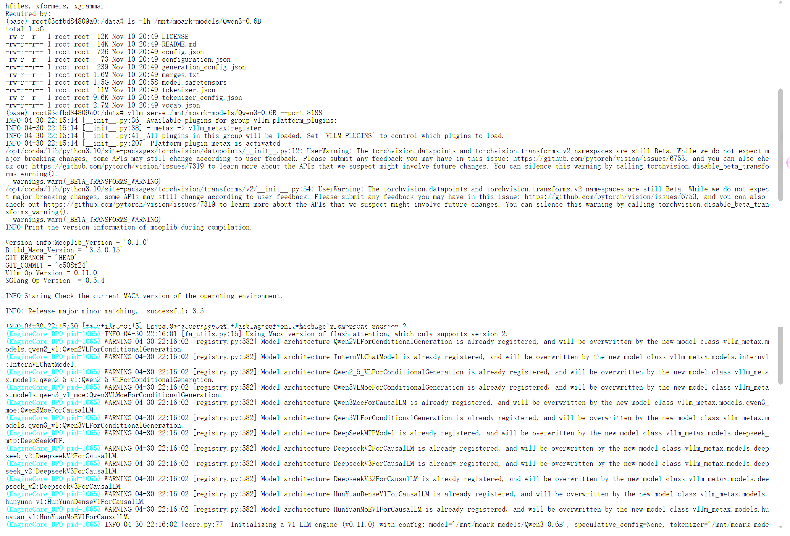

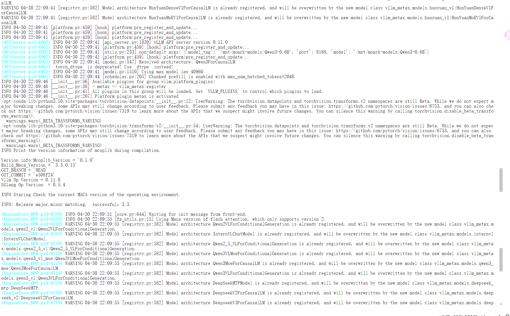

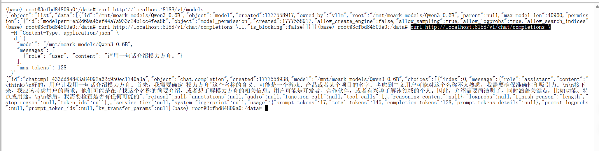

说明：

这个对照实验很关键。它说明“换小模型”并不能解决第一台实例的问题，因此最终选择重建 vLLM 实例。

---

## 11. 重建 vLLM 实例后成功

| 项目 | 内容 |
|---|---|
| 问题名称 | 重建 vLLM 实例后成功 |
| 发生阶段 | 最终验证 |
| 现象 | 重建干净的 vLLM 专用实例后，先跑通 Qwen3-0.6B，再跑通 Qwen3-8B |
| 报错信息 | 无新的报错；服务成功启动并返回 JSON |
| 原因判断 | 第一台 vLLM 实例更可能存在底层队列状态或环境状态异常；重建实例后同样镜像和模型路径可以正常工作 |
| 解决方法 | 使用新 vLLM 实例，启动 Qwen3-8B 服务，确认 8188 端口、`/v1/models`、`/v1/chat/completions`、`/data/exam/text_inference.txt` 均满足任务要求 |
| 对应截图 | `assets/05-vllm-new-instance-package-check.png`、`assets/05-vllm-qwen3-8b-server-start.png`、`assets/05-vllm-qwen3-8b-curl-test.png`、`assets/05-vllm-api-generated-text-output.png`、`assets/05-task2-pass.png` |

截图：

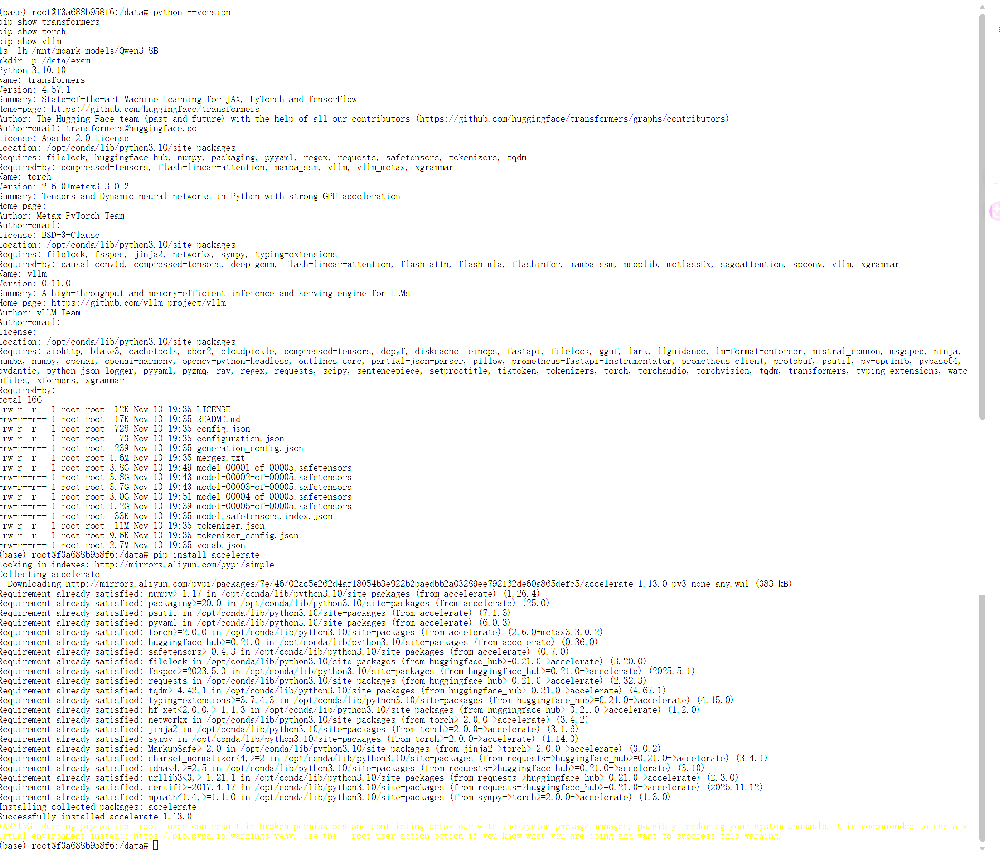

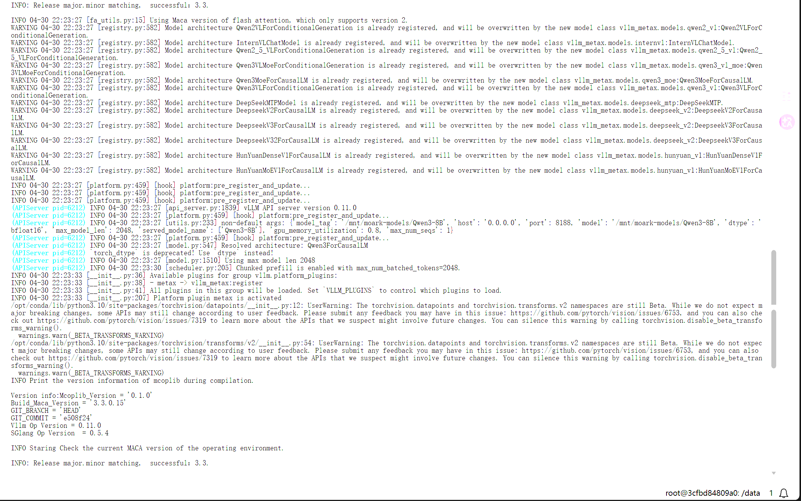

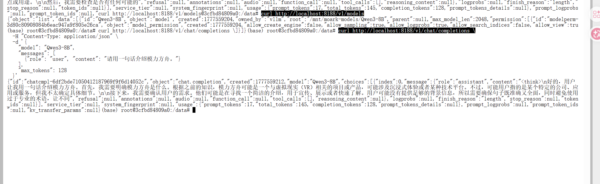

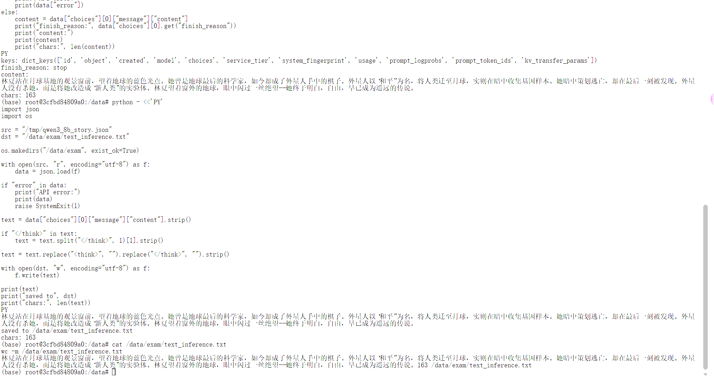

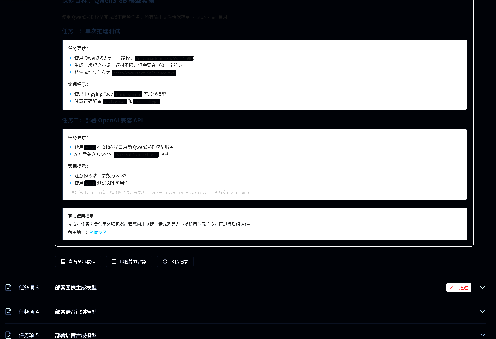

最终通过条件：

| 检查项 | 结果 |
|---|---|
| `/data/exam/text_inference.txt` | 已生成 |
| 文本长度 | 超过 100 字符 |
| Qwen3-8B vLLM 服务 | 运行在 8188 端口 |
| `/v1/models` | 能看到 Qwen3-8B |
| `/v1/chat/completions` | 可以正常返回 JSON |
| 平台检测 | 任务 2 已通过 |

---

## 12. 经验总结

| 经验 | 说明 |
|---|---|
| PyTorch 镜像和 vLLM 镜像用途不同 | PyTorch 镜像适合普通 Transformers 推理，vLLM 镜像适合 API 服务部署 |
| `device_map="auto"` 报错先查 `accelerate` | 缺少 `accelerate` 会直接导致模型加载失败 |
| Qwen3 输出需要清理 | 最终提交文件应尽量只保留正文，不要保留 `<think>` |
| MetaX queue 错误不能只改 Python 代码 | 出现 queue、EngineCore、底层设备错误时，要考虑实例状态和运行时环境 |
| 小模型对照很有价值 | Qwen3-0.6B 也失败时，可以排除“只是 Qwen3-8B 太大”的单一判断 |
| 重建实例是有效排查手段 | 当同一镜像在旧实例失败、新实例成功时，说明实例状态本身可能是关键变量 |
